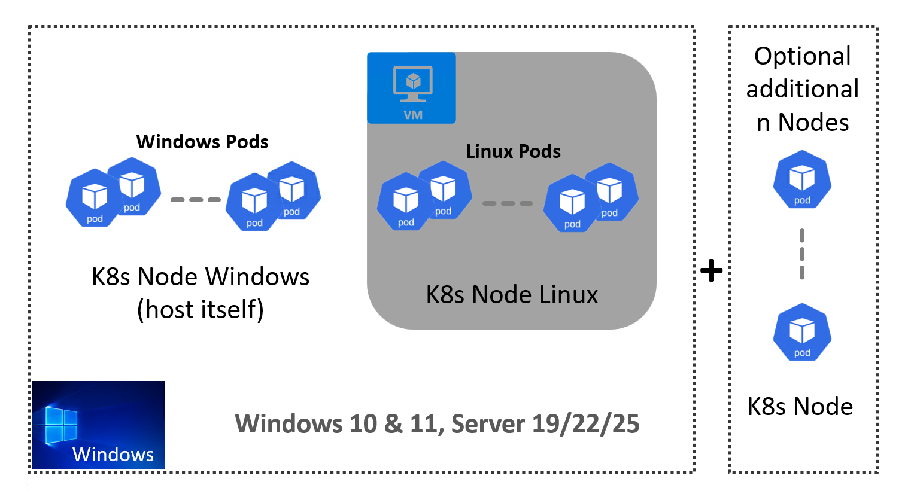

<!--
SPDX-FileCopyrightText: © 2024 Siemens Healthineers AG

SPDX-License-Identifier: MIT
-->

# K2s - Kubernetes distribution for Windows & Linux workloads
[](https://github.com/Siemens-Healthineers/K2s/actions/workflows/ci-reuse-checks.yml)
[](https://github.com/Siemens-Healthineers/K2s/actions/workflows/ci-unit-tests.yml)
[](https://github.com/Siemens-Healthineers/K2s/actions/workflows/build-k2s-cli.yml)
[](https://github.com/Siemens-Healthineers/K2s/actions/workflows/build-k2s-artifacts.yml)
[](https://github.com/Siemens-Healthineers/K2s/actions/workflows/build-docs-next.yml)

<span style="font-size: large;border: medium solid #326CE5;border-radius: 5px;padding: 10px;">Read the [K2s Online Documentation](https://siemens-healthineers.github.io/K2s/).</span>

---

*K2s* is a *Kubernetes* distribution which packages different open-source components into one small and easy to use solution focusing on running mixed *Windows*-based & *Linux*-based workloads in *Kubernetes*. 

This solution is installable on *Windows* hosts.

The name *K2s* comes from the fact that we start with the default setting of 2 *Kubernetes* nodes (*Windows* & *Linux*) and it relates to *K8s* as synonym for *Kubernetes*.

## Why *K2s*?
The problems that *K2s* solves are the following:

- It provides the option to construct a *K8s* cluster by reusing the *Windows* host as a node. This eliminates the need for an extra *Windows* license in the case of a mixed *Windows* & *Linux* cluster.
- Offline support is available for all use cases, eliminating the requirement for an internet connection.
- It offers an easy path for migrating bare metal *Windows* applications to *K8s* workloads.
- It maintains a low footprint by utilizing a single virtual machine for *Linux* workloads (*Hyper-V* or WSL).
- It is built 100% on open-source technology, requiring no additional licenses.

See also the [Features List](docs/index.md#features).

<div align="center">


</div>

## Quick Start
1. [Get *K2s*](docs/op-manual/getting-k2s.md)
3. Verify that the [Prerequisites](docs/op-manual/installing-k2s.md#prerequisites) are fulfilled
4. Run as administrator in the installation/repository folder:
    ```console
    k2s.exe install
    ```
5. Check *K2s* cluster health:
    ```console
    k2s.exe status
    ```
6. Deploy your workloads :rocket:

See [*k2s* CLI](docs/user-guide/k2s-cli.md) and [CLI Shortcuts](docs/user-guide/cli-shortcuts.md) for more means to interact with the *K2s* cluster.

Optionally, install one or more [*K2s* Addons](addons/README.md) for additional functionality.

To create an offline installer first, check out [Creating Offline Package](docs/op-manual/creating-offline-package.md).

## [Supported OS Versions](docs/op-manual/os-support.md)
See also [*Windows*-based Images](./smallsetup/ps-modules/windows-support/README.md).

## [Hosting Variants](docs/user-guide/hosting-variants.md)

## Further Usage
- [Getting *K2s*](docs/op-manual/getting-k2s.md)
- [Installing *K2s*](docs/op-manual/installing-k2s.md)
- [Starting *K2s*](docs/op-manual/starting-k2s.md)
- [Checking *K2s* Status](docs/op-manual/checking-k2s-status.md)
- [Stopping *K2s*](docs/op-manual/stopping-k2s.md)
- [Uninstalling *K2s*](docs/op-manual/uninstalling-k2s.md)
- [Adding a Container Registry](docs/user-guide/adding-container-registry.md)
- [Building a Container Image](docs/user-guide/building-container-image.md)
- [CLI Shortcuts](docs/user-guide/cli-shortcuts.md)
- [Upgrading *K2s*](docs/op-manual/upgrading-k2s.md)
- [Creating Offline Package](docs/op-manual/creating-offline-package.md)

## Addons
K2s provides a [rich set of addons](./addons/README.md) which are containing specific functionality, checkout the ```k2s addons``` command for all options.
These addons can be used for testing and rapid prototyping purposes, as well in selected product scenarios.

## [Contributing](docs/dev-guide/contributing/index.md)

## [Training](docs/dev-guide/training.md)

## [Troubleshooting](docs/troubleshooting/)