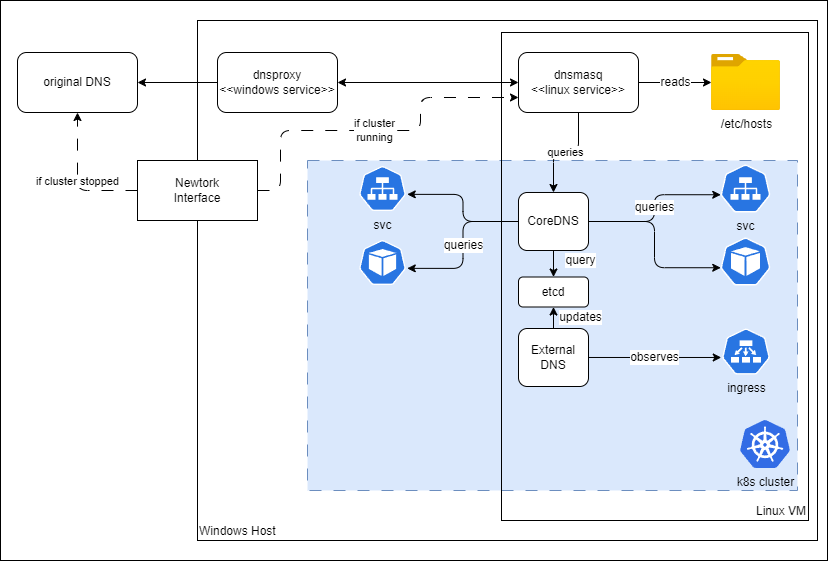

# ExternalDNS

ExternalDNS synchronizes ingress endpoints with a DNS provider.
In a Cloud environment the DNS provider would be an external DNS.

For K2s, we re-use the CoreDNS anc configure ExternalDNS to sync
all hosts it finds in the ingresses to the same DNS which is used to
resolve the k8s services.

For this we need:

- [etcd.yaml](etcd.yaml): an etcd instance to store the DNS entries generated
  by ExternalDNS. For now, this is a dedicated, unsecure instance.  
  TODO:  
  We can re-use an existing etcd, maybe the etcd instance of the cluster.
  The data produce by ExternalDNS will be stored under the `/skydns` prefix.
  Secure Communication and client-certificate-based authorization must be set up.
- [coredns-configmap.yaml](coredns-configmap.yaml): we extend the CoreDNS
  configuration so that entries which are not found in
  the kubernetes plugin of CoreDNS are looked up in the etcd plugin.
  The needed addition is this etcd plugin configuration,
  inserted before the kubernetes plugin:
  
  ```yaml
  etcd cluster.local {
    stubzones
    path /skydns
    endpoint http://etcd.kube-system.svc.cluster.local:2379
    fallthrough
  }
  ```

- [external-dns.yaml](external-dns.yaml): the ExternalDNS configuration,
  configured to observe ingresses and update the etcd with the found dns
  entries.

## Overview



## Links

- [ExternalDNS](https://kubernetes-sigs.github.io/external-dns/v0.14.2/):
  project overview
- [CoreDNS etcd plugin](https://coredns.io/plugins/etcd/):
  extends CoreDNS to answers DNS queries using data in SkyDNS format found in etcd.
- [ExternalDNS coredns plugin](https://github.com/kubernetes-sigs/external-dns/blob/master/docs/tutorials/coredns.md):
  extends ExternalDNS and saves all hosts in SkyDNS format to etcd.  
  [Configuration Env. Variables](https://github.com/kubernetes-sigs/external-dns/blob/master/provider/coredns/coredns.go#L212):
  this will help us setting up the connection to a secured etcd.

## Work Planning

### 1. Use the kubernetes cluster etcd

In order to re-use the etcd instance of the kubernetes cluster, we need
its ca certificate and a client secret. These are created and available
during initial installation on the master node, under

```path
/etc/kubernetes/pki/etcd/*
```

We will create kubernetes secrets out of them, this way it will be possible in
the future to leverage cert-manager and re-create them before they expire.

Steps:

1. Copy the secret files locally:

   ```cmd
   sudo mkdir etcd
   sudo cp /etc/kubernetes/pki/etcd/* etcd/
   sudo chmod 666 etcd/*
   ```

2. Generate the secrets `etcd-ca` and `etcd-client-for-core-dns`
   in the `kube-system` namespace:

   ```cmd
   kubectl create secret -n kube-system tls etcd-ca --cert=etcd/ca.crt --key=etcd/ca.key
   kubectl create secret -n kube-system tls etcd-client-for-core-dns --cert=etcd/healthcheck-client.crt --key=etcd/healthcheck-client.key
   ```

3. Use the secrets in the deployment of [external-dns.yaml](external-dns.yaml):

    ```yaml
    ...
          volumes:
          - name: etcd-ca-cert
            secret:
              secretName: etcd-ca
          - name: etcd-client-cert
            secret:
              secretName: etcd-client-for-core-dns
          containers:
            volumeMounts:
            - mountPath: /etc/kubernetes/pki/etcd-ca
              name: etcd-ca-cert
            - mountPath: /etc/kubernetes/pki/etcd-client
              name: etcd-client-cert
            env:
            - name: ETCD_URLS
              value: https://172.19.1.100:2379
            - name: ETCD_CERT_FILE
              value: /etc/kubernetes/pki/etcd-client/tls.crt
            - name: ETCD_KEY_FILE
              value: /etc/kubernetes/pki/etcd-client/tls.key
            - name: ETCD_CA_FILE
              value: /etc/kubernetes/pki/etcd-ca/tls.crt
    ...
    ```

4. Use the same secrets in the deployment of [coredns.yaml](coredns.yaml):

    ```yaml
        volumeMounts:
        - mountPath: /etc/coredns
          name: config-volume
          readOnly: true
        - mountPath: /etc/kubernetes/pki/etcd-ca
          name: etcd-ca-cert
        - mountPath: /etc/kubernetes/pki/etcd-client
          name: etcd-client-cert
    
    ...

      volumes:
      - configMap:
          defaultMode: 420
          items:
          - key: Corefile
            path: Corefile
          name: coredns
        name: config-volume
      - name: etcd-ca-cert
        secret:
          secretName: etcd-ca
      - name: etcd-client-cert
        secret:
          secretName: etcd-client-for-core-dns
    ```

    Also the [CoreDNS ConfigMap](coredns-configmap.yaml):
  
    ```text
        etcd cluster.local {
          stubzones
          path /skydns
          endpoint https://172.19.1.100:2379
          tls /etc/kubernetes/pki/etcd-client/tls.crt /etc/kubernetes/pki/etcd-client/tls.key /etc/kubernetes/pki/etcd-ca/tls.crt
          fallthrough
    }
    ```
