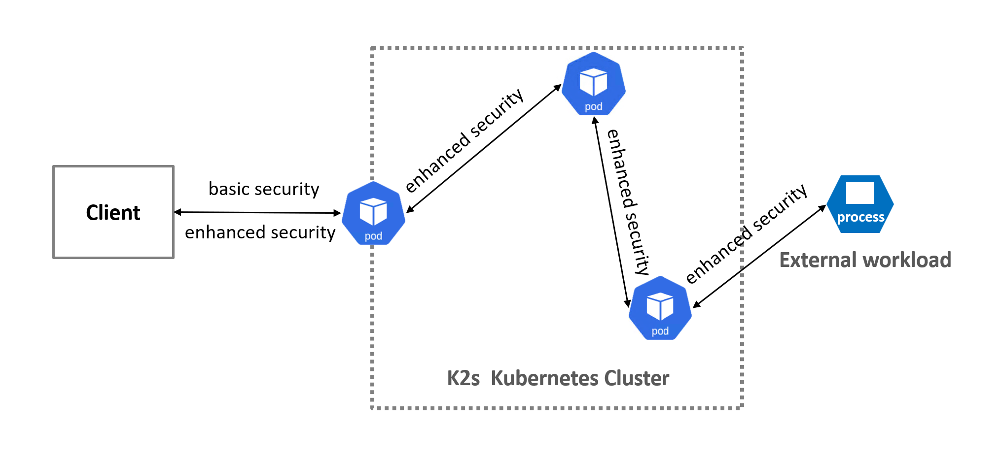

<!--
SPDX-FileCopyrightText: © 2024 Siemens Healthineers AG

SPDX-License-Identifier: MIT
-->

# security addon

Purpose: Enables secure communication and authentication into / out of the cluster (basic) and inside the cluster (enhanced).

Our strategy is to achieve **security through infrastructure**, effectively offloading fundamental security concerns like mutual TLS encryption, authentication, and authorization from the application layer. Instead of requiring every development team to build and maintain these complex security features within their own code, we leverage platform-level tools like service meshes (e.g., Linkerd) and identity providers (e.g., Keycloak). This allows application developers to focus solely on core business logic, accelerates development cycles, and ensures a consistent, standardized security posture enforced by the platform, not reinvented in every application (container or non-container).

**Note:** Certificate management (cert-manager) is now handled by the ingress addons. See [ingress nginx README](../ingress/nginx/README.md#certificate-management-with-cert-manager) for TLS certificate configuration.



## Getting Started

The `security` addon can be enabled using the `k2s` CLI:

```cmd
k2s addons enable security
```

For enabling basic or enhanced security please use the parameter:

```cmd
 -t, --type string (basic or enhanced)
```

K2s also has many addons like **dashboard**, **logging**, **monitoring**... which are bringing in also web apps.
By enabling the security addon they will be automatically also secured.

## Disable security

The `security` addon can be disabled using the k2s CLI:

```cmd
k2s addons disable security
```

After disabled security also please reset the policies (navigate to [chrome://net-internals/#hsts](chrome://net-internals/#hsts)) for the following domain:

```cmd
k2s.cluster.local
```

## Optional Components

By default, the security addon installs all components listed below. You can now selectively omit certain open source frameworks during installation using flags:

- `-OmitHydra`: Omits the setup of hydra and the local login implementation (useful if no local user management is needed).
- `-OmitKeycloak`: Omits the setup of keycloak and its database (useful if you want oauth2-proxy to reference an external OAuth2 provider).
- `-OmitOAuth2Proxy`: Omits the OAuth2 proxy deployment (useful if you want to use an external authentication proxy or no authentication at all).

Example usage:

```powershell
# Omit hydra and login
k2s addons enable security -OmitHydra

# Omit keycloak
k2s addons enable security -OmitKeycloak

# Omit OAuth2 proxy
k2s addons enable security -OmitOAuth2Proxy

# Omit all authentication components (cert-manager and linkerd only)
k2s addons enable security -OmitHydra -OmitKeycloak -OmitOAuth2Proxy

# Omit both
k2s addons enable security -OmitHydra -OmitKeycloak
```

If a component is omitted, the corresponding authentication or user management features will not be available in the cluster, and you must provide your own external solution if needed.

## Components used

This addon installs workloads needed to secure network communication and manage authentication. Components include (some optional via flags):

- [keycloak](https://www.keycloak.org/) - services for identity and access management. `keycloak` provides user federation, strong authentication, user management, fine-grained authorization, and more. _(Can be omitted with -OmitKeycloak)_

- [oauth2 proxy](https://github.com/oauth2-proxy/oauth2-proxy) - OAuth2 Proxy offloads the burden of implementing authentication logic from your applications. _(Can be omitted with -OmitOAuth2Proxy)_

- [ory hydra](https://github.com/ory/hydra) - using this "headless" OAuth2 and OIDC provider for providing the local user management on the windows host as part of the identity provider. _(Can be omitted with -OmitHydra)_

**Enhanced security mode only:**

- [linkerd](https://linkerd.io/) - service mesh implementation. `linkerd` adds security, observability, and reliability to any Kubernetes cluster. Linkerd latest versions are adapted to work also on windows hosts for windows containers.

- [trust-manager](https://cert-manager.io/docs/trust/trust-manager/) - trust-manager is a small Kubernetes operator which reduces the overhead of managing TLS trust bundles in your clusters, used by Linkerd for distributing CA certificates for service mesh mTLS.

**Note:** Certificate management for ingress TLS is handled by cert-manager, which is automatically installed with ingress addons. See [ingress nginx documentation](../ingress/nginx/README.md#certificate-management-with-cert-manager).

## How to use it

### Identity and access management with keycloak

Keycloak is a widely adopted open-source Identity and Access Management (IAM) solution that provides a comprehensive set of features for securing modern applications and services. When deployed in Kubernetes, Keycloak acts as a centralized authentication and authorization server for applications running within the cluster and potentially external to it.
Documentation related to `keycloak` you will find here: [keycloak docs](https://www.keycloak.org/guides).

The security addon adds in addition to the already many available identity providers also one for the local windows users.
Local users on the host where K2s was setup can than be used for identity and access management.

### Linkerd Service mesh

Linkerd is a lightweight, open-source service mesh designed specifically for Kubernetes. Its primary goal is to make running cloud-native applications easier and safer by providing a layer of infrastructure that handles the complexities of service-to-service communication.

In order to secure your workload please use the following annotation:

```cmd
     annotations:
       linkerd.io/inject: enabled
```

This is the only mandatory annotation to use, please check other annotations from the linkerd documenetation.

For using the linkerd dashboard please first install the dashboard resources:

```cmd
linkerd viz install | kubectl apply -f -
```

After all pods are ready please start dashoboard with (you can use also another port if there is some conflict):

```cmd
linkerd viz dashboard --port 60888 &
```

Documentation related to `linkerd` you will find here: [linkerd docs](https://www.keycloak.org/guides).

### Trust manager

The primary role of trust-manager is to orchestrate and distribute bundles of trusted X.509 Certificate Authority (CA) certificates across your Kubernetes cluster.
These bundles are crucial for applications to validate the authenticity of other services they communicate with, primarily during TLS handshakes.
It also automates the process of keeping these trust stores up-to-date.

Traditionally, trust stores might be baked into container images. trust-manager decouples this by managing trust bundles at runtime. This means you can update trusted CAs without needing to rebuild and redeploy all your application containers.

While cert-manager is a popular Kubernetes tool for automating the issuance and renewal of X.509 certificates (the actual server/client certificates), trust-manager focuses on managing the trust anchors (CA certificates) that are used to verify those certificates.

### OAuth2 Proxy

OAuth2 Proxy emerges as a popular and effective solution for adding an authentication layer to your services, particularly when integrated with ingress controllers. It acts as a reverse proxy that intercepts incoming requests and enforces authentication using various identity providers before forwarding the request to the actual application.

Essentially, OAuth2 Proxy offloads the burden of implementing authentication logic from your applications. Instead of each application needing to handle user login, session management, and interaction with identity providers, OAuth2 Proxy handles this centrally.

### Ory Hydra

Ory Hydra is an open-source implementation of the OAuth 2.0 authorization framework and the OpenID Connect Core 1.0 specifications.
Unlike traditional identity platforms that bundle user management, Hydra is designed as a "headless" OAuth2 and OIDC provider. This means it focuses solely on the OAuth2 and OIDC protocols, delegating concerns like user login, consent flows, and user data management to separate, customizable components.

## Further Reading

- Keycloak Docs: <https://www.keycloak.org/documentation>
- Keycloak Code: <https://github.com/keycloak/keycloak>
- Linkerd Docs: <https://linkerd.io/2-edge/overview/>
- Linkerd Code: <https://github.com/linkerd/linkerd2>
- Trust-manager Docs: <https://cert-manager.io/docs/trust/trust-manager/>
- Trust-manager Code: <https://github.com/cert-manager/trust-manager>
- OAuth2 Proxy Docs: <https://oauth2-proxy.github.io/oauth2-proxy/>
- OAuth2 Proxy Code: <https://github.com/oauth2-proxy/oauth2-proxy>
- Ory Hydra Docs: <https://www.ory.sh/hydra>
- Ory Hydra Code: <https://github.com/ory/hydra>
- **For cert-manager documentation, see:** [ingress nginx README](../ingress/nginx/README.md#certificate-management-with-cert-manager)

## Knowledge Base

- **HSTS:** Browsers keep track on several security-related properties of web sites. If they encounter weaker security settings that they encountered last time, they assume it is an attack and will not allow the navigation to that site. This is the case when you enable the security addon, browse a secure site of your cluster, and then disable the security addon. The browser will not trust the site you used before anymore.

  You can **reset HSTS** of your site stored by your browser by navigating to:

  ```cmd
  chrome://net-internals/#hsts
  ```

  and deleting the settings for your site.

## Guiding principle

The guiding principle is to provide security as an inherent property of the infrastructure, rather than an optional add-on implemented per application. By deploying components that transparently handle authentication and authorization (Keycloak, OAuth2 Proxy), service mesh encryption (Linkerd for enhanced mode), and leveraging ingress-level TLS (cert-manager via ingress addons), we abstract away the underlying complexity for application developers. This allows us to move towards a 'secure by default' environment, where essential security mechanisms are automatically applied to workloads simply by deploying them onto the protected infrastructure, without requiring explicit security code within the application itself.
