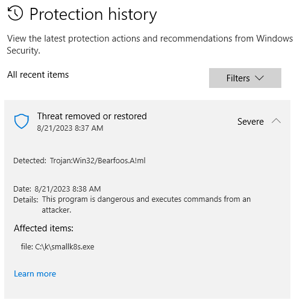

<!--
SPDX-FileCopyrightText: © 2023 Siemens Healthcare GmbH

SPDX-License-Identifier: MIT
-->

Troubleshooting
==============
[ Home ](../README.md)


# Quick overview of your K8s system

Simply type `ks` in you shell to get an overview about your K8s state !

# List all your mounted volumes

Get the list of all mounted volumes, their size and their namespace:

```
kg pv

Get the list of all mounted volume claims and their current usage:

```
kg pvc -A

# unbound immediate PersistentVolumeClaims

Error Pattern

```
0/2 nodes are available: 2 pod has unbound immediate PersistentVolumeClaims.
```

# Secret issue when loading over kustomization File

```
kubectl apply -k dicom
error: rawResources failed to read Resources: Load from path ../secrets failed: '../secrets' must be a file (got d='..\kubernetes\secrets')
```

=> Your kubectl version is too old. Update it !

# Disk Pressure

You may suddenly find that kubernetes cannot start a large number of Pods. This is often due to "Disk Pressure" meaning that you are missing Space on your Hard disk.

The best way to recognize it is to use the nice command `ks`

you can also use directly the k8s tools

```
kubectl describe nodes
```

or

```
kubectl describe nodes | less
```

under Linux.

Be aware that the Disk pressure may occur on your physical Windows System or in the linux VM...

If you have a large number of Pods stopped than the problem is probably on the Linux side since most of our containers run there.

If the problem is on your local Windows System, use all classical product to win space on C: and D: (TreeSize utility for example).

You need a least 10 GB free on both disks.

if the problem is on your Linux VM, you need following commands to find and fix the problem:

`sshm` to open a shall on the linux machine

`df` and look at /dev/sda1 percentage

to get an overview of the disk space consumption.

Then go to the very top directory with cd ../.. and with

```
sudo du -d1 -x -h
```

you can look in each directory and subdirectory to localize the high space consumption.

You may have too many data in your couch data and can remove them under /mnt/dicom with

```
sudo rm -r -d shards/
```

The problem comes most probably from the Docker Registry and you can clean it up with

```
docker system prune
```

or

```
crictl rmi --prune
```

if you do not have docker installation

<span style="color:red">Attention:</span> if you currently use some locally built containers,
Kubernetes will not be able to reload them automatically.
You must rebuild them locally on your system (**>k2s build**).

# Volume Access problem

```
kg pv => alle Volume should be away after K8s uninstall
kg pvc -n <namespace>
```

Check general state with

```
kg pv
```

**Remove** unbound volumes

```
k delete pvc  <volumaneName> -n <namespace> --f
k delete pv  <volumaneName> -n <namespace>
```

In K2s, we should reapply the volumes:

```
ka -f smallsetup\10-smallsetup.yaml
```

Then reapply the yaml of the service consuming the volumes

```
kubectl -k .\dicom
```

# No cbr0 switch created during StartK8s

When starting the SmallSetup K8s system, you run into an error (e.g. timeout) while
the script is waiting cbr0 switch to be created by flanneld. Example of such a situation:

```
    [10:19:22] waiting for cbr0 switch to be created by flanneld...
    Be prepared for several seconds of disconnected network!
    [10:19:25] State of services (checkpoint 1): All running
    No cbr0 switch created so far...
    [10:19:27] State of services (checkpoint 2): All running
    PID for flanneld service: 20256
    No cbr0 switch created so far...
    [10:19:29] State of services (checkpoint 3): All running
    No cbr0 switch created so far...
    [10:19:31] State of services (checkpoint 4): All running
    No cbr0 switch created so far...
    [10:19:33] State of services (checkpoint 5): All running
    PID for flanneld service: 5260  (restarted after failure)
    No cbr0 switch created so far...
    [10:19:35] State of services (checkpoint 6): All running
    PID for flanneld service: 14488  (restarted after failure)
    No cbr0 switch created so far...
    [10:19:37] State of services (checkpoint 7): All running
    PID for flanneld service: 2236  (restarted after failure)
    No cbr0 switch created so far...
```

There are several reasons which can cause this. Basically the _flanneld_ process is
waiting for a new virtual switch to be created which has the same IP as the original, physical
ethernet adapter. Then it tries to attach to that switch in promiscuous mode.

## Major Network problems

If you face network errors especially between Linux and Microsoft Services, you may need to reset your networking.

- small solution:
    - stopk8s
    - ipconfig
    - Cleanup within a powershell: get-hnsnetwork | remove-hnsnetwork
    - ipconfig (to check cleanup result)
    - startk8s

- big solution:
    - netcfg -d
    - booten

## Microsoft APIPA / Link-local address

Another reason could be the Windows Automatic Private IP Addressing (APIPA). It is
enabled by default in Windows 10, and depending on the speed of the physical adapter,
the CPU and the DHCP server, it may happen that Windows decides to use an "automatic
APIPA address".
There is a reserved IPv4 address block 169.254.0.0/16 (169.254.0.0 – 169.254.255.255)
for link-local addressing. If such an address is chosen by Microsoft, it will no longer
be overwritten by the DHCP server (depending on OS version).
This will make the flanneld approach unusable. Since 2021-10-08 such
APIPA addresses are detected by our StartK8s script, and the workaround is also provided
in script `<installation folder>\SmallSetup\FixAutoconfiguration.ps1`.


After that fix the APIPA system is completely disabled on the machine. Nevertheless
Microsoft does not indicate that properly when you issue the ```ipconfig /all``` command.
You will still see lines that state `Autoconfiguration Enabled . . . . : Yes` but **that is not true**.
Don't believe it, it's just a bug in the output. Autoconfiguration is really disabled.

More information on the topic:

- [What is APIPA](https://www.geeksforgeeks.org/what-is-apipa-automatic-private-ip-addressing/)
- [Wikipedia on APIPA](https://en.wikipedia.org/wiki/Link-local_address)
- [Microsoft on APIPA](https://docs.microsoft.com/en-us/previous-versions/windows/it-pro/windows-2000-server/cc958957(v=technet.10)?redirectedfrom=MSDN)

# Unable to mount file share between nodes

## K8s install superblock error

Error like below:

```
mount: /mnt/k8s-smb-share: can't read superblock on //172.x.x.x/k8s-smb-share.
```

The solution is to change the OU

From:

```
OU = RA106/02DE/02DE001/_Central/Computers/StdW10x64C
```

To:

```
OU = RA106/02DE/02DE003/_Central/Computers/StdW10x64C
```

# *k2s.exe* missing / *k2s* command not found
## Problem
If the *k2s.exe* is missing in the install folder, most likely the *Windows Virus & thread protection* identified it as a thread and moved it to quarantine. Despite all exclusion lists this file was added to by the K2s team, this can happen from time to time.
## Solution
- If the *Windows Virus & thread protection* asks for the appropriate action, allow the *k2s.exe* file on your system
- To restore the file, go to *Windows Virus & thread protection* -> *Protection history* and restore *k2s.exe*. The result should look similar to this:

  

# Unable to run Windows container on a harderned machine (AppLocker Rules)
## Problem

If the K2s cluster is installed on a machine where security hardening is applied using AppLocker rules, then running windows containers will be blocked. If you describe the windows container pod then you might see the following error, where the application is blocked by group policy.

```
Warning  FailedCreatePodSandBox  0s    kubelet            Failed to create pod sandbox: rpc error: code = Unknown desc = failed to start sandbox container task "459fe28ca0da5a154964c80e1b5d74de3abefc83cf7ad77418a5d6cd9a7e5605": hcs::System::CreateProcess 459fe28ca0da5a154964c80e1b5d74de3abefc83cf7ad77418a5d6cd9a7e5605: This program is blocked by group policy. For more information, contact your system administrator.: unknown
```

You can check the existing AppLocker rules by opening Local Group Policy Editor
Run cmd gpedit.msc
You can find the rules as shown below:


## Solution

>NOT AN IDEAL SOLUTION BUT A WORKAROUND!!

Change registry setting under Computer\HKEY_LOCAL_MACHINE\SOFTWARE\Policies\Microsoft\Windows\SrpV2\EXE, AllowsWindows - 1, EnforcementMode - 1 (Both are decimals).
Next, we should disable the rules in AppLocker and restart the machine.

Although, this is just a hack to continue working, we should allow windows containers execution specifically CMD.exe in a secured way. **Please review the AppLocker rules with your security experts**.