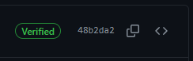

<!--
SPDX-FileCopyrightText: © 2023 Siemens Healthcare GmbH

SPDX-License-Identifier: MIT
-->

# Contributor License Agreement
There are two versions of the Contributor License Agreement (CLA). 
The contributor should be able to chose the right one: 

* contribution by an individual [CLA Individual Contributor](./CLA-IndividualContributor.md) 
* contribution by his/her employer (typically a legal entity) [CLA Corporate Contributor](./CLA-CorporateContributor.md).

The CLA is drafted for re-use for any contributions the (same) contributor makes, so that it needs to be signed only once.
This CLA does not enable Siemens Healthineers to use or process personal data. The contributor must not contribute personal data according to this CLA.

# Contributing with code
- [Contributor License Agreement](#contributor-license-agreement)
- [Contributing with code](#contributing-with-code)
  - [Clone *Git* Repository](#clone-git-repository)
  - [Codebase Structure](#codebase-structure)
  - [Building Locally](#building-locally)
    - [Workspace Prerequisites](#workspace-prerequisites)
    - [Build *Go* projects](#build-go-projects)
  - [Testing](#testing)
    - [Tags/Labels](#tagslabels)
      - [*Pester* Example](#pester-example)
      - [*Ginkgo* Example](#ginkgo-example)
      - [Commonly Used Tags](#commonly-used-tags)
    - [Pester Specifics](#pester-specifics)
    - [Ginkgo/Gomega Specifics](#ginkgogomega-specifics)
      - [Log Output Redirection](#log-output-redirection)
  - [Submit Changes](#submit-changes)

---

The code is mainly written in *Go* and *PowerShell*. See [*PowerShell* Scripts Development](powershell_dev.md) for more information about *PowerShell* development.

## Clone *Git* Repository

```shell
> mkdir c:\myFolder; cd c:\myFolder
C:\myFolder> git clone https://github.com/Siemens-Healthineers/K2s .
```


## Codebase Structure
<pre>
├── addons
├── bin
├── build
├── cfg         --> Configuration files
├── doc
├── LICENSES
└── pkg         --> Go based projects
    ├── base
    ├── network
    ├── k2s
    └── util
├── smallsetup  --> PowerShell scripts
├── test
├── README.md
├── k2s.exe
└── VERSION
</pre>

## Building Locally

### Workspace Prerequisites

All the prerequisites mentioned in [Install Prerequisites](../k2scli/install-uninstall_cmd.md#installing) are necessary.

* Install [*Go*](https://go.dev/dl/) for *Windows*.

### Build *Go* projects

Building *Go* based projects is done through [BuildGoExe.ps1](../../smallsetup/common/BuildGoExe.ps1)

> `bgo.cmd` is a shortcut command to invoke script BuildGoExe.ps1.

If you have not installed *K2s* yet, then your PATH is not updated with required locations. In this case, look for bgo.cmd and invoke the build command. In the below example, `c:\k` is the root of our *Git* repo.

```PowerShell
PS> where.exe bgo
C:\k\bin\bgo.cmd
```

Building `httpproxy` *Go* project:

```PowerShell
PS> C:\k\bin\bgo -ProjectDir "C:\k\k2s\cmd\httpproxy\" -ExeOutDir "c:\k\bin"
```

 <span style="color:orange;font-size:medium">**💡**</span> `k2s` CLI can be built without any parameters:
```PowerShell
PS> C:\k\bin\bgo
```

To build all *Go* executables:
```PowerShell
PS> C:\k\bin\bgo -BuildAll 1
```

If *K2s* is installed then just simply execute command without full path.
```PowerShell
PS> bgo -ProjectDir "C:\k\k2s\cmd\httpproxy\" -ExeOutDir "c:\k\bin"
PS> bgo -BuildAll 1
```
---
## Testing 

<span style="color:orange;font-size:medium">**⚠** </span> Prerequisites: [Install *Pester*](powershell_dev.md#install-pester) and [Install *Ginkgo*](https://onsi.github.io/ginkgo/#installing-ginkgo).

When you have made changes either to PowerShell scripts or Go projects, you can run all test suites in the repository via:

```PowerShell
PS> c:\k\k2s\test\execute_all_tests.ps1
```
<span style="color:orange;font-size:medium">**⚠** </span> Acceptance/e2e/system tests might require a running *K2s* cluster. See also [*K2s* Acceptance Testing](../../k2s/test/README.md).

To filter tests for e.g. executing only unit tests, use the **-Tags** and **-ExcludeTags** parameters:
```PowerShell
PS> c:\k\k2s\test\execute_all_tests.ps1 -Tags unit
```

> Inspect the script for further parameter details and descriptions.

### Tags/Labels
To control which tests or test types shall be executed in which context/environment, tags/labels can be utilized.
> See [*Pester* Tag Documentation](https://pester.dev/docs/usage/tags) for information about tagging/labelling Pester tests.<br/>
> See [*Ginkgo* Spec Labels Documentation](https://onsi.github.io/ginkgo/#spec-labels) for information about tagging/labelling Ginkgo tests.

#### *Pester* Example
Define one or more tags at any level of a test container:
```PowerShell
Describe 'Get-Status' -Tag 'unit', 'addon' {
    # ...
}
```
Execute tests with tag *unit*:
```sh
PS> Invoke-Pester <dir-with-test-files> -Tag unit
```

#### *Ginkgo* Example
Define one or more tags at any level of a test node, here for a whole test suite:
```Go
// ...
func TestHttpproxyUnitTests(t *testing.T) {
	RegisterFailHandler(Fail)
	RunSpecs(t, "httpproxy Unit Tests", Label("unit", "ci"))
}
// ...
```
Execute tests with tag *unit*:
```sh
PS> ginkgo --label-filter="unit" <dir-with-test-suites>
```

#### Commonly Used Tags
| Name                     | Description                                                                                                                |
| ------------------------ | -------------------------------------------------------------------------------------------------------------------------- |
| **acceptance**           | end-to-end test/executable spec in production-like scenario                                                                |
| **integration**          | test requiring certain external resources/systems to be reachable or additional software to be installed                   |
| **unit**                 | test can be executed in isolation, all dependencies to the environment are mocked                                          |
| **ci**                   | test that is fast-running and therefore applicable to CI runs; applies most likely to all unit tests                       |
| **addon**                | test is addon-related and does not test *K2s* core functionality                                                           |
| **internet-required**    | test requires internet connectivity, e.g. for package downloads                                                            |
| **invasive**             | test changes either state of the host system or *K2s* installation                                                         |
| **read-only**            | test does not change state of the host system or *K2s* installation; optional, since read-only tests should be the default |
| **setup-required**       | test requires *K2s* to be installed; currently, the tests determine the setup type in the test runs                        |
| **no-setup**             | *K2s* must not be installed on the system to test pre-installation behavior                                                |
| **setup=\<setup name\>** | *K2s* setup type must match, e.g. *setup=k2s* or *setup=MultiVMK8s*                                                        |
| **system-running**       | test requires *K2s* to be started/running                                                                                  |
| **system-stopped**       | test requires *K2s* to be stopped                                                                                          |

### Pester Specifics
See [Automated Testing with Pester](powershell_dev.md#automated-testing-with-pester).

### Ginkgo/Gomega Specifics
#### Log Output Redirection
For diagnostic logging, *k2s* CLI uses [slog](https://pkg.go.dev/log/slog). To redirect the log output to *Ginkgo*, set the *Ginkgo* logger as follows (*Ginkgo* uses [logr](https://github.com/go-logr/logr/) internally):

```go
var _ = BeforeSuite(func() {
	slog.SetDefault(slog.New(logr.ToSlogHandler(GinkgoLogr)))
})
```

This enables control over *slog* output, i.e. the output can be enabled when running *Ginkgo* in verbose mode (`ginkog -v`) and be omitted in non-verbose mode.

## Submit Changes
The following guidelines apply to submitting changes to *K2s*:
- only commit changes when a corresponding issue exists and the maintainers have agreed that this issue is going to be realized (see [K2s Issues](https://github.com/Siemens-Healthineers/K2s/issues))
- since *K2s* is open source, we utilize the *GitHub's* [Pull Requests](https://docs.github.com/en/pull-requests) workflow:
  - forking the repo (applies to all non-maintainers)
  - creating a separate branch, commit to that branch and push
  - create a PR in *K2s* repo. This will trigger at least short-running automated tests.
  - the PR will be reviewed by the maintainers. If re-work is needed, preceding steps will be iterated. If the changes are acceptable, the PR will be merged to main.
- reference the issue in commit messages, e.g. for a refactoring issue with ID 42, create a message like `#42 refactor(addons): obsolete code path removed`. **Note:** This example also uses [Conventional Commits](https://www.conventionalcommits.org/en/v1.0.0/), which is not mandatory, but recommended.
- sign your commits
  - signing commits increases trust in your contributions. Verified commit signatures will be display in GitHub like this: 
  
    Further readings: [Displaying verification statuses for all of your commits](https://docs.github.com/en/authentication/managing-commit-signature-verification/displaying-verification-statuses-for-all-of-your-commits)
  - if you do not have a GPG key yet, see [Generating a new GPG key](https://docs.github.com/en/authentication/managing-commit-signature-verification/generating-a-new-gpg-key). **Note:** If you are running on *Windows*, you can use the *Git bash* for `gpg` commands
  - if you have a GPG key in place, sign your commits. According to [Signing commits](https://docs.github.com/en/authentication/managing-commit-signature-verification/signing-commits), the following options exist:
    - sign every commit with `git commit -S -m "YOUR_COMMIT_MESSAGE"`
    - enable GPG signature for the whole local repo with `git config commit.gpgsign true`
    - enable GPG signature for all local repos with `git config --global commit.gpgsign true`
    
    **Note:** To avoid entering the passphrase for the GPG key too often, you can increase the expiration time, e.g. on *Windows* using [Gpg4win](https://gpg4win.org/download.html) (see [How do I install and use gpg-agent on Windows?](https://stackoverflow.com/a/66821816)). Alternatively, these settings can also be modified in this file: `C:\Users\<user>\AppData\Roaming\gnupg\gpg-agent.conf`
  - see [Managing commit signature verification](https://docs.github.com/en/authentication/managing-commit-signature-verification) for more information
- run as many automated tests as possible, but at least the unit tests :`<repo>\k2s\test\execute_all_tests.ps1 -Tags unit`. Depending on the area of changes, consider running the appropriate e2e tests as well