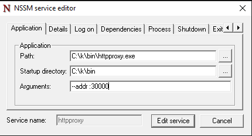
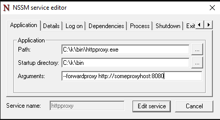
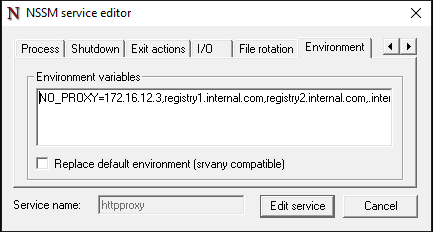
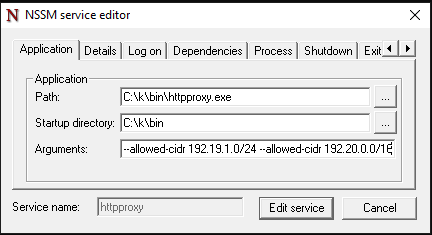

<!--
SPDX-FileCopyrightText: © 2023 Siemens Healthcare GmbH

SPDX-License-Identifier: MIT
-->
# Configuring HTTPProxy Service
The HTTPProxy service is a proxy server that can be used to provide external network access to Virtual Machines running in Hyper-V without setting up a NAT network. 

During k2s installation, HTTPProxy is deployed as a Windows Service.

By default, HTTPProxy service listens for requests on **ALL** available interfaces at port **8181**.

The logs for HTTPProxy service are in directory **<InstallationDrive>\var\log\httpproxy**. For example, if k2s is installed in directory *D:\k2s* then HTTPProxy service logs will be available in directory *D:\var\log\httpproxy*

## Customize HTTPProxy listen port
HTTPProxy can be started on a different port using the **addr** parameter. For example, if we want to start HTTPProxy service on Windows 10 Hyper-V host at port 30000, then the it can be achieved as follows:
```
httpproxy --addr ":30000"
```
To edit the windows service deployed by k2s, we can use **NSSM** to modify the parameters with which the service is started by adding *--addr ":30000"* as shown below:



## Configuring Forward Proxy
In some cases, the Windows 10 host itself receives internet connection via an internet proxy. In these cases, the HTTPProxy service must forward the requests to this internet proxy.

This can be achieved by using the **--forward-proxy** parameter as shown below.
```
httpproxy --forward-proxy http://someproxyhost:8080
```
In the above example, the internet proxy is available on url *http://someproxyhost:8080*. In this case, the outgoing requests are forwarded to the internet through HTTPProxy via the the internet proxy.

Using the NSSM UI, it can be achieved as shown below:




### Configuring NO_PROXY with Forward Proxy
In some case, when the Windows 10 host receives internet connection via an internet proxy, certain requests are not meant to be forwarded to the Internet. For example, we would want to pull a container image from a container registry hosted over the intranet. In these cases, the environment variable **NO_PROXY** can be appropriately configured on the host or in the NSSM UI.

For example, we want to pull images from a container registry *registry.internal.com* we can configure the NO_PROXY variable as follows
```
NO_PROXY=registry.internal.com
```
Multiple hosts or domain names can be specified in NO_PROXY separated by a comma as shown below
```
NO_PROXY=172.16.12.3,registry1.internal.com,registry2.internal.com,.internal.io
```
In the above example, *.internal.io* is used to represent domain *internal.io*.
Similarly, we can also configure IP addresses in NO_PROXY. However, adding Network CIDRs or subnets is not supported.

The NO_PROXY environment variable can be configured as a system environment variable or as a process environment variable. For HTTPProxy windows service, we can set the NO_PROXY as a process environment variable in the **Environment** tab of the NSSM's *Edit* UI as shown below:




## Configure Listen Interfaces
In some cases, HTTPProxy should be used to provide internet access to only certain networks. In this case, we can specify the network CIDRs of the interfaces for which HTTPProxy must provide internet access.

For example, if HTTPProxy must provide internet access to network with CIDR 192.19.1.0/24 and 192.20.0.0/16, then we can start the HTTPProxy service with the following parameters
```
httpproxy --allowed-cidr 192.19.1.0/24 --allowed-cidr 192.20.0.0/16
```
In this case, only the virtual machines, running in the two configured networks, would have internet access. 

In the NSSM UI, we can add additional interfaces using *--allowed-cidr* to the service parameters.



