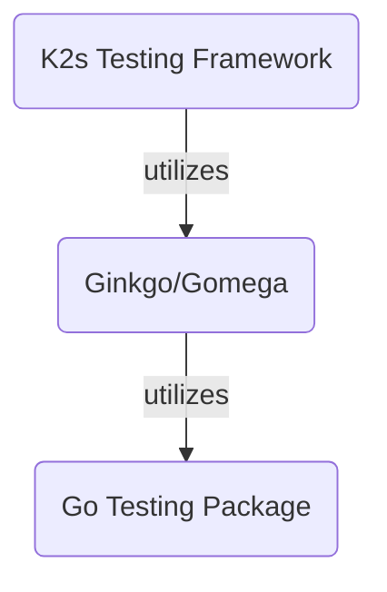

<!--
SPDX-FileCopyrightText: © 2024 Siemens Healthcare GmbH
SPDX-License-Identifier: MIT
-->

# Automated Testing
## Automate Everything
The ultimate goal is to automate every test case and type, i.e.:

- Unit tests
- Integration Tests
- e2e tests / system tests / acceptance tests / executable specifications (BDD-style, see also [*K2s* Acceptance Testing](#k2s-acceptance-testing))

!!! info
    Acceptance tests might require a running *K2s* cluster.

## Prerequisites
[Install *Pester*](#install-pester) and [Install *Ginkgo*](https://onsi.github.io/ginkgo/#installing-ginkgo){target="_blank"}.

!!! tip
    When running the [Main Script: execute_all_tests.ps1](#main-script-execute_all_testsps1) for the first time, those prerequisites are installed automatically in the correct version.
  
## Main Script: execute_all_tests.ps1
The main entry point for automated testing is the script `execute_all_tests.ps1`, whether being executed locally or in CI/CD workflows. It is not mandatory, but recommended to use this script instead of running *Pester* or *Ginkgo* commands directly due to the following features of the `execute_all_tests.ps1` script:

- Run all test suites in this repository (*PowerShell*- or *Go*-based tests)
- Automatic installation of the required testing frameworks on-the-fly when they do not exist in the required version (i.e. *Pester* and *Ginkgo*)
- Tags/labels filtering that applies both to *PowerShell* and *Go*
- Options to exclude either *PowerShell* or *Go* tests
- Unified test execution report

!!! example
    ```powershell
    <repo>\test\execute_all_tests.ps1 -Tags unit -ExcludeGoTests
    ```

The preceding example would execute all *PowerShell*-based tests tagged with `unit`.

!!! tip
    Inspect the [execute_all_tests.ps1](https://github.com/Siemens-Healthineers/K2s/blob/main/test/execute_all_tests.ps1){target="_blank"} script for further parameter details and descriptions.<br/>
    See [Commonly Used Tags](tags-labels.md#commonly-used-tags) for commonly used labels/tags.
    
## Automated Testing with Pester
!!! note
    For a quick start and command overview, see [Pester Quick Start](https://pester.dev/docs/quick-start){target="_blank"}.
### Install Pester
!!! info
    [Pester](https://github.com/pester/Pester){target="_blank"} comes pre-installed on Win 10 or later.

To check the installed version, run:
```PowerShell
Import-Module Pester -Passthru
```

This output will be similar to:
``` title="Output"
ModuleType Version    Name    ExportedCommands
---------- -------    ----    ----------------
Script     3.4.0      Pester  {AfterAll, AfterEach, Assert-MockCalled, Assert-VerifiableMocks...}
```
!!! tip
    It is highly recommended to update Pester to the latest version to have a consistent set of test APIs.
 
### Update Pester
If Pester was not installed explicitly yet (i.e., the version shipped with Windows is installed), run:
```PowerShell
Install-Module Pester -Force -SkipPublisherCheck
```

For subsequent updates, run:
```PowerShell
Update-Module -Name Pester
```

### Run Pester
To start test discovery and execution, run:
```PowerShell
Invoke-Pester .\<test file>.tests.ps1
```
!!! info
    Pester discovers test files via naming convention **\*.\[T|t\]ests.ps1**

To see detailed output, run:
```PowerShell
Invoke-Pester -Output Detailed .\<test file>.Tests.ps1
```
To include/exclude tests by tags, run:
```PowerShell
Invoke-Pester -Tag "acceptance" -ExcludeTag "slow", "linuxOnly" .\<test file>.Tests.ps1
```

#### Code Coverage
To calculate the code coverage of a test run, additionally specify the file(s) under test:
```PowerShell
Invoke-Pester .\<test file>.Tests.ps1 -CodeCoverage .\<file-under-test>.ps1
```

To export the code coverage results as [JaCoCo](https://www.jacoco.org/){target="_blank"} XML file, specify the output file:
```PowerShell
Invoke-Pester .\<test file>.Tests.ps1 -CodeCoverage .\<file-under-test>.ps1 -CodeCoverageOutputFile <some dir>\coverage.xml
```

!!! note
    See [Pester Code Coverage](https://pester.dev/docs/usage/code-coverage/){target="_blank"} for more options.

### Log Output Redirection
When executing *K2s* scripts inside *Pester* test functions, it is recommended to execute these scripts in a separate *PowerShell* session, so that the called scripts still log to the *K2s* log files due to the current logging implementation.

#### Don't
```PowerShell
# ...
$enableScript = "$PSScriptRoot\Enable.ps1"
# ...
It 'does not log to log file :-(' {
    $output = $(&$enableScript -ShowLogs) *>&1 # output redirect, but no log file entries
    # ...
}
# ...
```

#### Do
```PowerShell
# ...
$enableScript = "$PSScriptRoot\Enable.ps1"
# ...
It 'logs to log file :-)' {
    $output = powershell -Command "$enableScript -ShowLogs" *>&1 # output redirect and log file entries
    # ...
}
# ...
```

### Suppress Code Analysis
*Pester* requires a certain test code structure that can lead to code analyzer warnings, e.g. in this case:
```PowerShell
BeforeAll {
    $module = "$PSScriptRoot\setupinfo.module.psm1"

    $moduleName = (Import-Module $module -PassThru -Force).Name
}
```
The analyzer would complain:
!!! quote
    The variable 'moduleName' is assigned but never used. *PSScriptAnalyzer(PSUseDeclaredVarsMoreThanAssignments)*

To mitigate this, suppress this warning like the following:
```PowerShell
BeforeAll {
    $module = "$PSScriptRoot\setupinfo.module.psm1"

    [Diagnostics.CodeAnalysis.SuppressMessageAttribute('UseDeclaredVarsMoreThanAssignments', '', Justification = 'Pester Test')]
    $moduleName = (Import-Module $module -PassThru -Force).Name
}
```

## Automated Testing with Ginkgo/Gomega
### Log Output Redirection
For diagnostic logging, *k2s* CLI uses [slog](https://pkg.go.dev/log/slog){target="_blank"}. To redirect the log output to *Ginkgo*, set the *Ginkgo* logger as follows (*Ginkgo* uses [logr](https://github.com/go-logr/logr/){target="_blank"} internally):
```go
var _ = BeforeSuite(func() {
	slog.SetDefault(slog.New(logr.ToSlogHandler(GinkgoLogr)))
})
```

This enables control over *slog* output, i.e. the output can be enabled when running *Ginkgo* in verbose mode (`ginkog -v`) and be omitted in non-verbose mode.

### *K2s* Acceptance Testing
!!! info
    **The acceptance tests focus on testing *K2s* from a user's point of view** in an automated, repeatable and reproduceable fashion. They are intended to cover all available features across the various [Supported OS Versions](../../op-manual/os-support.md). They are not intended to cover all the edge and corner cases, though (Unit Tests might be a better fit there).

**To mark acceptance tests as such** and provide additional information about test prerequisites (e.g. a running *K2s* cluster, internet connectivity, etc.), **use [Tags/Labels](tags-labels.md)**.

#### Tech Stack
The tech stack mostly comprises the [*Go* testing package](https://pkg.go.dev/testing){target="blank"}, [*Ginkgo*](https://onsi.github.io/ginkgo/#top){target="blank"}/[*Gomega*](https://onsi.github.io/gomega/#top){target="blank"} and the *[K2s Testing Framework](https://github.com/Siemens-Healthineers/K2s/blob/main/k2s/test/framework/README.md){target="blank"}* to write acceptance tests in an efficient way without having to write boilerplate code repeatedly. The levels of abstraction are depicted in the following:



#### Implementing Tests/Specs
See [*K2s* Acceptance Tests/Specs](https://github.com/Siemens-Healthineers/K2s/blob/main/k2s/test/README.md){target="blank"}.

#### Executing Tests/Specs
Multiple options exist to run *Go*-based test specs:

- [Main Script: execute_all_tests.ps1](#main-script-execute_all_testsps1) - Recommended, provides most flexibility
- Running *Ginkgo*:
    ```console
    ginkgo <dir-with-test-specs>
    ```
- Running `go test`:
    ```console
    cd <dir-with-test-specs>
    go test 
    ```

!!! tip "Ginkgo and go test"
    Use `-v` flag to enable verbose test execution output.
    
    Use `-r` or `./...` to scan for and execute tests recursively starting in the given directory.

!!! tip "Optimizing Test Execution Speed"
    When executing *Go*-based tests, the packages containing the test specs will get built right before test execution. This compilation is rather time-consuming compared to the actual test runs, especially when executing short-running unit tests.

    To optimize the overall execution speed, the packages containing test specs can be build before hand, either through `ginkgo build` or `go test -c`.