<!--
SPDX-FileCopyrightText: © 2026 Siemens Healthineers AG
SPDX-License-Identifier: MIT
-->

# GPU-Node Addon Roadmap: Aligning K2s with K3s / Vanilla Kubernetes

## 1. Executive Summary

K2s currently uses a **legacy OCI prestart hook** to inject NVIDIA GPU support into
every container. Vanilla Kubernetes and K3s have moved to a **runtime-handler +
RuntimeClass** model (and increasingly **CDI — Container Device Interface**). This
roadmap describes the phased migration to bring K2s GPU workloads in line with the
upstream ecosystem.

---

## 2. Current State vs Target

### K2s Today — Global OCI Hook

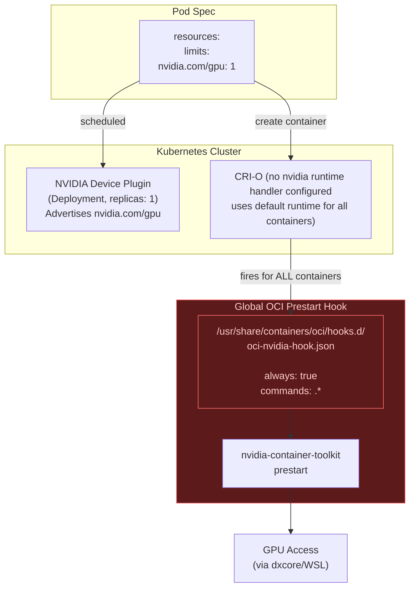

**Problems with current approach:**

| Issue | Impact |
|-------|--------|
| Hook fires for **ALL** containers | Wasteful, potential errors on non-GPU pods |
| No `RuntimeClass` | Pods can't explicitly request GPU runtime |
| No `nvidia-ctk runtime configure` | CRI-O has no nvidia handler registered |
| Not aligned with K3s/K8s ecosystem | Users can't use standard pod specs |
| Device Plugin is a Deployment | Not idiomatic for per-node daemon |
| WSL2: Linux VM cannot TCP-connect to Windows proxy | ~~apt and CRI-O image pulls fail in WSL2 mode~~ **Fixed in Phase 0** (SSH reverse tunnel + buildah pre-pull) |
| DCGM crashes on both GPU modes | NVML unavailable on dxcore path (confirmed) — **non-fatal since Phase 0** |

### Target — Runtime Handler + RuntimeClass (Phase 1)

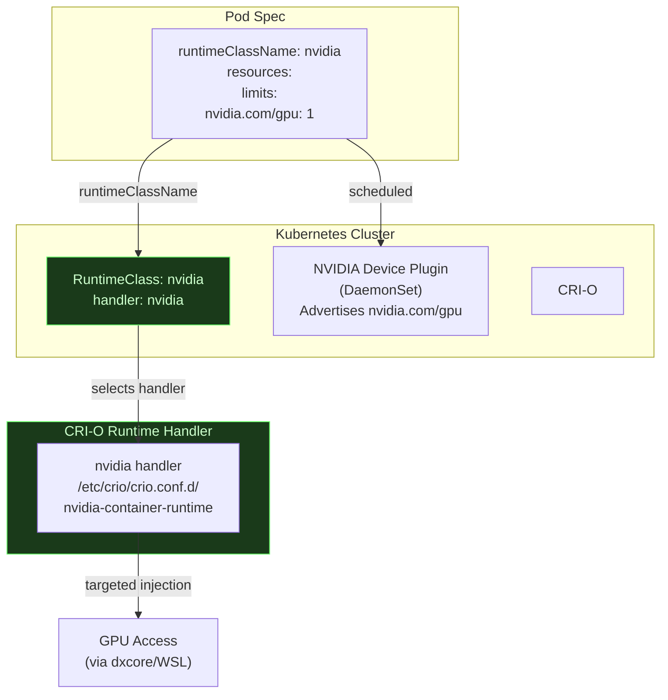

### Future — CDI-First (Phase 2)

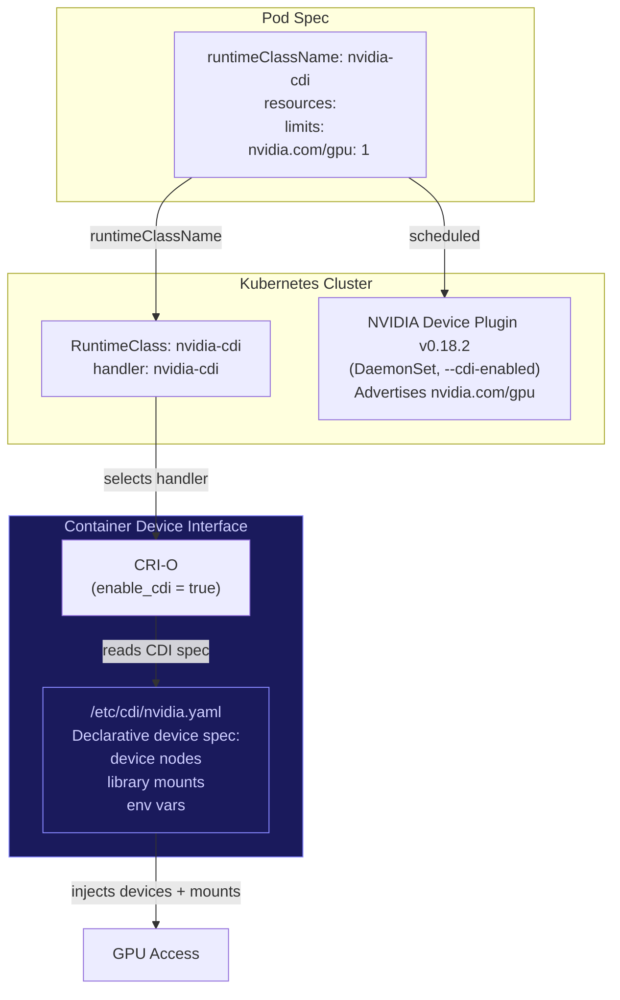

---

## 3. How Each Distribution Handles GPU Workloads

### 3.1 Vanilla Kubernetes (containerd or CRI-O)

```mermaid
sequenceDiagram
    participant Admin as Cluster Admin
    participant Node as GPU Node
    participant K8s as Kubernetes API
    participant Pod as GPU Pod

    rect rgb(20, 40, 80)
    Note over Admin,Node: Step 1: Node-level setup (once)
    Admin->>Node: Install NVIDIA driver
    Admin->>Node: Install NVIDIA Container Toolkit
    Admin->>Node: nvidia-ctk runtime configure --runtime=crio
    Admin->>Node: systemctl restart crio
    end

    rect rgb(20, 60, 20)
    Note over Admin,K8s: Step 2: Cluster resources
    Admin->>K8s: kubectl apply RuntimeClass (name: nvidia, handler: nvidia)
    Admin->>K8s: kubectl apply NVIDIA Device Plugin DaemonSet
    end

    rect rgb(60, 40, 10)
    Note over Pod,K8s: Step 3: Workload
    Pod->>K8s: Create Pod with runtimeClassName: nvidia + nvidia.com/gpu: 1
    K8s->>Node: Schedule pod to GPU node
    Node->>Node: CRI-O uses nvidia handler → injects GPU
    Node->>Pod: Container starts with GPU access
    end
```

**Key characteristics:**

- Manual setup of runtime handler via `nvidia-ctk`
- Explicit `RuntimeClass` resource required
- Device plugin as DaemonSet
- Pod specifies `runtimeClassName: nvidia`

### 3.2 K3s (Automated Detection)

```mermaid
sequenceDiagram
    participant Admin as Cluster Admin
    participant K3s as K3s Server
    participant CT as containerd (embedded)
    participant K8s as Kubernetes API

    rect rgb(20, 40, 80)
    Note over Admin,K3s: Step 1: Install prerequisites
    Admin->>K3s: Install NVIDIA driver
    Admin->>K3s: Install NVIDIA Container Toolkit
    Admin->>K3s: Restart K3s
    end

    rect rgb(20, 60, 20)
    Note over K3s,K8s: Step 2: K3s auto-detection (automatic!)
    K3s->>CT: Detects nvidia binaries on PATH
    K3s->>CT: Auto-configures nvidia runtime handler
    K3s->>K8s: Auto-creates RuntimeClass objects
    Note over K8s: RuntimeClasses created:\n• nvidia\n• nvidia-cdi\n• nvidia-experimental
    end

    rect rgb(60, 40, 10)
    Note over Admin,K8s: Step 3: Deploy device plugin & run workloads
    Admin->>K8s: Deploy NVIDIA Device Plugin
    Admin->>K8s: Deploy GPU pods with runtimeClassName: nvidia
    end
```

**Key characteristics:**

- **Auto-detection** of NVIDIA toolkit on K3s (re)start
- **Auto-creation** of RuntimeClass objects
- Uses embedded containerd (not CRI-O)
- Optional: `--default-runtime=nvidia` eliminates need for `runtimeClassName` in pods

### 3.3 K2s (Current Implementation)

```mermaid
sequenceDiagram
    participant User as User
    participant K2s as k2s.exe CLI
    participant PS as Enable.ps1
    participant VM as KubeMaster VM
    participant K8s as Kubernetes API

    User->>K2s: k2s addons enable gpu-node

    rect rgb(70, 20, 20)
    Note over PS,VM: Hyper-V GPU-PV path (non-WSL)
    PS->>VM: Stop VM
    PS->>VM: Add-VMGpuPartitionAdapter
    PS->>VM: Start VM
    PS->>VM: Copy NVIDIA drivers from host
    PS->>VM: Install WSL2 kernel (for dxcore)
    PS->>VM: Restart VM with new kernel
    end

    rect rgb(20, 40, 70)
    Note over PS,VM: WSL2 path — proxy tunnel (confirmed working 2026-02-27)
    PS->>VM: Verify WSL switch IP (reassign if lost)
    PS->>VM: Kill stale sshd on port 8181 (sudo ss + /proc/comm)
    PS->>PS: Start SSH reverse tunnel Windows→Linux port 8181
    PS->>VM: Patch apt proxy.conf → 127.0.0.1:8181
    end

    rect rgb(20, 60, 20)
    Note over PS,VM: Common path (both WSL and Hyper-V)
    PS->>VM: Install nvidia-container-toolkit (APT)
    PS->>VM: Create OCI prestart hook (global, always: true)
    Note over VM: ❌ No nvidia-ctk runtime configure
    Note over VM: ❌ No RuntimeClass created
    end

    rect rgb(20, 40, 70)
    Note over PS,VM: WSL2 image pre-pull (confirmed working 2026-02-27)
    PS->>VM: buildah pull (device-plugin + dcgm-exporter) via HTTPS_PROXY=127.0.0.1:8181
    Note over VM: No CRI-O restart needed — buildah pulls directly
    PS->>VM: Restore apt proxy.conf → 172.19.1.1:8181
    PS->>PS: Stop SSH tunnel
    end

    rect rgb(30, 20, 70)
    Note over PS,K8s: Deploy Kubernetes resources
    PS->>K8s: kubectl apply nvidia-device-plugin (Deployment)
    PS->>K8s: kubectl patch device-plugin (WSL2: LD_LIBRARY_PATH + wsl-libs + privileged)
    PS->>K8s: kubectl delete pod (WSL2 only — force spec pickup after patch)
    PS->>K8s: kubectl apply dcgm-exporter (DaemonSet)
    Note over K8s: DCGM crashes (NVML unavailable on dxcore) — non-fatal on both modes
    end
```

---

## 4. Detailed Gap Analysis

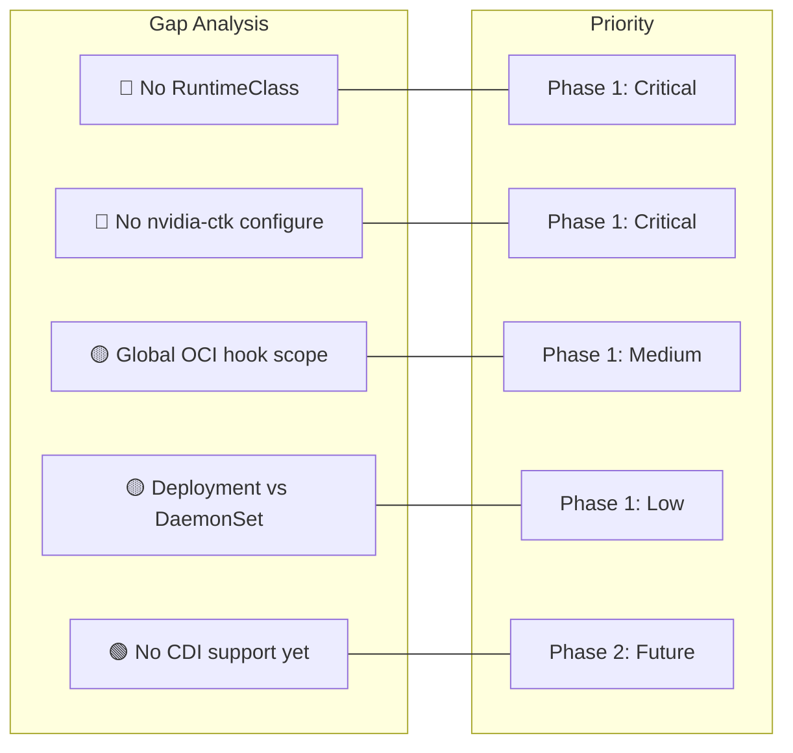

| Capability | Vanilla K8s | K3s | K2s (current) | Gap Severity |
|---|---|---|---|---|
| Container runtime | containerd or CRI-O | containerd (embedded) | CRI-O | — |
| GPU device injection | Runtime handler | Auto-configured handler | Global OCI hook | 🔴 Major |
| `nvidia-ctk runtime configure` | Yes (manual) | Automatic | **Not done** | 🔴 Major |
| `RuntimeClass` resource | Yes (manual) | Auto-created | **Not present** | 🔴 Major |
| Pod `runtimeClassName` | `nvidia` | `nvidia` / `nvidia-cdi` | **Not used** | 🔴 Major |
| Hook scope | Targeted (GPU pods only) | Targeted | Global (all containers) | 🟡 Medium |
| CDI support | Yes (modern path) | Yes (`nvidia-cdi`) | **No** | 🟢 Future |
| CDI on WSL2/dxcore | Yes | Yes | Infrastructure ✅ (2026-03-03): CDI spec at `/etc/cdi/nvidia.yaml` generated, CRI-O 1.35 CDI built-in, `/dev/dxg` accessible. **Blocked (2026-03-03):** `cdi-annotations` on v0.18.2/fb1242ad tested live — device plugin starts but CRI-O cannot resolve CDI devices; adding `/etc/cdi` mount causes NVML init failure. **Root cause: NVML unavailable on WSL2/dxcore — fundamental constraint, not a version issue.** | 🔴 Blocked |
| Device plugin type | DaemonSet | DaemonSet | Deployment (replicas:1) | 🟡 Minor |
| DCGM-Exporter | Optional | Optional | Included (fails on GPU-PV) | — |
| Offline support | Manual | Manual | **Built-in** (export/import) | ✅ K2s ahead |

---

## 5. Implementation Plan

### Phase 0 (Completed 2026-02-27): WSL2 Online Mode Fixes

The following bugs were confirmed and fixed, making `k2s addons enable gpu-node`
work end-to-end in WSL2 online mode for the first time.

#### Fixed: `common-setup.module.psm1` — WSL VM network broken since install

**File:** `lib/modules/k2s/k2s.node.module/linuxnode/distros/common-setup.module.psm1` line 1082  
**Scope:** Affects `k2s install` WSL2 mode — VM networking at every boot.

Spurious PowerShell `""` double-quote escaping in the `wsl.conf` `boot.command` written
during `Add-SupportForWSL` caused the shell to treat the quoted portion as a single
token, silently failing both `ifconfig` calls. Only `route add default gw` ran,
leaving the VM interface without an IP address after every reboot.

| | Before | After |
|---|---|---|  
| Written to `/etc/wsl.conf` | `command = "sudo ifconfig eth0 ... && sudo ifconfig eth0 netmask ..." && sudo route add ...` | `command = sudo ifconfig eth0 ... && sudo ifconfig eth0 netmask ... && sudo route add ...` |
| ifconfig IP assign | ❌ Silent fail (quoted as word) | ✅ Executes |
| ifconfig netmask assign | ❌ Silent fail | ✅ Executes |
| route add | ✅ (accidentally) | ✅ |

> **Impact on existing clusters:** The broken `wsl.conf` is already written. Existing
> WSL2 clusters need a manual fix or reinstall to benefit. New installs are correct.

#### Fixed: `Enable.ps1` — WSL2 package/image downloads always failed

WSL2 Linux VM cannot initiate TCP connections to the Windows host vEthernet IP
(`172.19.1.1`) — an architectural WSL2 constraint. Both apt and CRI-O were
configured to use `172.19.1.1:8181` as their proxy, so all downloads failed.

| Fix | Mechanism |
|---|---|
| SSH reverse tunnel | Windows SSH client connects out to Linux, binds `127.0.0.1:8181` inside Linux, forwards to `172.19.1.1:8181` on Windows |
| Stale port cleanup | `sudo ss -tlnp` + `/proc/$pid/comm` check — only kills `sshd` holding port 8181 |
| apt proxy patch | `sed` patches `/etc/apt/apt.conf.d/proxy.conf` to `127.0.0.1:8181` while tunnel active; restored in `finally` |
| buildah pre-pull | `sudo HTTPS_PROXY=http://127.0.0.1:8181 buildah pull` fetches deployment images directly — no CRI-O restart required |
| PowerShell exit/finally | `exit` inside `try` skips `finally` in PowerShell — replaced with `$installFailed = $true; return` + post-block `if ($installFailed) { exit 1 }` |
| Device plugin patch | WSL2 only: `kubectl patch` adds `LD_LIBRARY_PATH=/usr/lib/wsl/lib` + `wsl-libs` hostPath volume + `privileged:true`; pod deleted to pick up immutable spec change |

#### Fixed: `Enable.ps1` — DCGM fatal on WSL2 (incorrect assumption)

Original code assumed NVML works in WSL2 mode and treated DCGM failure as fatal.
Confirmed (2026-02-27): WSL2 uses the same dxcore/GPU-PV path as Hyper-V — NVML
cannot initialize on either. DCGM failure is now non-fatal (warning only) on both modes.
DCGM timeout unified to 30s (was 300s for WSL2 — pointless when pod crashes in <1s).

#### Fixed: `addon.manifest.yaml` — deployment images missing from offline export

`additionalImages` only listed `microsoft-standard-wsl2`. The two deployment images
(`nvidia-device-plugin`, `dcgm-exporter`) were never exported/imported, breaking
offline mode on both Hyper-V and WSL2. All missing images added to `additionalImages`
(4 total: WSL2 kernel, device-plugin, dcgm-exporter, test image `nvcr.io/nvidia/cuda:12.3.0-base-ubuntu22.04`).

---

### Phase 0: Pre-Phase 1 Fixes (Completed)

The following pre-existing gap in `Disable.ps1` has been fixed. Previously,
`k2s addons disable gpu-node` deleted the Kubernetes manifests but left the OCI hook
and `nvidia-container-toolkit` packages on the VM. Now `Disable.ps1` removes them
before K8s resource deletion:

**Fix — added to `Disable.ps1` before K8s resource deletion:**

```powershell
# Remove OCI hook left by Enable.ps1
Invoke-SSHWithKey "sudo rm -f /usr/share/containers/oci/hooks.d/oci-nvidia-hook.json"

# Remove nvidia-container-toolkit packages
Invoke-SSHWithKey "sudo apt-get remove -y nvidia-container-toolkit libnvidia-container1 libnvidia-container-tools nvidia-container-runtime 2>/dev/null || true"
```

This fix is included in the Phase 0 changeset.

#### Additional Phase 0 Changes

The following improvements were made as follow-ups to the initial Phase 0 fixes:

| Change | Detail |
|--------|--------|
| **CUDA test image replaced** | Old `k8s.gcr.io/cuda-vector-add:v0.1` (1.99 GB, 8 years old) failed with `cudaErrorInsufficientDriver` on WSL2. Replaced with `nvcr.io/nvidia/cuda:12.3.0-base-ubuntu22.04` (87 MB compressed) across all 5 files |
| **nvidia-smi non-fatal** | Test pod runs `nvidia-smi` as best-effort: `nvidia-smi 2>&1 \|\| echo 'unavailable'`. NVML fails inside containers on dxcore/GPU-PV ("GPU access blocked by the operating system") even though it works on the bare VM. Test assertions only check for `Test PASSED` and `Done` — nvidia-smi output is a bonus on native GPU passthrough |
| **Device plugin WSL2 patch** | `kubectl patch` adds `LD_LIBRARY_PATH=/usr/lib/wsl/lib`, `wsl-libs` hostPath volume, and `privileged:true` on WSL2. Pod deleted and recreated to pick up immutable spec change |
| **buildah pre-pull** | Replaced broken `crictl pull` + CRI-O restart with `buildah pull` using inline `HTTPS_PROXY=127.0.0.1:8181`. No CRI-O restart needed |
| **Test image removed from pre-pull** | Test image (`nvcr.io/nvidia/cuda:12.3.0-base-ubuntu22.04`) removed from `Enable.ps1` pre-pull list — test images are not addon runtime dependencies |
| **Stale pod handling in test** | `kubectl delete pod cuda-vector-add --ignore-not-found` before `kubectl apply` prevents immutability errors from prior failed runs |
| **Driver update guidance** | `Enable.ps1` error message improved: if `nvidia-smi` fails, suggests `k2s stop; k2s start` to remount WSL2 driver libs |

---

### Phase 1: Runtime Handler + RuntimeClass

> **Status: COMPLETED ✅ (2026-03-03)**  
> All Phase 1 code changes are implemented and validated on WSL2 + dxcore GPU.  
> `cuda-vector-add` pod with `runtimeClassName: nvidia` runs to `Completed` with `Test PASSED`.  
> See risk table for the `nvidia-container-runtime` / OCI spec 1.3.0 workaround.  
>
> **Phase 1.1 note:** The OCI hook **cannot be removed** before Phase 2 (CDI). `crun` is a
> generic OCI runtime — it has zero GPU awareness. The hook is the sole mechanism injecting
> GPU devices into containers. Removing it now would silently break all GPU workloads.
> Phase 1.1 is therefore redefined as optional polish: make the hook **targeted** (fire only
> on GPU-requesting containers) instead of `always: true`. Hook removal is merged into Phase 2.

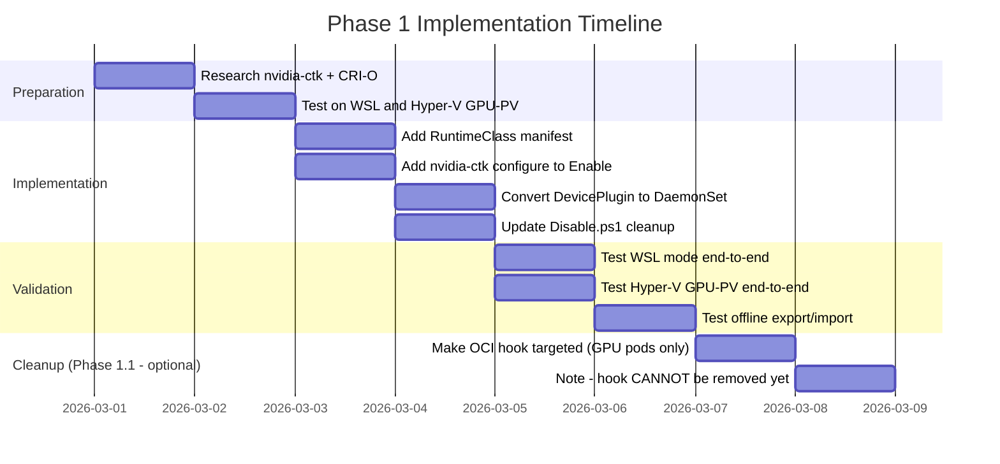

#### 5.1 Files to Create/Modify

```text
addons/gpu-node/
├── Enable.ps1                          ← MODIFY: add nvidia-ctk + crio restart
├── Disable.ps1                         ← MODIFY: undo nvidia-ctk configuration
├── manifests/
│   ├── nvidia-device-plugin.yaml       ← MODIFY: Deployment → DaemonSet
│   ├── nvidia-runtime-class.yaml       ← NEW: RuntimeClass manifest
│   └── dcgm-exporter.yaml             ← No change
└── addon.manifest.yaml                 ← No change
```

#### 5.2 New File: `nvidia-runtime-class.yaml`

```yaml
# SPDX-FileCopyrightText: © 2026 Siemens Healthineers AG
# SPDX-License-Identifier: MIT

apiVersion: node.k8s.io/v1
kind: RuntimeClass
metadata:
  name: nvidia
# handler must match the runtime name registered in CRI-O config
# created by: nvidia-ctk runtime configure --runtime=crio
handler: nvidia
```

#### 5.3 Enable.ps1 Changes

**Housekeeping fix (same PR):** `Enable.ps1` is missing `Initialize-Logging -ShowLogs:$ShowLogs`
after the module imports, unlike `Disable.ps1` which has it correctly. Add this call at the
top of `Enable.ps1` so console log visibility controlled by `-ShowLogs` works consistently:

```powershell
Initialize-Logging -ShowLogs:$ShowLogs
```

**New flow** (additions marked with ★):

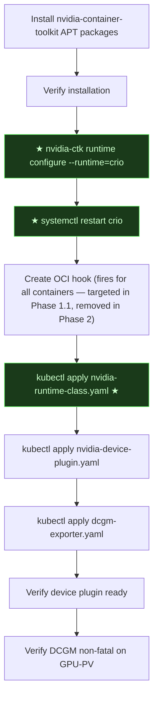

**Key SSH commands to add:**

```bash
# Configure CRI-O with nvidia runtime handler
sudo nvidia-ctk runtime configure --runtime=crio

# Restart CRI-O to pick up the new configuration
sudo systemctl restart crio
```

**What `nvidia-ctk runtime configure --runtime=crio` does:**

It creates a config file (e.g., `/etc/crio/crio.conf.d/99-nvidia.toml`) with:

```toml
[crio.runtime.runtimes.nvidia]
  runtime_path = "/usr/libexec/crio/crun"
  runtime_type = "oci"
  monitor_path = "/usr/libexec/crio/conmon"
```

> **⚠ Implementation note (confirmed 2026-03-03):** `nvidia-container-runtime` 1.18.x cannot be
> used as `runtime_path` with CRI-O 1.35 because CRI-O 1.35 passes OCI spec version 1.3.0 to the
> runtime, which `nvidia-container-runtime` rejects with `unknown version specified`. The drop-in
> instead configures `crun` as the backing OCI runtime. The OCI prestart hook handles GPU injection
> (same as today). This approach keeps correct `RuntimeClass` semantics while avoiding the version
> mismatch. Phase 2 (CDI) eliminates the need for both the hook and this workaround.
>
> Additionally, `nvidia-ctk` 1.18.x writes its output to `/etc/crio/conf.d/` (not the CRI-O
> drop-in directory `/etc/crio/crio.conf.d/`) and omits the required `monitor_path` field,
> so `Enable.ps1` writes the drop-in directly rather than relying on `nvidia-ctk`.

This registers `nvidia` as a named runtime handler in CRI-O that Kubernetes can
reference via `RuntimeClass`.

#### 5.4 Disable.ps1 Changes

> All kubectl calls use `Invoke-Kubectl -Params` and SSH calls use `Invoke-SSHWithKey`
> per K2s conventions. Output is piped through `Write-Log`.

```powershell
# Remove OCI hook
Invoke-SSHWithKey "sudo rm -f /usr/share/containers/oci/hooks.d/oci-nvidia-hook.json"

# Remove nvidia runtime config from CRI-O
Invoke-SSHWithKey "sudo rm -f /etc/crio/crio.conf.d/*nvidia*.conf"

# Restart CRI-O
Invoke-SSHWithKey "sudo systemctl restart crio"

# Delete Kubernetes resources
(Invoke-Kubectl -Params 'delete', 'runtimeclass', 'nvidia', '--ignore-not-found').Output | Write-Log
(Invoke-Kubectl -Params 'delete', '-f', "$PSScriptRoot\manifests\nvidia-device-plugin.yaml", '--ignore-not-found').Output | Write-Log
(Invoke-Kubectl -Params 'delete', '-f', "$PSScriptRoot\manifests\dcgm-exporter.yaml", '--ignore-not-found').Output | Write-Log
```

#### 5.5 Device Plugin: Deployment → DaemonSet

**Current** (Deployment):

```yaml
kind: Deployment
spec:
  replicas: 1
  selector:
    matchLabels:
      k8s-app: nvidia-device-plugin
```

**Target** (DaemonSet):

```yaml
kind: DaemonSet
spec:
  updateStrategy:
    type: RollingUpdate
  selector:
    matchLabels:
      k8s-app: nvidia-device-plugin
```

**Why:** A DaemonSet runs one pod per matching node — semantically correct for
a device plugin. In single-node K2s this is functionally identical, but:

- Correct semantics for multi-node future
- Matches upstream NVIDIA Helm chart
- Matches K3s and vanilla K8s best practice

The readiness check in Enable.ps1 changes from:

```powershell
# Before:
(Invoke-Kubectl -Params 'wait', '--timeout=5s', '--for=condition=Available', '-n', 'gpu-node', 'deployment/nvidia-device-plugin').Success

# After:
(Invoke-Kubectl -Params 'rollout', 'status', 'daemonset', 'nvidia-device-plugin', '-n', 'gpu-node', '--timeout', '120s').Output | Write-Log
```

---

### Phase 2: CDI-First (Container Device Interface)

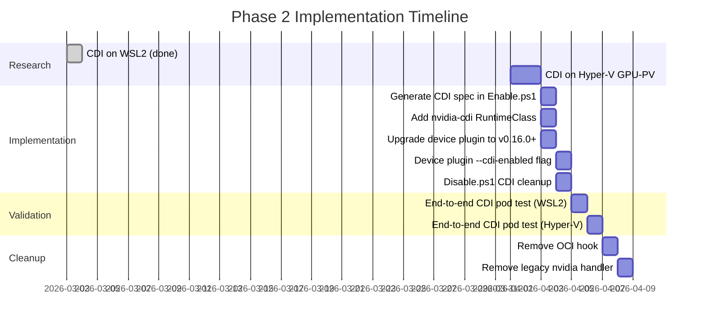

**CDI flow (Phase 2):**

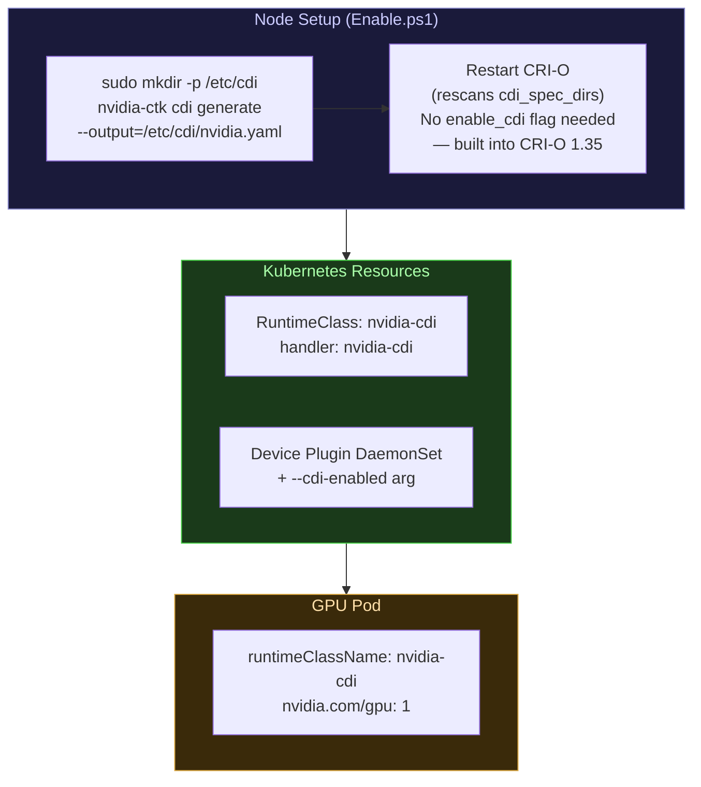

**Actual CDI spec generated on WSL2** (`/etc/cdi/nvidia.yaml`, via `nvidia-ctk cdi generate`):

```yaml
cdiVersion: 0.3.0
kind: nvidia.com/gpu
devices:
  - name: all
    containerEdits:
      deviceNodes:
        - path: /dev/dxg          # WSL2: dxcore device, NOT /dev/nvidia*
containerEdits:
  env:
    - NVIDIA_VISIBLE_DEVICES=void
  hooks:
    - hookName: createContainer
      path: /usr/bin/nvidia-cdi-hook
      args:
        - nvidia-cdi-hook
        - create-symlinks
        - --link
        - /usr/lib/wsl/drivers/nvblwi.inf_amd64_.../nvidia-smi::/usr/bin/nvidia-smi
    - hookName: createContainer
      path: /usr/bin/nvidia-cdi-hook
      args:
        - nvidia-cdi-hook
        - update-ldcache
        - --folder
        - /usr/lib/wsl/drivers/nvblwi.inf_amd64_...
        - --folder
        - /usr/lib/wsl/lib
  mounts:
    - hostPath: /usr/lib/wsl/lib/libdxcore.so
      containerPath: /usr/lib/wsl/lib/libdxcore.so
      options: [ro, nosuid, nodev, rbind, rprivate]
    - hostPath: /usr/lib/wsl/drivers/.../libcuda.so.1.1
      containerPath: /usr/lib/wsl/drivers/.../libcuda.so.1.1
      options: [ro, nosuid, nodev, rbind, rprivate]
    # ... libcuda_loader.so, libnvdxgdmal.so.1, libnvidia-ml.so.1,
    # ... libnvidia-ml_loader.so, libnvidia-ptxjitcompiler.so.1, nvcubins.bin, nvidia-smi
```

> **Key difference from native GPU:** WSL2 CDI spec uses `/dev/dxg` (not `/dev/nvidia0`),
> mounts libraries from `/usr/lib/wsl/lib/` and the driver store path instead of
> `/usr/lib/x86_64-linux-gnu/`. `nvidia-ctk cdi generate` handles this automatically
> when it auto-detects `wsl` mode — no flags required.

> **Phase 2 removes the `kubectl patch` workaround:** Currently `Enable.ps1` manually
> patches the device plugin DaemonSet to add `LD_LIBRARY_PATH` + `wsl-libs` hostPath volume.
> With CDI, the spec mounts all required libraries (`libdxcore.so`, `libcuda.so`, etc.)
> declaratively — the patch and the hostPath volume are no longer needed.

#### 5.6 CDI Integration Steps — Research Findings (2026-03-03)

**WSL2 CDI infrastructure confirmed; device plugin upgrade required:**

| Component | Status | Detail |
|---|---|---|
| `nvidia-ctk cdi generate` | ✅ Works | Auto-detects WSL mode, uses `/dev/dxg`, spec version 0.3.0 |
| `nvidia-cdi-hook` binary | ✅ Present | `/usr/bin/nvidia-cdi-hook` — referenced in generated spec |
| CRI-O 1.35 CDI support | ✅ Built-in | No `enable_cdi = true` flag needed — CDI is always enabled in CRI-O 1.35. Config only exposes `cdi_spec_dirs = ["/etc/cdi", "/var/run/cdi"]` |
| `/etc/cdi/nvidia.yaml` generated | ✅ Done (2026-03-03) | `sudo mkdir -p /etc/cdi && sudo nvidia-ctk cdi generate --output=/etc/cdi/nvidia.yaml` — succeeded; CRI-O restarted and confirmed `CRI-O-OK` |
| `/dev/dxg` in containers | ✅ Accessible | hostPath volume mount of `/dev/dxg` into a privileged container works; device file visible (`crw-rw-rw- 10,125`) |
| Device plugin `--cdi-enabled` | ❌ **Does not exist — neither in v0.15.0 nor in fb1242ad (tagged v0.18.2)** | `--cdi-enabled` flag does not exist in v0.15.0. Upgraded to `fb1242ad` (tagged `v0.18.2-ubi8`, 2026-03-03): `--cdi-enabled` flag **still does not exist** in this binary. Available CDI mechanism is `--device-list-strategy=cdi-annotations`. Tested live (2026-03-03): device plugin starts OK with `DEVICE_LIST_STRATEGY=cdi-annotations`, auto-detects WSL mode, logs `Generating CDI spec for resource: k8s.device-plugin.nvidia.com/gpu`. However CRI-O fails with `CDI device injection failed: unresolvable CDI devices k8s.device-plugin.nvidia.com/gpu=...` — the generated CDI spec (kind `k8s.device-plugin.nvidia.com/gpu`) is internal to the container and not visible to CRI-O on the host. Adding `/etc/cdi` as a hostPath volume mount causes a different failure: `unable to create cdi spec file: failed to initialize NVML: Unable to load the NVML library` — NVML is required to enumerate devices for CDI spec generation, but NVML is unavailable on WSL2/dxcore. **Root cause: CDI mode on WSL2 requires NVML to generate the device spec; NVML is not available on the dxcore/GPU-PV path. This is a fundamental limitation, not a version issue.** |
| End-to-end CDI pod | ❌ **Blocked — fundamental NVML constraint on WSL2** | Tested live on v0.18.2/fb1242ad (2026-03-03): `cdi-annotations` strategy starts device plugin but CRI-O cannot resolve CDI devices. Mounting `/etc/cdi` for spec write causes NVML initialization failure. **Phase 1 (envvar + OCI hook) remains the only working approach on WSL2/dxcore.** |
| Hyper-V GPU-PV CDI | ⚠ Unknown | Requires Hyper-V cluster — different driver layout, may need different spec |

> **Key finding:** CRI-O 1.35 has CDI support compiled in. There is no `enable_cdi = true`
> toggle in its config output. Simply placing a valid spec at `/etc/cdi/nvidia.yaml` is
> sufficient — no CRI-O drop-in or restart needed for the CDI feature flag (CRI-O restart
> is still needed after generating the spec so it rescans `cdi_spec_dirs`).

> **Device plugin version history for CDI (live test results):**
> - v0.15.0: `--device-list-strategy=cdi-annotations` — device plugin generates its own CDI spec and passes CDI annotations to pods. Fails on WSL2 (empty device edits). Not suitable.
> - v0.15.0: `--cdi-enabled` — flag **does not exist** in v0.15.0.
> - fb1242ad (tagged `v0.18.2-ubi8`, tested 2026-03-03): `--cdi-enabled` flag **still does not exist**. `cdi-annotations` strategy starts OK (WSL mode auto-detected, selects `/dev/dxg` + driver store libs), but CRI-O fails to resolve CDI devices — generated spec (`k8s.device-plugin.nvidia.com/gpu` kind) is inside the container, not on the host. Mounting `/etc/cdi` as a hostPath volume causes NVML init failure (`Unable to load the NVML library`) during CDI spec generation — NVML is unavailable on WSL2/dxcore.
> - **Conclusion:** CDI mode on WSL2/dxcore is **fundamentally blocked by NVML unavailability**. The device plugin requires NVML to enumerate and describe GPU devices in the CDI spec. No version upgrade can resolve this unless NVIDIA adds a non-NVML CDI spec generation path for WSL2/dxcore mode.
>
> **Phase 1 (envvar + OCI hook) remains the production path for WSL2. Phase 2 (CDI) is deferred.**

---

## 6. GPU-PV vs WSL Compatibility Matrix

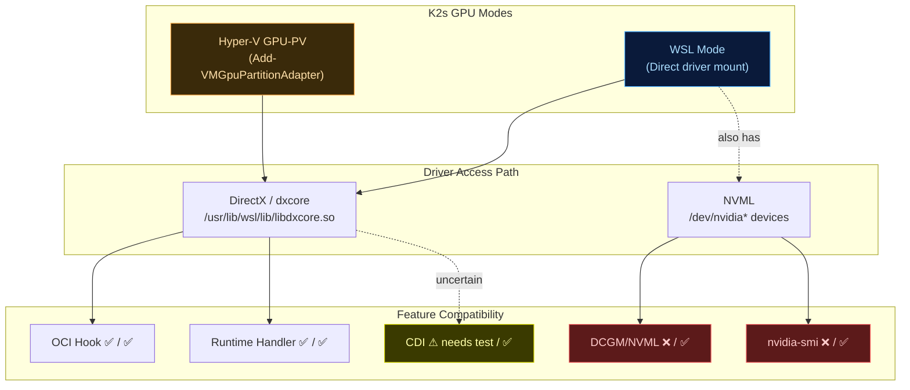

| Mechanism | Hyper-V GPU-PV | WSL Mode | Native GPU Passthrough |
|-----------|---------------|----------|----------------------|
| OCI Hook (current) | ✅ Works | ✅ Works | ✅ Works |
| Runtime Handler (Phase 1) | ✅ Should work | ✅ Should work | ✅ Works |
| CDI (Phase 2) | ⚠ Needs investigation | ❌ **Blocked (2026-03-03)** — `nvidia-ctk cdi generate` spec generated OK, CRI-O CDI built-in works. But `cdi-annotations` strategy on v0.18.2/fb1242ad requires NVML to write CDI spec; NVML unavailable on WSL2/dxcore. Phase 1 (envvar + OCI hook) remains production path. | ✅ Works |
| DCGM / NVML monitoring | ❌ No NVML (dxcore path) | ❌ No NVML (same dxcore path, **confirmed 2026-02-27**) | ✅ Works |
| nvidia-smi | ❌ No device nodes | ✅ VM only (❌ inside containers — "GPU access blocked") | ✅ Works |
| CUDA workloads | ✅ Via dxcore | ✅ Via dxcore | ✅ Native |
| apt package downloads | ✅ Direct via proxy | ✅ Via SSH reverse tunnel (**confirmed 2026-02-27**) | ✅ Direct |
| CRI-O image pulls | ✅ Direct via proxy | ✅ Via buildah pre-pull + SSH tunnel (**confirmed 2026-02-27**) | ✅ Direct |

> **Confirmed (2026-02-27):** WSL2 uses the **same** dxcore/GPU-PV driver path as
> Hyper-V — NVML returns `Failed to initialize NVML` on both. DCGM is non-fatal
> (warning only) on both modes. The original roadmap entry `WSL Mode: ✅ NVML works`
> was incorrect.

---

## 7. Pod Spec Examples

### After Phase 1 — Standard GPU Workload (K3s/K8s aligned)

```yaml
apiVersion: v1
kind: Pod
metadata:
  name: cuda-vectoradd
  namespace: default
spec:
  restartPolicy: Never
  runtimeClassName: nvidia              # ← selects nvidia runtime handler
  containers:
  - name: cuda
    image: nvcr.io/nvidia/k8s/cuda-sample:vectoradd-cuda12.5.0
    resources:
      limits:
        nvidia.com/gpu: 1               # ← schedules to GPU node
```

### After Phase 1 — Backward Compatible (existing K2s workloads)

```yaml
apiVersion: v1
kind: Pod
metadata:
  name: cuda-legacy
spec:
  restartPolicy: Never
  containers:
  - name: cuda
    image: nvcr.io/nvidia/k8s/cuda-sample:vectoradd-cuda12.5.0
    resources:
      limits:
        nvidia.com/gpu: 1
    # No runtimeClassName — OCI hook still injects GPU support
```

### After Phase 2 — CDI-First (modern path)

```yaml
apiVersion: v1
kind: Pod
metadata:
  name: cuda-cdi
spec:
  restartPolicy: Never
  runtimeClassName: nvidia-cdi          # ← CDI-based device injection
  containers:
  - name: cuda
    image: nvcr.io/nvidia/k8s/cuda-sample:vectoradd-cuda12.5.0
    resources:
      limits:
        nvidia.com/gpu: 1
```

### Multi-GPU Workload

```yaml
apiVersion: v1
kind: Pod
metadata:
  name: ml-training
spec:
  runtimeClassName: nvidia
  containers:
  - name: training
    image: nvcr.io/nvidia/pytorch:24.01-py3
    resources:
      limits:
        nvidia.com/gpu: 2               # ← request 2 GPUs
    command: ["python", "-m", "torch.distributed.launch", "train.py"]
```

---

## 8. Verification Checklist

### Phase 1 Verification

```bash
# 1. Verify CRI-O has nvidia runtime handler
sudo crio config 2>/dev/null | grep -A4 'runtimes.nvidia'
# Expected (crun-backed, Phase 1 per OCI spec 1.3.0 compat workaround):
#   runtime_path = "/usr/libexec/crio/crun"
#   runtime_type = "oci"
#   monitor_path = "/usr/libexec/crio/conmon"
# NOTE: runtime_path is crun, NOT nvidia-container-runtime.
# See risk table: nvidia-container-runtime 1.18.x rejects CRI-O 1.35 / OCI spec 1.3.0.

# 2. Verify RuntimeClass exists in cluster
kubectl get runtimeclass nvidia
# Expected: nvidia   nvidia   <age>

# 3. Verify device plugin is running as DaemonSet
kubectl get ds -n gpu-node nvidia-device-plugin
# Expected: DESIRED=1  CURRENT=1  READY=1

# 4. Verify GPU resource is advertised on node
kubectl describe node | grep -A2 nvidia.com/gpu
# Expected: nvidia.com/gpu: 1

# 5. Smoke test WITH RuntimeClass
cat <<EOF | kubectl apply -f -
apiVersion: v1
kind: Pod
metadata:
  name: gpu-test-runtimeclass
spec:
  restartPolicy: Never
  runtimeClassName: nvidia
  containers:
  - name: cuda
    image: nvcr.io/nvidia/k8s/cuda-sample:vectoradd-cuda12.5.0
    resources:
      limits:
        nvidia.com/gpu: 1
EOF
kubectl wait --for=condition=Succeeded pod/gpu-test-runtimeclass --timeout=120s
kubectl logs gpu-test-runtimeclass
# Expected: [Vector addition of 50000 elements] ... Test PASSED
# NOTE on WSL2/dxcore: NVML is unavailable inside containers — the sample prints
# "Failed to initialize NVML: GPU access blocked by the operating system" before the
# vector-add test. This is expected and non-fatal. The test still prints "Test PASSED".

# 6. Smoke test WITHOUT RuntimeClass (backward compat via OCI hook)
cat <<EOF | kubectl apply -f -
apiVersion: v1
kind: Pod
metadata:
  name: gpu-test-legacy
spec:
  restartPolicy: Never
  containers:
  - name: cuda
    image: nvcr.io/nvidia/k8s/cuda-sample:vectoradd-cuda12.5.0
    resources:
      limits:
        nvidia.com/gpu: 1
EOF
kubectl wait --for=condition=Succeeded pod/gpu-test-legacy --timeout=120s

# 7. Cleanup
kubectl delete pod gpu-test-runtimeclass gpu-test-legacy
```

### Phase 2 Verification

```bash
# 1. Verify CDI spec was generated
ls -la /etc/cdi/nvidia.yaml

# 2. Verify CDI is scanned by CRI-O (enable_cdi flag does NOT exist in CRI-O 1.35 — CDI is always on)
sudo crio config 2>/dev/null | grep cdi_spec_dirs
# Expected: cdi_spec_dirs = ["/etc/cdi", "/var/run/cdi"]

# 3. Verify nvidia-cdi RuntimeClass
kubectl get runtimeclass nvidia-cdi

# 4. Smoke test with CDI
cat <<EOF | kubectl apply -f -
apiVersion: v1
kind: Pod
metadata:
  name: gpu-test-cdi
spec:
  restartPolicy: Never
  runtimeClassName: nvidia-cdi
  containers:
  - name: cuda
    image: nvcr.io/nvidia/k8s/cuda-sample:vectoradd-cuda12.5.0
    resources:
      limits:
        nvidia.com/gpu: 1
EOF
kubectl wait --for=condition=Succeeded pod/gpu-test-cdi --timeout=120s
kubectl logs gpu-test-cdi
```

---

## 9. Risk Assessment

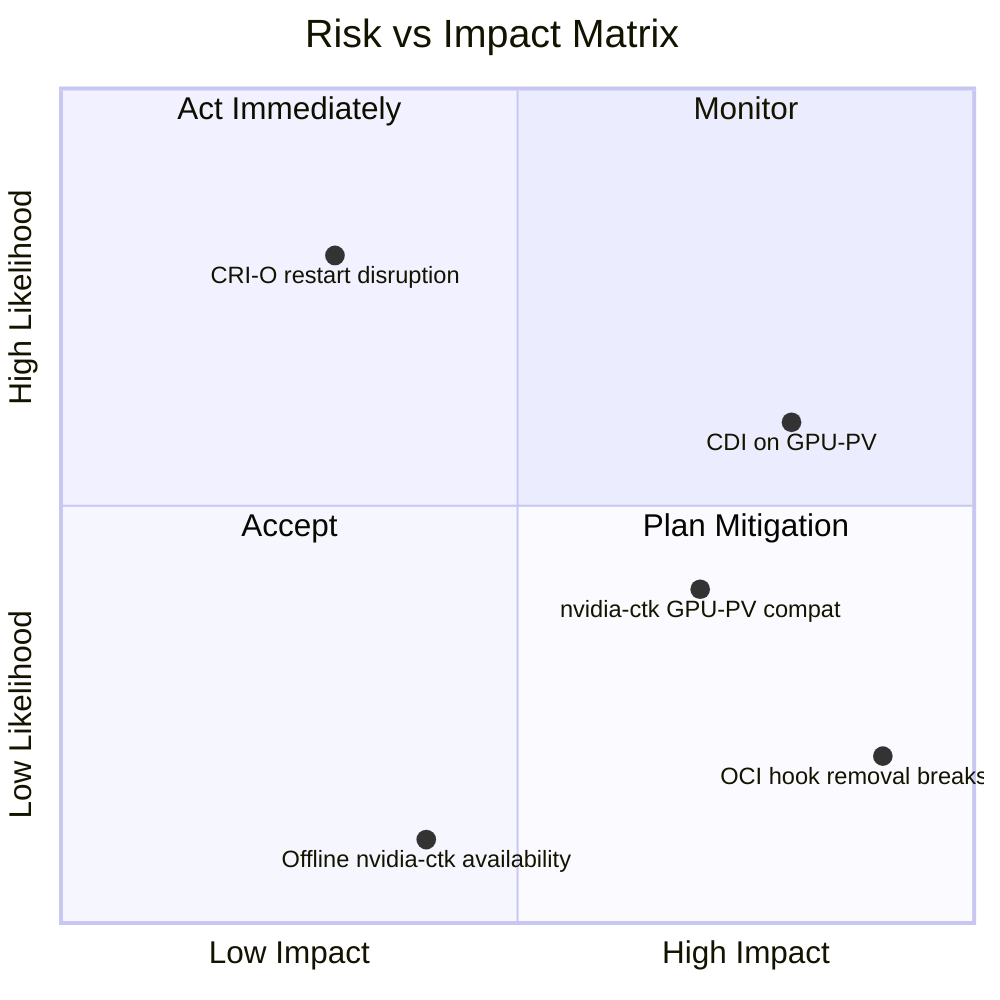

| Risk | Likelihood | Impact | Mitigation |
|------|-----------|--------|------------|
| `nvidia-ctk runtime configure` doesn't work with GPU-PV dxcore | Medium | High | Test early; keep OCI hook as fallback in Phase 1 |
| `nvidia-container-runtime` incompatible with CRI-O 1.35 / OCI spec 1.3.0 | **Confirmed ✅** | High | CRI-O nvidia handler uses `crun` as backing runtime; OCI hook performs GPU injection. Resolved when nvidia-container-toolkit adds OCI spec 1.3.0 support or Phase 2 (CDI) lands |
| CDI spec generation fails without `/dev/nvidia*` on GPU-PV | High | High | Phase 2 targets WSL first — CDI spec generation confirmed on WSL2 (2026-03-03); GPU-PV CDI still needs testing |
| Device plugin v0.15.0 CDI-annotations fails on WSL2 | **Confirmed ✅** | High | v0.15.0's `cdi-annotations` strategy produces empty device edits on WSL2. `--cdi-enabled` flag not present in v0.15.0. Phase 2 upgrades to **v0.18.2-ubi8** (latest stable, includes `--cdi-enabled` + CDI race condition fixes) |
| CRI-O restart during enable disrupts running pods | High | Low | Document interruption; existing Hyper-V path already restarts VM |
| Removing OCI hook before Phase 2 breaks ALL GPU workloads | **Confirmed ⚠** | High | Hook is the only GPU injection mechanism while `crun` is the backing runtime. Removal deferred to Phase 2 when CDI takes over injection. Phase 1.1 may make it targeted only |
| `nvidia-ctk` not available offline | Low | Medium | Already included in `nvidia-container-toolkit` APT package; covered by export/import |
| DCGM fails on all K2s GPU modes | **Confirmed ✅** | Low | Non-fatal warning on both modes (fixed 2026-02-27); CUDA workloads unaffected |
| WSL VM `wsl.conf` boot.command broken (no IP after reboot) | **Confirmed ✅** | High | Fixed in `common-setup.module.psm1` (2026-02-27); existing clusters need manual fix or reinstall |
| SSH reverse tunnel port collision from failed prior run | **Confirmed ✅** | Medium | Fixed: stale sshd killed via `sudo ss` + `/proc/$pid/comm` before tunnel start |
| Windows NVIDIA driver update while VM running | **Confirmed ✅** | High | WSL2 9p mount goes stale → `nvidia-smi` returns exit code -1. Fix: `k2s stop; k2s start` to remount driver libs. Error message updated in `Enable.ps1` |

---

## 10. Timeline & Effort

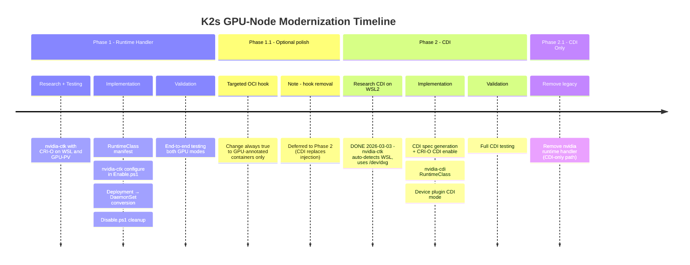

| Phase | Scope | Effort | Dependencies |
|-------|-------|--------|-------------|
| **Phase 1** | Runtime handler + RuntimeClass + DaemonSet | ~2-3 days | None — can start immediately |
| **Phase 1.1** | Make OCI hook targeted (optional polish) | ~0.5 day | Phase 1 validated; hook removal deferred to Phase 2 — removing it now would break GPU pods because `crun` has no GPU awareness |
| **Phase 2** | CDI integration | ~2-3 days | WSL2 research done ✅; Hyper-V CDI still needs testing; end-to-end pod test on WSL2 is the immediate next step |
| **Phase 2.1** | Remove legacy runtime handler | ~1 day | Phase 2 validated across all modes |

---

## 11. K2s-Specific Considerations

Unlike vanilla K8s or K3s, K2s has constraints that affect this roadmap:

### 11.1 GPU Paravirtualization (Hyper-V GPU-PV)

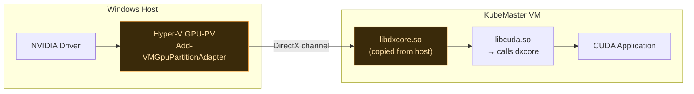

- No `/dev/nvidia*` device nodes exist
- GPU exposed via DirectX/dxcore, not native NVIDIA driver
- NVML cannot see the GPU → nvidia-smi, DCGM don't work
- CUDA works through `libcuda.so` → `libdxcore.so` pipeline
- This is unique to K2s — neither K3s nor vanilla K8s face this

### 11.2 CRI-O (not containerd)

K2s uses CRI-O while K3s uses embedded containerd. All `nvidia-ctk` commands
must use `--runtime=crio` (not `--runtime=containerd`).

### 11.3 Offline-First Design

Any new dependencies must be covered by `k2s addons export/import`:

- `nvidia-ctk` binary is already in the `nvidia-container-toolkit` package (covered)
- RuntimeClass manifest is a YAML file applied via kubectl (covered)
- CDI spec (`/etc/cdi/nvidia.yaml`) is generated at enable time (no new download)

### 11.4 WSL vs Hyper-V Dual Paths

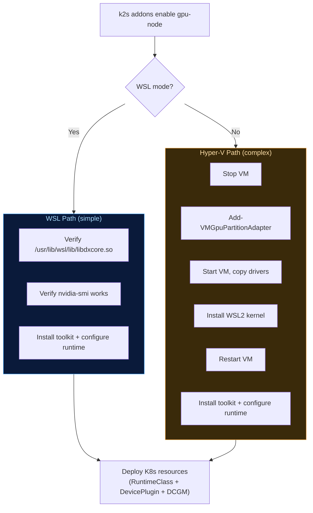

---

## 12. Export / Import / Backup / Restore Considerations

Phase 1 introduces new state at two levels — **VM-level** (CRI-O drop-in config) and
**cluster-level** (RuntimeClass object) — that must be handled correctly by the
export/import and backup/restore workflows.

### 12.1 Export / Import

| Artifact | Exported? | Risk |
|---|---|---|
| `RuntimeClass nvidia` (K8s object) | ✅ Yes — cluster-scoped K8s resource included in any `kubectl`-based export | If imported onto a K2s instance where gpu-node is **disabled**, the RuntimeClass exists but the CRI-O handler does not |
| `/etc/crio/crio.conf.d/99-nvidia.conf` | ❌ No — VM filesystem, not part of K8s export | CRI-O handler absent after fresh cluster install unless gpu-node is re-enabled |
| `addon.manifest.yaml` identity | ✅ Unchanged — addon name/metadata unaffected | — |

**Note:** `/etc/crio/crio.conf.d/99-nvidia.conf` is a VM-level file and is never
included in a K8s export. On a fresh machine, `k2s addons enable gpu-node` must be
run as normal before GPU workloads are scheduled — same as any first-time install.
Without the CRI-O handler present, pods with `runtimeClassName: nvidia` will fail:

```
Error: failed to create containerd task: runtime handler "nvidia" not found
```

### 12.2 Backup / Restore

`/etc/crio/crio.conf.d/99-nvidia.conf` is a VM filesystem file. If the VM is
restored to a snapshot taken before `k2s addons enable gpu-node` was run, the CRI-O
handler will not be present. Simply re-run `k2s addons enable gpu-node` as normal —
no different from a first-time install.

### 12.3 Why `Disable.ps1` Cleanup Matters

Phase 0 and Phase 1 both ensure `Disable.ps1` removes all gpu-node state cleanly:

- **Phase 0**: Removes OCI hook + nvidia packages from VM
- **Phase 1**: Additionally removes `99-nvidia.conf` + deletes `RuntimeClass` from cluster

This guarantees that after `k2s addons disable gpu-node`, no dangling RuntimeClass
references a missing CRI-O handler — making export/import safe regardless of addon state.

---

## 13. References

- [NVIDIA Container Toolkit Documentation](https://docs.nvidia.com/datacenter/cloud-native/container-toolkit/latest/index.html)
- [Kubernetes RuntimeClass](https://kubernetes.io/docs/concepts/containers/runtime-class/)
- [K3s GPU Support](https://docs.k3s.io/advanced#nvidia-container-runtime-support)
- [Container Device Interface (CDI) Spec](https://github.com/cncf-tags/container-device-interface)
- [NVIDIA Device Plugin for Kubernetes](https://github.com/NVIDIA/k8s-device-plugin)
- [CRI-O Runtime Handlers](https://github.com/cri-o/cri-o/blob/main/docs/crio.conf.5.md)
