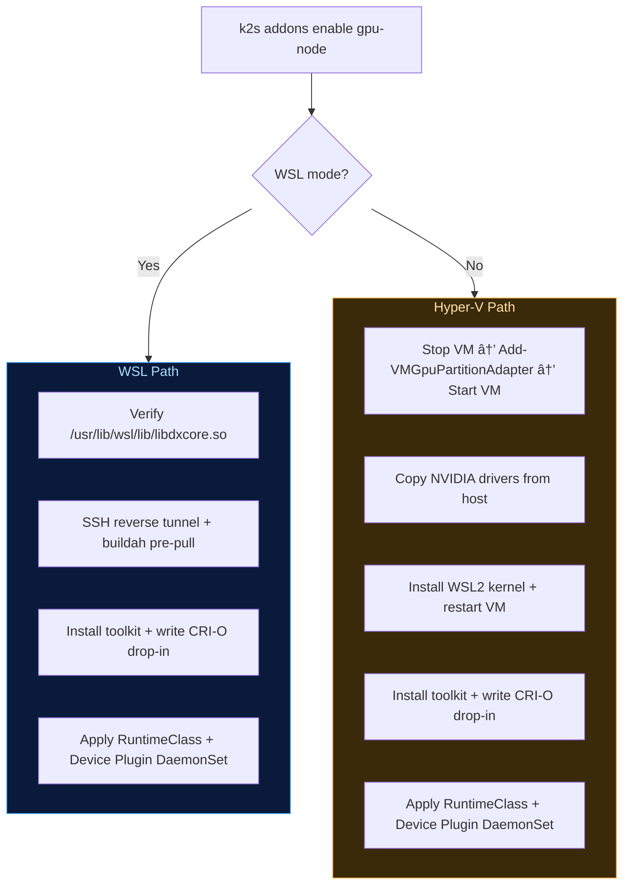

<!--
SPDX-FileCopyrightText: © 2026 Siemens Healthineers AG
SPDX-License-Identifier: MIT
-->

# GPU-Node Addon Roadmap: Aligning K2s with K3s / Vanilla Kubernetes

## 1. Current State (as of 2026-03-05)

Phase 2 CDI is **in production on WSL2**. The legacy OCI prestart hook is gone.

```
k2s addons enable gpu-node
  → CRI-O drop-in  /etc/crio/crio.conf.d/99-nvidia.toml  (crun-backed nvidia handler)
  → RuntimeClass   nvidia                                  (deployed to cluster)
  → DaemonSet      nvidia-device-plugin v0.18.2-ubi8       (cdi-annotations strategy)
  → DaemonSet      dcgm-exporter 4.5.2-4.8.1-ubi9         (metrics, non-fatal on dxcore)
```

**CDI injection flow (live):**

```
Device plugin starts
  ├─ Detects WSL2/dxcore (no NVML, uses libnvidia-ml.so.1 stub + /usr/lib/wsl/drivers/)
  ├─ Writes CDI spec → /var/run/cdi/k8s.device-plugin.nvidia.com-gpu.json
  └─ postStart hook: waits for spec, calls nvidia-smi for GPU UUID, awk-patches UUID alias into spec

GPU pod is scheduled (nvidia.com/gpu: 1)
  ├─ Device plugin allocates GPU, annotates pod: k8s.device-plugin.nvidia.com/gpu=GPU-<uuid>
  ├─ CRI-O reads CDI annotation, resolves GPU-<uuid> in /var/run/cdi/ → mounts /dev/dxg
  ├─ CRI-O applies top-level containerEdits (WSL lib mounts, ldcache + symlink hooks)
  └─ Container starts with GPU access ✅
```

**Validated on WSL2 — NVIDIA RTX A2000 8GB, Driver 595.71, CUDA 13.2:**

```
NAME              READY   STATUS      RESTARTS   AGE
cuda-vector-add   0/1     Completed   0          53s

NVIDIA-SMI 595.45.03    Driver Version: 595.71    CUDA Version: 13.2
GPU: NVIDIA RTX A2000 8GB Lap...   46C   Memory: 426MiB / 8192MiB
Test PASSED
Done
```

---

## 2. What Is Done

| Phase | Status | Key deliverable |
|-------|--------|----------------|
| **Phase 0** | ✅ 2026-02-27 | WSL2 online mode fixed (SSH tunnel, wsl.conf IP bug, buildah pre-pull, DCGM non-fatal) |
| **Phase 1** | ✅ 2026-03-03 | RuntimeClass `nvidia`, CRI-O drop-in (crun-backed), device plugin → DaemonSet, Disable.ps1 full cleanup |
| **Phase 2 (WSL2)** | ✅ 2026-03-05 | CDI via `cdi-annotations` + `/var/run/cdi` hostPath; postStart UUID alias hook; OCI hook removed; hardware-validated |

### Phase 0 Key Fixes

- **WSL2 network fix** (`common-setup.module.psm1`): spurious quoting in `wsl.conf boot.command` prevented `ifconfig` from assigning the VM IP. Fixed.
- **Proxy tunnel** (`Enable.ps1`): SSH reverse tunnel `Windows→Linux` on port 8181; stale sshd killed via `sudo ss` + `/proc/$pid/comm`; apt proxy patched to `127.0.0.1:8181` while tunnel is active.
- **buildah pre-pull**: replaces broken `crictl pull` + CRI-O restart for WSL2 image downloads.
- **DCGM non-fatal**: both WSL2 and Hyper-V use dxcore; NVML unavailable on both; DCGM crash is a warning only.
- **`additionalImages`**: 4 deployment images added to `addon.manifest.yaml` for offline export.

### Phase 1 Key Fixes

- **RuntimeClass `nvidia`** (`nvidia-runtime-class.yaml`) applied by `Enable.ps1`.
- **CRI-O drop-in** (`/etc/crio/crio.conf.d/99-nvidia.toml`): `crun` as `runtime_path` because `nvidia-container-runtime` 1.18.x rejects CRI-O 1.35 / OCI spec 1.3.0 (`unknown version specified`). `Enable.ps1` writes the drop-in directly via base64 SSH transfer because `nvidia-ctk runtime configure` writes to the wrong path and omits `monitor_path`.
- **Device plugin → DaemonSet**: `kubectl rollout status daemonset` replaces the old Deployment readiness check; `Get-Status.ps1` updated.
- **`Disable.ps1`**: removes OCI hook (idempotent), CDI spec, CRI-O drop-in, restarts CRI-O, deletes RuntimeClass + DaemonSets with `--ignore-not-found`.
- **`Initialize-Logging`** added to `Enable.ps1`.

### Phase 2 Key Fixes

Three rounds of debugging were needed before CDI worked end-to-end on WSL2:

| Round | Root cause | Fix |
|-------|-----------|-----|
| **Round 1** | `/etc/cdi` mounted into device plugin → NVML init failure. Device plugin hardcodes `cdiRoot = "/var/run/cdi"` in `cdi.go`; mounting the wrong dir triggered NVML code path. | Mount `/var/run/cdi/` instead |
| **Round 2** | CDI spec only has `"name":"all"`; device plugin annotates pods with `GPU-<uuid>`; CRI-O cannot resolve. | `postStart` lifecycle hook reads UUID via `nvidia-smi`, `awk`-inserts UUID alias device entry into spec |
| **Round 3** | **(a)** `/usr/lib/wsl/drivers/` not mounted: `libnvidia-ml.so.1` is a stub that `dlopen()`s real NVML from the 9p driver store — this 9p mount is **not** inherited into container mount namespaces automatically. **(b)** `mv /tmp/cdi_patch.json /var/run/cdi/...` fails with `EXDEV` (different filesystems); UBI8 minimal `mv` does not fall back to copy+delete. | **(a)** Add `wsl-drivers` hostPath volume (`/usr/lib/wsl/drivers`). **(b)** Write awk temp file to `/var/run/cdi/.cdi_tmp` in the same mounted dir. Added `sleep 2` race guard. |

**CDI spec structure (device plugin-generated + postStart patch):**

```json
{
  "cdiVersion": "0.5.0",
  "kind": "k8s.device-plugin.nvidia.com/gpu",
  "devices": [
    {"name": "all",        "containerEdits": {"deviceNodes": [{"path": "/dev/dxg", "hostPath": "/dev/dxg"}]}},
    {"name": "GPU-<uuid>", "containerEdits": {"deviceNodes": [{"path": "/dev/dxg", "hostPath": "/dev/dxg"}]}}
  ],
  "containerEdits": {
    "env":    ["NVIDIA_VISIBLE_DEVICES=void"],
    "hooks":  ["create-symlinks for nvidia-smi", "update-ldcache for /usr/lib/wsl/drivers/ + /usr/lib/wsl/lib"],
    "mounts": ["libdxcore.so", "libcuda.so.1.1", "libcuda_loader.so", "libnvdxgdmal.so.1",
               "libnvidia-ml.so.1", "libnvidia-ml_loader.so", "libnvidia-ptxjitcompiler.so.1",
               "nvcubins.bin", "nvidia-smi"]
  }
}
```

> **Maintenance note:** The `postStart` hook uses `awk` with the substring pattern `}]}}]` to locate the end of the `devices` array in the single-line JSON spec. If the upstream device plugin changes its CDI spec serialisation, this pattern may need updating (it lives in `addons/gpu-node/manifests/nvidia-device-plugin.yaml`).

---

## 3. What Is Pending

| Item | Priority | Effort |
|------|----------|--------|
| **CDI on Hyper-V GPU-PV** — validate end-to-end on a Hyper-V cluster | High | ~1 day |
| **Phase 2.1** — remove legacy `nvidia` CRI-O drop-in and RuntimeClass once Hyper-V CDI confirmed | Medium | ~1 day |
| **E2E Go test suite** — update `k2s/test/e2e/addons/gpu-node/` to use Phase 2 CDI test path | Medium | ~half day |
| **DCGM investigation** — check if dcgm-exporter 4.5.2-4.8.1-ubi9 improves on dxcore; currently non-fatal | Low | — |

### Hyper-V CDI expectations

NVML is **fully available** on Hyper-V GPU-PV (unlike WSL2):

- The device plugin will likely generate per-UUID device entries itself, without needing the `postStart` hook.
- The `postStart` hook exits early via `grep -q "$UUID" "$SPEC" && exit 0` if the UUID is already in the spec.
- `/usr/lib/wsl/drivers/` does **not** exist on Hyper-V; the hook handles missing `nvidia-smi` via `[ -z "$UUID" ] && exit 0`.
- Verify `/dev/nvidia0` (vs `/dev/dxg`) appears in the CDI spec — the UUID alias insert logic is unaffected by device node differences.

---

## 4. Architecture Reference

### How Other Distributions Handle GPU Workloads

| | Vanilla K8s | K3s | K2s Today (Phase 2) |
|---|---|---|---|
| Container runtime | containerd / CRI-O | containerd (embedded) | CRI-O 1.35 |
| GPU injection | Runtime handler (manual) | Runtime handler (auto-detected) | **CDI via cdi-annotations** |
| RuntimeClass setup | Manual | Auto-created | Manual (`Enable.ps1`) |
| OCI hook | No | No | **Removed (Phase 2)** |
| CDI support | Yes | Yes (`nvidia-cdi`) | ✅ Working on WSL2 |
| Device plugin type | DaemonSet | DaemonSet | DaemonSet v0.18.2 |
| Offline support | Manual | Manual | Built-in export/import |

### K2s GPU Mode Compatibility

| Capability | Hyper-V GPU-PV | WSL2 Mode |
|-----------|---------------|-----------|
| GPU device node | `/dev/dxg` via GPU-PV | `/dev/dxg` via WSL2 |
| NVML / nvidia-smi | ❌ (dxcore only) | ✅ (via `/usr/lib/wsl/lib/nvidia-smi`) |
| CUDA workloads | ✅ via dxcore | ✅ via dxcore |
| DCGM monitoring | ❌ non-fatal | ❌ non-fatal |
| CDI (Phase 2) | ⚠ Needs validation | ✅ Working 2026-03-05 |
| apt / image pulls | Direct via proxy | SSH reverse tunnel to proxy |

### WSL2 Library Dependency Map

```
/usr/lib/wsl/lib/libnvidia-ml.so.1   ← stub loader (in container via wsl-libs hostPath)
  └─ dlopen() → real NVML at /usr/lib/wsl/drivers/<infdir>/...  ← MUST also be hostPath-mounted
/usr/lib/wsl/lib/nvidia-smi          ← used by postStart hook to query UUID
/usr/bin/nvidia-smi                  ← symlink created by CDI ldcache hook INSIDE workload containers
```

> The 9p driver store at `/usr/lib/wsl/drivers/` is mounted in the **host** WSL2 mount namespace but is **not inherited** into CRI-O container mount namespaces. Both `wsl-libs` and `wsl-drivers` must be mounted as hostPath volumes in the device plugin DaemonSet.

---

## 5. Pod Spec Examples

### Standard GPU Workload (current / recommended)

```yaml
apiVersion: v1
kind: Pod
spec:
  restartPolicy: Never
  runtimeClassName: nvidia
  containers:
  - name: cuda
    image: nvcr.io/nvidia/cuda:12.3.0-base-ubuntu22.04
    resources:
      limits:
        nvidia.com/gpu: 1
```

> `runtimeClassName: nvidia` routes to the `crun`-backed CRI-O handler. GPU devices are injected by CRI-O processing the CDI annotation added by the device plugin. `crun` itself has no GPU awareness.

---

## 6. Verification Checklist

### Cluster state after `k2s addons enable gpu-node`

```bash
# 1. CRI-O has nvidia runtime handler (crun-backed)
ssh remote@<vm-ip> "sudo crio config 2>/dev/null | grep -A4 'runtimes.nvidia'"
# Expected:
#   runtime_path = "/usr/libexec/crio/crun"
#   runtime_type = "oci"
#   monitor_path = "/usr/libexec/crio/conmon"

# 2. RuntimeClass exists in cluster
kubectl get runtimeclass nvidia
# Expected: nvidia  nvidia  <age>

# 3. Device plugin DaemonSet is healthy with correct image
kubectl get ds -n gpu-node nvidia-device-plugin
# Expected: DESIRED=1  CURRENT=1  READY=1
kubectl get ds nvidia-device-plugin -n gpu-node -o jsonpath='{.spec.template.spec.containers[0].image}'
# Expected: nvcr.io/nvidia/k8s-device-plugin:v0.18.2-ubi8

# 4. CDI spec exists and UUID alias was injected by postStart hook
kubectl exec -n gpu-node <device-plugin-pod> -- \
  grep -o "GPU-[a-f0-9-]*" /var/run/cdi/k8s.device-plugin.nvidia.com-gpu.json
# Expected: GPU-<uuid>   (the UUID alias device entry)

# 5. GPU resource advertised on node
kubectl describe node | grep -A2 nvidia.com/gpu
# Expected: nvidia.com/gpu: 1

# 6. No OCI hook present on VM
ssh remote@<vm-ip> "ls /usr/share/containers/oci/hooks.d/ 2>/dev/null || echo empty"
# Expected: empty
```

### End-to-end GPU test

```bash
kubectl delete pod cuda-vector-add --ignore-not-found
kubectl apply -f k2s/test/e2e/addons/gpu-node/workloads/cuda-sample.yaml
kubectl wait --for=condition=Succeeded pod/cuda-vector-add --timeout=120s
kubectl logs cuda-vector-add
# Expected (last lines):
#   NVIDIA-SMI ...  Driver Version: ...  CUDA Version: ...
#   Test PASSED
#   Done
```

### After `k2s addons disable gpu-node`

```bash
# No CDI spec remains on VM
ssh remote@<vm-ip> "ls /var/run/cdi/ 2>/dev/null || echo empty"
# Expected: empty

# No CRI-O drop-in remains
ssh remote@<vm-ip> "ls /etc/crio/crio.conf.d/*nvidia* 2>/dev/null || echo none"
# Expected: none

# No K8s objects remain
kubectl get runtimeclass nvidia --ignore-not-found
kubectl get ns gpu-node --ignore-not-found
# Expected: (no output)
```

---

## 7. Risk Assessment

| Risk | Likelihood | Impact | Mitigation / Status |
|------|-----------|--------|---------------------|
| CDI on Hyper-V GPU-PV untested | **Active** | Medium | Pending validation. postStart hook handles "UUID already in spec" and "nvidia-smi missing" gracefully. Do not remove legacy nvidia handler until validated. |
| CDI spec JSON pattern (`}]}}]`) breaks on device plugin upgrade | Low | Medium | Pattern lives in `nvidia-device-plugin.yaml` postStart hook. Check on any device plugin version bump. |
| Windows NVIDIA driver update while VM running | Medium | High | WSL2 9p mount goes stale → `nvidia-smi` exits -1. Fix: `k2s stop; k2s start`. `Enable.ps1` error message advises this. |
| `nvidia-ctk` package unavailable offline | Low | Medium | Included in `nvidia-container-toolkit` APT bundle; covered by addon export/import. |
| CRI-O restart during enable disrupts running pods | High | Low | Documented disruption; same as existing Hyper-V VM-restart path. |
| DCGM fails on all K2s GPU modes | **Confirmed** | Low | Non-fatal warning on both WSL2 and Hyper-V (dxcore, NVML unavailable). CUDA workloads unaffected. |
| `nvidia-container-runtime` incompatible with CRI-O 1.35 | **Confirmed / Resolved** | — | CRI-O drop-in uses `crun`; CDI handles GPU injection. `nvidia-container-runtime` not used. |
| WSL VM `wsl.conf` boot.command broken on pre-Phase-0 clusters | **Confirmed / Resolved** | — | Fixed in `common-setup.module.psm1` 2026-02-27. Existing clusters: manual fix or reinstall. |

---

## 8. Export / Import / Backup / Restore

### VM-level state (not in K8s export)

| Artifact | Path | Managed by |
|----------|------|-----------|
| CRI-O nvidia drop-in | `/etc/crio/crio.conf.d/99-nvidia.toml` | `Enable.ps1` / `Disable.ps1` |
| nvidia-container-toolkit packages | APT | `Enable.ps1` / `Disable.ps1` |

These are **not** included in `kubectl`-based exports. After importing to a new machine, run `k2s addons enable gpu-node` before scheduling GPU workloads.

Without the CRI-O drop-in, pods with `runtimeClassName: nvidia` fail:
```
Error: failed to create containerd task: runtime handler "nvidia" not found
```

### Cluster-level state (included in K8s export)

| Artifact | Notes |
|----------|-------|
| `RuntimeClass nvidia` | Included in kubectl export. Harmless if imported without gpu-node enabled — missing handler is only surfaced at pod creation time. |

### Disable cleanup guarantee

`Disable.ps1` removes all gpu-node state:
1. OCI hook (idempotent — absent on Phase 2 installs)
2. CDI spec `/var/run/cdi/k8s.device-plugin.nvidia.com-gpu.json`
3. CRI-O drop-in `/etc/crio/crio.conf.d/*nvidia*` + CRI-O restart
4. RuntimeClass + DaemonSets (with `--ignore-not-found`)
5. nvidia-container-toolkit package removal

---

## 9. K2s-Specific Constraints

### GPU Paravirtualization (Hyper-V GPU-PV)

No `/dev/nvidia*` device nodes exist. GPU exposed via DirectX/dxcore only. NVML unavailable → DCGM and bare `nvidia-smi` don't work. CUDA works through `libcuda.so → libdxcore.so`. This is unique to K2s.

### CRI-O (not containerd)

K2s uses CRI-O while K3s uses embedded containerd. CDI is built into CRI-O 1.35 with no toggle — `cdi_spec_dirs` defaults to `["/etc/cdi", "/var/run/cdi"]`.

### Offline-First Design

- `nvidia-ctk` is part of `nvidia-container-toolkit` APT package (covered by export/import)
- CDI spec is generated at enable time by the device plugin — no new download
- RuntimeClass manifest is a YAML file applied via kubectl

### WSL2 vs Hyper-V Dual Paths



---

## 10. References

- [NVIDIA Container Toolkit Documentation](https://docs.nvidia.com/datacenter/cloud-native/container-toolkit/latest/index.html)
- [Kubernetes RuntimeClass](https://kubernetes.io/docs/concepts/containers/runtime-class/)
- [K3s GPU Support](https://docs.k3s.io/advanced#nvidia-container-runtime-support)
- [Container Device Interface (CDI) Spec](https://github.com/cncf-tags/container-device-interface)
- [NVIDIA Device Plugin for Kubernetes](https://github.com/NVIDIA/k8s-device-plugin)
- [CRI-O Runtime Handlers](https://github.com/cri-o/cri-o/blob/main/docs/crio.conf.5.md)
