<!--
SPDX-FileCopyrightText: © 2026 Siemens Healthineers AG
SPDX-License-Identifier: MIT
-->

# GPU-Node Addon Roadmap: Aligning K2s with Upstream Kubernetes

## 1. Executive Summary

K2s originally used a **legacy global OCI prestart hook** to inject NVIDIA GPU support
into every container. Upstream Kubernetes uses a **CDI -- Container Device Interface**
model where the device plugin annotates pods and the container runtime resolves devices
declaratively. As of 2026-03-04, K2s has completed the full migration:

- **Phase 2 CDI** is in production on both WSL2 and Hyper-V
- Both modes validate with `[Vector addition of 50000 elements] … Test PASSED`
- The legacy OCI hook, CRI-O drop-in, and RuntimeClass have all been removed

All phases are complete. The E2E Go test suite has been updated to the Phase 2 CDI path.

---

## 2. Before vs After: K2s GPU Injection Evolution

### K2s Before (pre-Phase 0) -- Global OCI Hook

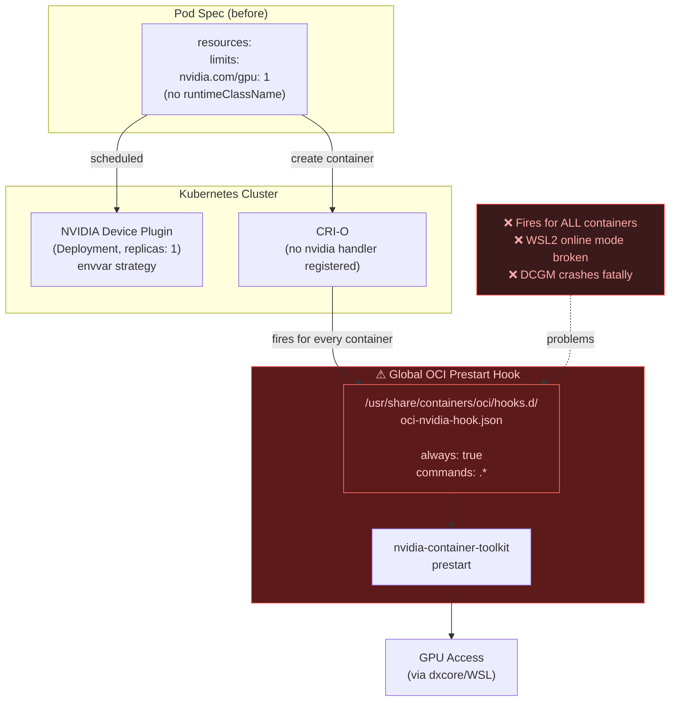

**Problems with the legacy approach:**

| Issue | Impact |
|-------|--------|
| Hook fires for **ALL** containers | Wasteful; potential errors on non-GPU pods |
| No `RuntimeClass` | Pods could not explicitly request GPU runtime |
| No CRI-O nvidia handler registered | Not aligned with upstream semantics |
| `Device Plugin` as a `Deployment` | Not idiomatic for per-node daemon |
| WSL2 online mode broken | Network/proxy setup missing; users had to reinstall |
| DCGM crash was fatal | Addon enable failed instead of continuing non-fatally |

---

### K2s Now (Phase 2.1) -- CDI via Device Plugin Annotations

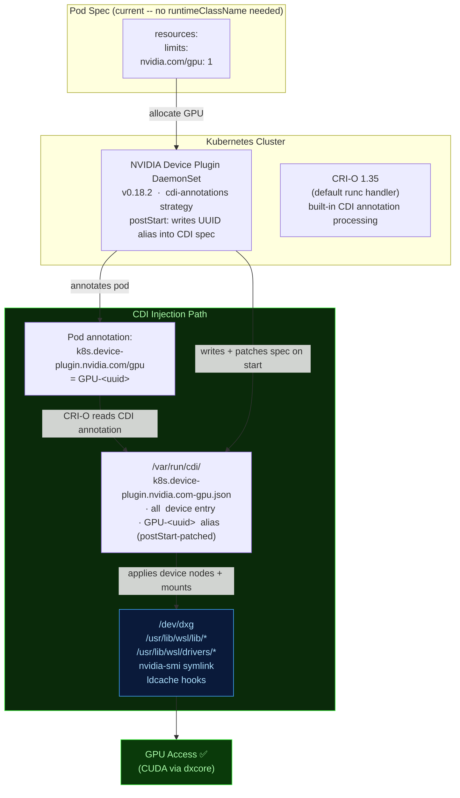

**Validated on both modes -- NVIDIA RTX A2000 8GB, Driver 595.71:**

```
NAME              READY   STATUS      RESTARTS   AGE
cuda-vector-add   0/1     Completed   0          ~60s

[Vector addition of 50000 elements]
Copy input data from the host memory to the CUDA device
CUDA kernel launch with 196 blocks of 256 threads
Copy output data from the CUDA device to the host memory
Test PASSED
```

---

## 3. How Kubernetes Handles GPU Workloads

### 3.1 Vanilla Kubernetes (containerd or CRI-O)

```mermaid
sequenceDiagram
    participant Admin as Cluster Admin
    participant Node as GPU Node
    participant K8s as Kubernetes API
    participant Pod as GPU Pod

    rect rgb(20, 40, 80)
    Note over Admin,Node: Step 1 -- Node-level setup (once)
    Admin->>Node: Install NVIDIA driver
    Admin->>Node: Install NVIDIA Container Toolkit
    Admin->>Node: nvidia-ctk cdi generate --output=/etc/cdi/nvidia.yaml
    Admin->>Node: systemctl restart crio
    end

    rect rgb(20, 60, 20)
    Note over Admin,K8s: Step 2 -- Cluster resources
    Admin->>K8s: kubectl apply Device Plugin DaemonSet (--device-list-strategy=cdi)
    end

    rect rgb(60, 40, 10)
    Note over Pod,K8s: Step 3 -- Workload
    Pod->>K8s: Create Pod with nvidia.com/gpu: 1
    K8s->>Node: Schedule pod to GPU node
    Node->>Node: Device plugin annotates pod with CDI device name
    Node->>Node: CRI-O reads CDI annotation → injects GPU via /etc/cdi spec
    Node->>Pod: Container starts with GPU access
    end
```

**Key characteristics (vanilla K8s CDI path):**

- Manual `nvidia-ctk cdi generate` produces a static `/etc/cdi/nvidia.yaml`
- Device plugin uses `--device-list-strategy=cdi` to annotate pods
- No RuntimeClass required -- CDI annotation processing is built into CRI-O/containerd
- Pod needs only `nvidia.com/gpu: 1` -- no `runtimeClassName`

> **Note:** K2s cannot use `nvidia-ctk cdi generate` (no `/dev/nvidia*` on dxcore).
> Instead the device plugin generates the CDI spec dynamically and a `postStart` hook
> patches the GPU UUID alias. See §7 for the detailed flow.

### 3.2 K2s Current Implementation

```mermaid
sequenceDiagram
    participant User as User
    participant K2s as k2s.exe CLI
    participant PS as Enable.ps1
    participant VM as KubeMaster VM
    participant K8s as Kubernetes API

    User->>K2s: k2s addons enable gpu-node

    rect rgb(70, 20, 20)
    Note over PS,VM: Hyper-V GPU-PV path only
    PS->>VM: Stop VM
    PS->>VM: Add-VMGpuPartitionAdapter
    PS->>VM: Start VM → copy NVIDIA drivers
    PS->>VM: Install WSL2 kernel + restart VM
    end

    rect rgb(20, 60, 20)
    Note over PS,VM: Common path (WSL2 and Hyper-V)
    PS->>VM: Install nvidia-container-toolkit (APT, via proxy)
    PS->>VM: Copy lxss/lib/* → /usr/lib/wsl/lib/ (dxcore stack)
    Note over VM: No OCI hook. No CRI-O drop-in. No RuntimeClass.
    end

    rect rgb(30, 20, 70)
    Note over PS,K8s: Deploy Kubernetes resources
    PS->>K8s: kubectl apply nvidia-device-plugin DaemonSet
    PS->>K8s: kubectl apply dcgm-exporter DaemonSet
    Note over K8s: Device plugin writes CDI spec → /var/run/cdi/
    Note over K8s: postStart hook patches UUID alias into CDI spec
    end
```

---

## 4. Gap Analysis: K2s vs Vanilla Kubernetes

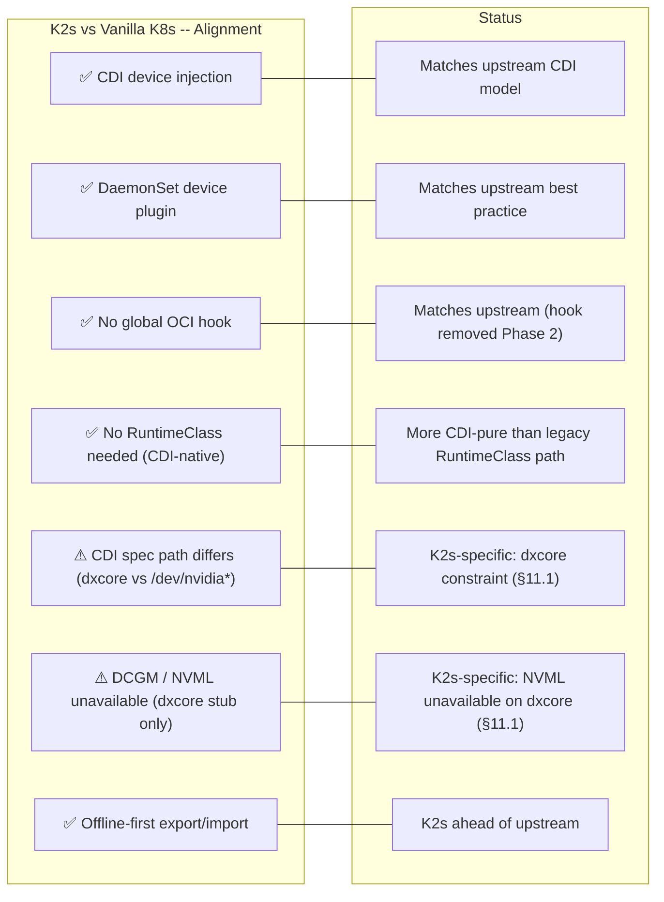

| Capability | Vanilla K8s | K2s Today (Phase 2.1) | Status |
|---|---|---|---|
| Container runtime | containerd or CRI-O | CRI-O 1.35 | -- |
| GPU injection method | CDI annotations (modern) | **CDI annotations** ✅ | Aligned |
| CDI spec source | `nvidia-ctk cdi generate` → `/etc/cdi/` | Device plugin generates `/var/run/cdi/` + postStart UUID patch | K2s-specific (dxcore) |
| RuntimeClass required | No (CDI-native) | **No (Phase 2.1 removed it)** ✅ | Aligned |
| OCI hook | No | **No (removed Phase 2)** ✅ | Aligned |
| Device plugin type | DaemonSet | **DaemonSet v0.18.2** ✅ | Aligned |
| Hook scope | Targeted (CDI annotation) | **Targeted** ✅ | Aligned |
| NVML / nvidia-smi | ✅ On native GPU | **❌ dxcore stub only** | K2s constraint |
| DCGM monitoring | ✅ Optional | ❌ NVML unavailable (non-fatal) | K2s constraint |
| CUDA workloads | ✅ Via NVML | **✅ Via dxcore** | Equivalent |
| Offline support | Manual | **Built-in export/import** ✅ | K2s ahead |

---

## 5. Implementation Phases

### Progress Overview

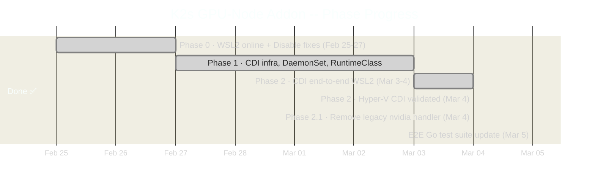

### Phase Summary Table

| Phase | Status | Key deliverable |
|-------|--------|----------------|
| **Phase 0** | ✅ 2026-02-27 | WSL2 online mode fixed (SSH tunnel, wsl.conf IP bug, buildah pre-pull). `Disable.ps1` cleanup gap fixed. DCGM made non-fatal. |
| **Phase 1** | ✅ 2026-03-03 | RuntimeClass `nvidia` + CRI-O `crun`-backed drop-in (Phase 2.1 removed these). Device Plugin → DaemonSet. `Get-Status.ps1` updated. |
| **Phase 2 (WSL2)** | ✅ 2026-03-04 | CDI via `cdi-annotations` + `/var/run/cdi` hostPath. postStart UUID alias hook. OCI hook removed. Hardware-validated. |
| **Phase 2 (Hyper-V)** | ✅ 2026-03-04 | Device plugin `1/1 Running`. Image tag bug fixed (`v0.18.2-ubi8` → `v0.18.2`). NVML confirmed unavailable (same dxcore stack). CUDA: `Test PASSED`. |
| **Phase 2.1** | ✅ 2026-03-04 | Removed CRI-O `99-nvidia.toml` drop-in and RuntimeClass `nvidia`. CDI annotations require no runtime handler. Deleted `nvidia-runtime-class.yaml`. |
| **E2E test update** | ✅ 2026-03-05 | Updated `k2s/test/e2e/addons/gpu-node/` to Phase 2 CDI path. Real `vectoradd-cuda11.7.1` image, `ContainSubstring("Test PASSED")`, DCGM comment (NVML unavailable on dxcore). |

---

### Phase 0 Key Fixes

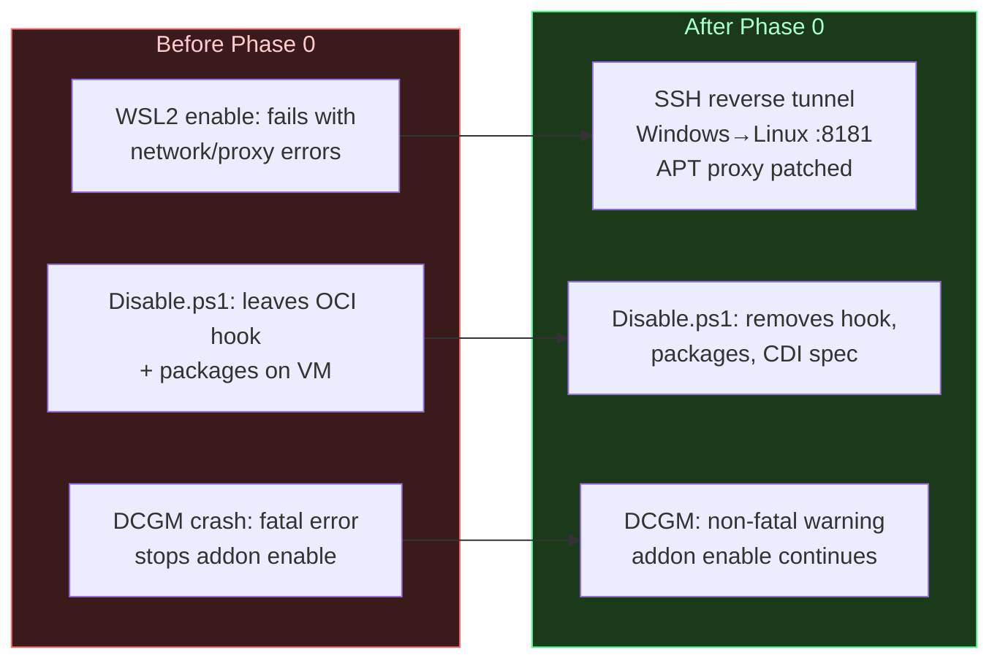

- **WSL2 network fix** (`common-setup.module.psm1`): spurious quoting in `wsl.conf boot.command` prevented `ifconfig` from assigning the VM IP.
- **Proxy tunnel** (`Enable.ps1`): SSH reverse tunnel `Windows→Linux` on port 8181; stale sshd killed via `sudo ss`; apt proxy patched to `127.0.0.1:8181` while tunnel active.
- **buildah pre-pull**: replaces broken `crictl pull` + CRI-O restart for WSL2 image downloads. NGC token exchange works through Windows httpproxy.
- **DCGM non-fatal**: `CrashLoopBackOff` downgraded to warning -- CUDA workloads unaffected.
- **`additionalImages`**: 4 deployment images added to `addon.manifest.yaml` for offline export.

---

### Phase 1 Key Fixes (historical -- Phase 2.1 removed RuntimeClass and CRI-O drop-in)

- **RuntimeClass `nvidia`** + **CRI-O drop-in `99-nvidia.toml`**: `nvidia-container-runtime` 1.18.x rejects CRI-O 1.35 / OCI spec 1.3.0 (`unknown version specified`), so a `crun`-backed drop-in was used in Phase 1. Both removed in Phase 2.1 -- CDI annotation processing in CRI-O requires no named handler.
- **Device Plugin → DaemonSet**: `kubectl rollout status daemonset` replaces old Deployment readiness check.
- **`Initialize-Logging`** added to `Enable.ps1` for `-ShowLogs` flag consistency.

---

### Phase 2 Key Fixes

Three debugging rounds were needed before CDI worked end-to-end:

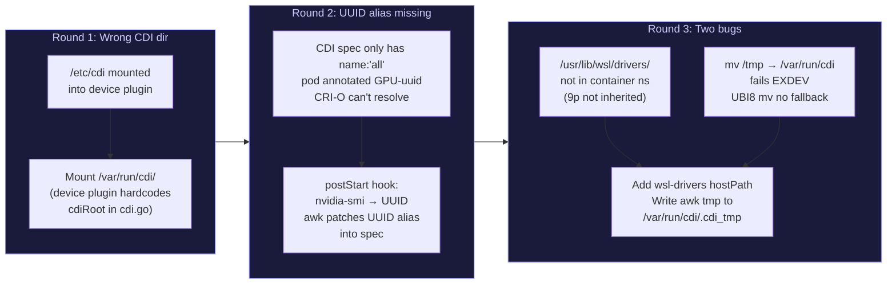

**CDI spec structure (device plugin-generated + postStart UUID patch):**

```json
{
  "cdiVersion": "0.5.0",
  "kind": "k8s.device-plugin.nvidia.com/gpu",
  "devices": [
    {"name": "all",        "containerEdits": {"deviceNodes": [{"path": "/dev/dxg", "hostPath": "/dev/dxg"}]}},
    {"name": "GPU-<uuid>", "containerEdits": {"deviceNodes": [{"path": "/dev/dxg", "hostPath": "/dev/dxg"}]}}
  ],
  "containerEdits": {
    "env":    ["NVIDIA_VISIBLE_DEVICES=void"],
    "hooks":  ["create-symlinks for nvidia-smi", "update-ldcache for /usr/lib/wsl/drivers/ + /usr/lib/wsl/lib"],
    "mounts": ["libdxcore.so", "libcuda.so.1.1", "libcuda_loader.so", "libnvdxgdmal.so.1",
               "libnvidia-ml.so.1", "libnvidia-ml_loader.so", "libnvidia-ptxjitcompiler.so.1",
               "nvcubins.bin", "nvidia-smi"]
  }
}
```

> **Maintenance note:** The `postStart` hook uses `awk` with the pattern `}]}}]` to locate the
> end of the `devices` array. If the device plugin changes its CDI spec serialisation, this
> pattern needs updating -- it lives in `addons/gpu-node/manifests/nvidia-device-plugin.yaml`.

---

### Phase 2.1 Key Changes

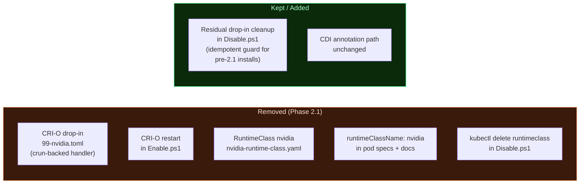

---

## 6. GPU-PV vs WSL Compatibility Matrix

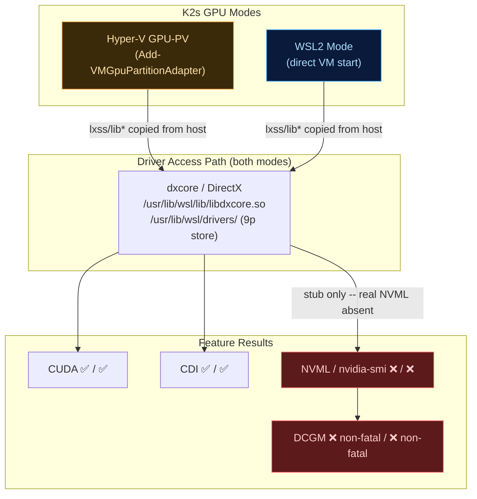

| Capability | Hyper-V GPU-PV | WSL2 Mode | Vanilla K8s (bare metal) |
|-----------|---------------|-----------|--------------------------|
| GPU device node | `/dev/dxg` via GPU-PV | `/dev/dxg` via WSL2 | `/dev/nvidia0` |
| CDI injection | ✅ Validated 2026-03-04 | ✅ Validated 2026-03-04 | ✅ via `/etc/cdi/` |
| CUDA workloads | ✅ via dxcore | ✅ via dxcore | ✅ native |
| NVML / nvidia-smi | ❌ dxcore stub only | ❌ dxcore stub only | ✅ full NVML |
| DCGM monitoring | ❌ `ERROR_LIBRARY_NOT_FOUND` (non-fatal) | ❌ `ERROR_LIBRARY_NOT_FOUND` (non-fatal) | ✅ works |
| RuntimeClass needed | ❌ not needed | ❌ not needed | ❌ not needed (CDI-native) |
| Offline image pull | Direct via proxy | SSH reverse tunnel to proxy | Manual |
| Export/import | ✅ built-in | ✅ built-in | Manual |

> **Why NVML is unavailable on both K2s modes:** `Enable.ps1` copies
> `C:\Windows\System32\lxss\lib\*` into the VM at `/usr/lib/wsl/lib/`.
> `libnvidia-ml.so.1` in that directory is a **dxcore stub** -- it routes through
> `libdxcore.so` to the Windows driver, not a full NVIDIA kernel driver. DCGM
> requires real NVML and fails identically on both modes. CUDA works through
> the same dxcore path.

---

## 7. Architecture Deep Dive

### WSL2 Library Dependency Map

```
/usr/lib/wsl/lib/libnvidia-ml.so.1   <- dxcore stub (hostPath-mounted into device plugin)
  +-- dlopen() -> real driver at /usr/lib/wsl/drivers/<infdir>/...
                 +-- 9p mount NOT inherited into CRI-O container namespaces
                     => wsl-drivers hostPath volume REQUIRED in DaemonSet
/usr/lib/wsl/lib/nvidia-smi          <- used by postStart hook to query GPU UUID
/usr/bin/nvidia-smi                  <- symlink created by CDI ldcache hook INSIDE workload containers
```

### CDI Annotation Flow (detailed)

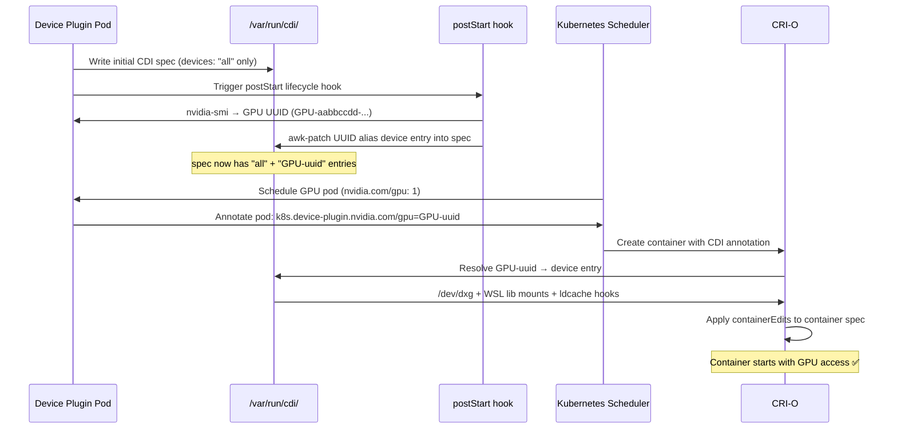

---

## 8. Pod Spec Examples

### Standard GPU Workload (current -- no runtimeClassName needed)

```yaml
apiVersion: v1
kind: Pod
metadata:
  name: cuda-workload
spec:
  restartPolicy: Never
  containers:
  - name: cuda
    image: nvcr.io/nvidia/k8s/cuda-sample:vectoradd-cuda11.7.1
    imagePullPolicy: IfNotPresent
    resources:
      limits:
        nvidia.com/gpu: 1     # schedules to GPU node; CDI annotation added automatically
```

> No `runtimeClassName` required. The device plugin CDI annotation and CRI-O's
> built-in CDI processing handle device injection without a named runtime handler.
> This matches the vanilla K8s CDI-native pod spec exactly.

### Verified E2E Test Workload

```yaml
# k2s/test/e2e/addons/gpu-node/workloads/cuda-sample.yaml
apiVersion: v1
kind: Pod
metadata:
  name: cuda-vector-add
spec:
  restartPolicy: OnFailure
  containers:
  - name: cuda-vector-add
    image: nvcr.io/nvidia/k8s/cuda-sample:vectoradd-cuda11.7.1
    imagePullPolicy: IfNotPresent
    resources:
      limits:
        nvidia.com/gpu: 1
```

> `vectoradd-cuda12.x` tags pass manifest inspection but fail NGC CDN pull --
> `vectoradd-cuda11.7.1` pulls reliably and runs the real `vectorAdd` CUDA kernel.

### Multi-GPU Workload (future -- single-node K2s has one GPU)

```yaml
apiVersion: v1
kind: Pod
metadata:
  name: ml-training
spec:
  containers:
  - name: training
    image: nvcr.io/nvidia/pytorch:24.01-py3
    resources:
      limits:
        nvidia.com/gpu: 2
    command: ["python", "-m", "torch.distributed.launch", "train.py"]
```

---

## 9. Verification Checklist

### After `k2s addons enable gpu-node`

```bash
# 1. Device plugin DaemonSet healthy -- correct image tag
kubectl get ds -n gpu-node nvidia-device-plugin
# Expected: DESIRED=1  CURRENT=1  READY=1

kubectl get ds nvidia-device-plugin -n gpu-node \
  -o jsonpath='{.spec.template.spec.containers[0].image}'
# Expected: nvcr.io/nvidia/k8s-device-plugin:v0.18.2

# 2. CDI spec present and UUID alias injected by postStart hook
kubectl exec -n gpu-node \
  $(kubectl get pod -n gpu-node -l k8s-app=nvidia-device-plugin -o name) -- \
  grep -o "GPU-[a-f0-9-]*" /var/run/cdi/k8s.device-plugin.nvidia.com-gpu.json
# Expected: GPU-<uuid>  (UUID alias entry added by postStart hook)

# 3. GPU resource advertised on node
kubectl describe node | grep -A2 nvidia.com/gpu
# Expected: nvidia.com/gpu: 1

# 4. No OCI hook on VM (removed in Phase 2)
ssh remote@<vm-ip> "ls /usr/share/containers/oci/hooks.d/ 2>/dev/null || echo empty"
# Expected: empty

# 5. No RuntimeClass exists (removed in Phase 2.1)
kubectl get runtimeclass 2>&1
# Expected: No resources found
```

### End-to-end GPU test

```bash
kubectl delete pod cuda-vector-add --ignore-not-found
kubectl apply -f k2s/test/e2e/addons/gpu-node/workloads/cuda-sample.yaml
kubectl wait pod cuda-vector-add --for=condition=Completed --timeout=120s
kubectl logs cuda-vector-add
# Expected:
#   [Vector addition of 50000 elements]
#   Copy input data from the host memory to the CUDA device
#   CUDA kernel launch with 196 blocks of 256 threads
#   Copy output data from the CUDA device to the host memory
#   Test PASSED
```

### After `k2s addons disable gpu-node`

```bash
# CDI spec removed from VM
ssh remote@<vm-ip> "ls /var/run/cdi/ 2>/dev/null || echo empty"
# Expected: empty

# No residual CRI-O drop-in (Phase 1 artifact)
ssh remote@<vm-ip> "ls /etc/crio/crio.conf.d/*nvidia* 2>/dev/null || echo none"
# Expected: none

# No gpu-node namespace remains
kubectl get ns gpu-node --ignore-not-found
# Expected: (no output)
```

---

## 10. Risk Assessment

```mermaid
quadrantChart
    title Risk vs Impact Matrix (current state)
    x-axis Low Impact --> High Impact
    y-axis Low Likelihood --> High Likelihood
    quadrant-1 Monitor
    quadrant-2 Act Immediately
    quadrant-3 Accept
    quadrant-4 Plan Mitigation
    CDI awk pattern breaks on plugin upgrade: [0.5, 0.2]
    Windows driver update stalens 9p mount: [0.6, 0.5]
    DCGM unavailable on all K2s modes: [0.3, 1.0]
    NGC CDN pull failure for cuda12 tags: [0.4, 0.5]
    nvidia-ctk pkg missing offline: [0.3, 0.1]
```

| Risk | Likelihood | Impact | Mitigation / Status |
|------|-----------|--------|---------------------|
| CDI spec `awk` pattern `}]}}]` breaks on device plugin upgrade | Low | Medium | Pattern lives in `nvidia-device-plugin.yaml` postStart hook. Verify on any version bump. |
| Windows NVIDIA driver update while VM running | Medium | High | WSL2 9p mount goes stale → `nvidia-smi` exits -1. Fix: `k2s stop; k2s start`. |
| DCGM fails on all K2s GPU modes | **Confirmed** (non-fatal) | Low | `libnvidia-ml.so.1` is a dxcore stub on both modes. CUDA workloads unaffected. `Get-Status.ps1` reports non-fatally. |
| NGC CDN: `vectoradd-cuda12.x` tags pull-fail | **Confirmed** | Low | `vectoradd-cuda11.7.1` used instead -- confirmed working on both modes. |
| `nvidia-ctk` package unavailable offline | Low | Medium | Included in `nvidia-container-toolkit` APT bundle; covered by export/import. |
| `nvidia-container-runtime` incompatible with CRI-O 1.35 | **Confirmed / Resolved** | -- | Not used -- CDI annotations bypass runtime handler entirely (Phase 2.1). |
| WSL `wsl.conf` boot.command broken on pre-Phase-0 clusters | **Confirmed / Resolved** | -- | Fixed in `common-setup.module.psm1` 2026-02-27. Existing clusters need manual fix or reinstall. |

---

## 11. K2s-Specific Constraints

### 11.1 GPU Paravirtualization (Hyper-V GPU-PV)

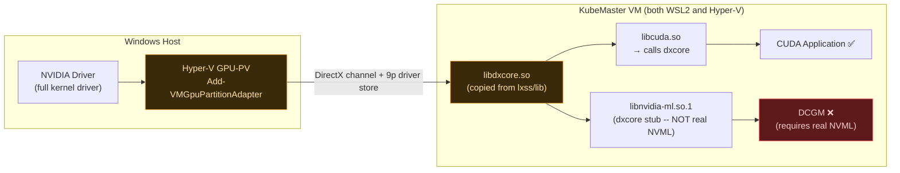

- No `/dev/nvidia*` device nodes -- GPU exposed via DirectX/dxcore only
- Both WSL2 and Hyper-V modes use the **same dxcore library stack** (copied from `lxss/lib`)
- NVML unavailable on both → DCGM and bare `nvidia-smi` (outside containers) don't work
- CUDA works: `libcuda.so → libdxcore.so → Windows NVIDIA driver`
- This is unique to K2s -- vanilla Kubernetes on bare metal does not face this constraint

### 11.2 CRI-O (not containerd)

K2s uses CRI-O 1.35. CDI is built into CRI-O with no extra toggle -- `cdi_spec_dirs`
defaults to `["/etc/cdi", "/var/run/cdi"]`. The device plugin writes its spec to
`/var/run/cdi/` which CRI-O monitors automatically. No `enable_cdi = true` config
change is needed.

### 11.3 Offline-First Design

Any new dependencies must be covered by `k2s addons export/import`:

| Dependency | Coverage |
|------------|----------|
| `nvidia-container-toolkit` APT packages | ✅ Covered by addon export |
| `nvcr.io/nvidia/k8s-device-plugin:v0.18.2` | ✅ In `additionalImages` |
| `nvcr.io/nvidia/k8s/dcgm-exporter:4.5.2-4.8.1-ubi9` | ✅ In `additionalImages` |
| CDI spec (`/var/run/cdi/`) | ✅ Generated at enable time -- no download |

### 11.4 WSL2 vs Hyper-V Dual Paths

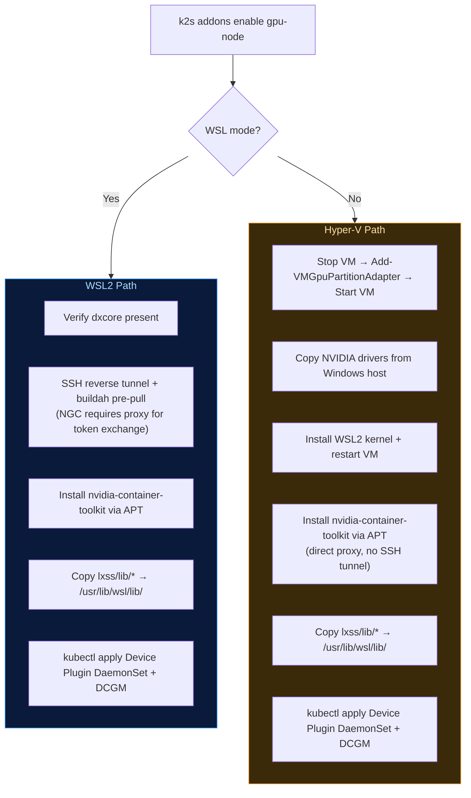

---

## 12. Export / Import / Backup / Restore

### VM-level state (not in K8s export)

| Artifact | Path | Managed by |
|----------|------|-----------|
| `nvidia-container-toolkit` packages | APT | `Enable.ps1` / `Disable.ps1` |
| CDI spec | `/var/run/cdi/k8s.device-plugin.nvidia.com-gpu.json` | Device plugin (auto-regenerated on next enable) |

After importing to a new machine, run `k2s addons enable gpu-node` before scheduling GPU workloads.

### Disable cleanup guarantee

`Disable.ps1` removes all gpu-node state in order:

1. OCI hook (idempotent -- absent on Phase 2 installs)
2. CDI spec `/var/run/cdi/k8s.device-plugin.nvidia.com-gpu.json`
3. Residual CRI-O drop-in `/etc/crio/crio.conf.d/*nvidia*` (idempotent guard for pre-2.1 installs)
4. DaemonSets deleted with `--ignore-not-found`
5. `nvidia-container-toolkit` package removal

---

## 13. References

- [NVIDIA Container Toolkit Documentation](https://docs.nvidia.com/datacenter/cloud-native/container-toolkit/latest/index.html)
- [Kubernetes CDI Support](https://kubernetes.io/docs/concepts/extend-kubernetes/compute-storage-net/device-plugins/#cdi-devices)
- [Container Device Interface (CDI) Spec](https://github.com/cncf-tags/container-device-interface)
- [NVIDIA Device Plugin for Kubernetes](https://github.com/NVIDIA/k8s-device-plugin)
- [CRI-O CDI Support](https://github.com/cri-o/cri-o/blob/main/docs/crio.conf.5.md)
- [K3s GPU Support](https://docs.k3s.io/advanced#nvidia-container-runtime-support)

