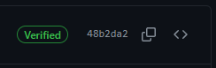

<!--
SPDX-FileCopyrightText: © 2024 Siemens Healthcare GmbH
SPDX-License-Identifier: MIT
-->

# Contributing
## Contributor License Agreement
There are two versions of the Contributor License Agreement (CLA). 
The contributor should be able to chose the right one: 

* contribution by his/her employer (typically a legal entity) [CLA Corporate Contributor](./cla-corporate-contributor.md)
* contribution by an individual [CLA Individual Contributor](./cla-individual-contributor.md) 

The CLA is drafted for re-use for any contributions the (same) contributor makes, so that it needs to be signed only once.
This CLA does not enable Siemens Healthineers to use or process personal data. The contributor must not contribute personal data according to this CLA.

## Contributing with code
The code is mainly written in *Go* and *PowerShell*. See [*PowerShell* Development](powershell-dev.md) for more information.

### Clone *Git* Repository

```console
> mkdir c:\myFolder; cd c:\myFolder
C:\myFolder> git clone https://github.com/Siemens-Healthineers/K2s .
```

### Codebase Structure
<pre>
├── addons      --> Addon(s)-specific configuration and PowerShell scripts
├── bin         --> Binaries (either committed to this repo or dropped as build target)
├── build
├── cfg         --> Configuration files
├── docs
├── k2s         --> Go-based sources
├── lib         --> PowerShell scripts
├── LICENSES
├── smallsetup  --> [legacy] PowerShell scripts; to be migrated to "lib"
├── test        --> Main test script(s)
├── ...
├── README.md
├── k2s.exe
├── VERSION
└── ...
</pre>

### Licensing
!!! warning
    **All files**, whether *own* code or 3rd-party code (i.e. *PowerShell*/*Go* snippets or configuration files like *yaml* manifests, etc.), have to be clearly marked with the respective license.

The currently supported/used 3rd-party licenses can be found in the [LICENSES](https://github.com/Siemens-Healthineers/K2s/tree/main/LICENSES){target="_blank"} folder.

!!! warning
    **This repository follows the [REUSE Specification – Version 3.0](https://reuse.software/spec/){target="_blank"},** meaning that a valid license configuration must exist for every file, either **as comment or as separate \*.license file**.

The CI runs will check all files against the *REUSE* specification, but you can pre-check your local repo using the [reuse tool](https://github.com/fsfe/reuse-tool){target="_blank"}.

### Building Locally
#### Workspace Prerequisites
All the prerequisites mentioned in [Installation Prerequisites](../../op-manual/installation.md#prerequisites) must be fulfilled.

* Install [*Go*](https://go.dev/dl/){target="_blank"} for *Windows*.

#### Build *Go* projects
Building *Go* based projects is done through [BuildGoExe.ps1](https://github.com/Siemens-Healthineers/K2s/blob/main/smallsetup/common/BuildGoExe.ps1){target="_blank"}

!!! tip
    `bgo.cmd` is a shortcut command to invoke the script `BuildGoExe.ps1`.<br/>
    If you have not installed *K2s* yet, then your `PATH` is not updated with the required locations. In this case, look for bgo.cmd and invoke the build command.

In the below example, `c:\k` is the root of the *Git* repo:
```console
where bgo
C:\k\bin\bgo.cmd
```

Building `httpproxy` *Go* project:
```console
C:\k\bin\bgo -ProjectDir "C:\k\k2s\cmd\httpproxy\" -ExeOutDir "c:\k\bin"
```

!!! info
    The `k2s` CLI can be built without any parameters:
```console
C:\k\bin\bgo
```

To build all *Go* executables:
```console
C:\k\bin\bgo -BuildAll 1
```

If *K2s* is installed then just simply execute the command without the full path:
```console
bgo -ProjectDir "C:\k\k2s\cmd\httpproxy\" -ExeOutDir "c:\k\bin"
bgo -BuildAll 1
```

### Testing 
See [Automated Testing](automated-testing.md)

### Submitting Changes
The following guidelines apply to submitting changes to *K2s*:

- Only commit changes when a corresponding issue exists and the maintainers have agreed that this issue is going to be realized (see [K2s Issues](https://github.com/Siemens-Healthineers/K2s/issues){target="_blank"})
- Reference the issue in commit messages, e.g. for a refactoring issue with ID 42, create a message like `#42 refactor(addons): obsolete code path removed`. 
!!! info
    This example also uses [Conventional Commits](https://www.conventionalcommits.org/en/v1.0.0/){target="_blank"}, which is not mandatory, but recommended.
- Since *K2s* is open source, we utilize the *GitHub's* [Pull Requests](https://docs.github.com/en/pull-requests){target="_blank"} workflow:
    - Fork this repository (applies to all non-maintainers)
    - Create a separate branch, commit to that branch and push your changes
    - Create a PR in *GitHub* to this repository. This will trigger at least short-running automated tests.
    - The PR will be reviewed by the maintainers. If re-work is needed, the preceding steps will be iterated. If the changes are acceptable, the PR will be merged to main.
- Sign your commits (see [Commit Signing](#commit-signing))
- Run as many automated tests as possible, but at least the unit tests: `<repo>\test\execute_all_tests.ps1 -Tags unit` (see also [Main Script: execute_all_tests.ps1](automated-testing.md#main-script-execute_all_testsps1)). Depending on the area of changes, consider running the appropriate e2e tests as well.

#### Commit Signing
Signing commits increases trust in your contributions. Verified commit signatures will be display in GitHub like this:

<figure markdown="span">
  
  <figcaption>Verified Commit</figcaption>
</figure>
  
Further readings: [Displaying verification statuses for all of your commits](https://docs.github.com/en/authentication/managing-commit-signature-verification/displaying-verification-statuses-for-all-of-your-commits){target="_blank"}

!!! tip
    If you use [Visual Studio Code](https://code.visualstudio.com/){target="_blank"} in conjunction with the [GitHub Pull Requests Extension](https://marketplace.visualstudio.com/items?itemName=GitHub.vscode-pull-request-github){target="_blank"} and you are logged in into *GitHub* with that extension, your commits might get signed automatically already.

To setup code signing manually, follow these steps:

- If you do not have a GPG key yet, see [Generating a new GPG key](https://docs.github.com/en/authentication/managing-commit-signature-verification/generating-a-new-gpg-key){target="_blank"}.
!!! info
    Since you are most likely running on *Windows*, you can use the *Git bash* for `gpg` commands
- If you have a GPG key in place, sign your commits. According to [Signing commits](https://docs.github.com/en/authentication/managing-commit-signature-verification/signing-commits){target="_blank"}, the following options exist:
    - sign every commit with `git commit -S -m "YOUR_COMMIT_MESSAGE"`
    - enable GPG signature for the whole local repo with `git config commit.gpgsign true`
    - enable GPG signature for all local repos with `git config --global commit.gpgsign true`
    
    !!! tip
        To avoid entering the passphrase for the GPG key too often, you can increase the expiration time, e.g. on *Windows* using [Gpg4win](https://gpg4win.org/download.html){target="_blank"} (see [How do I install and use gpg-agent on Windows?](https://stackoverflow.com/a/66821816){target="_blank"}). Alternatively, these settings can also be modified in this file: `C:\Users\<user>\AppData\Roaming\gnupg\gpg-agent.conf`

See [Managing commit signature verification](https://docs.github.com/en/authentication/managing-commit-signature-verification){target="_blank"} for more information.
