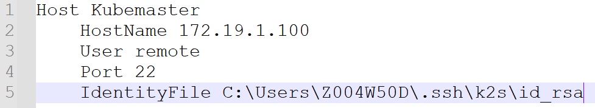
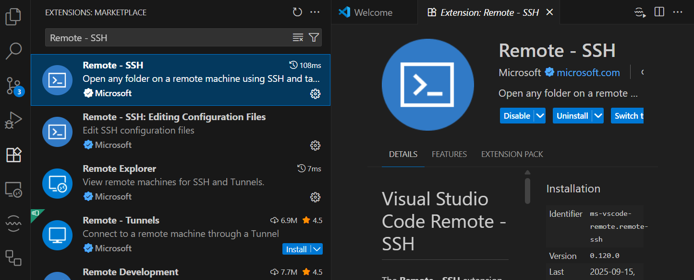
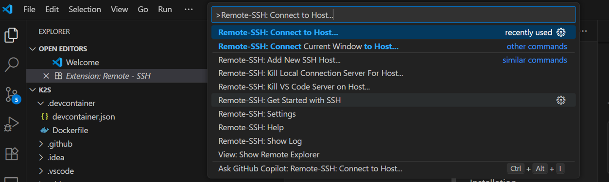
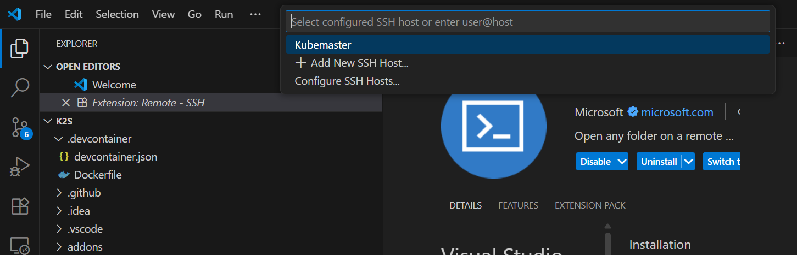
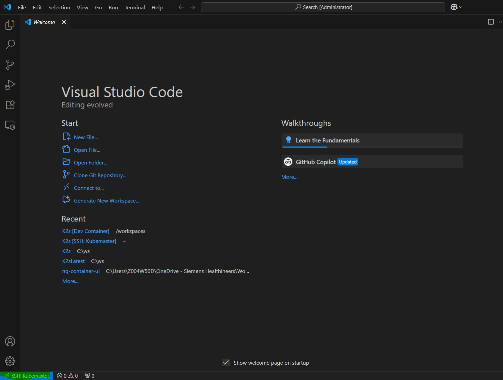
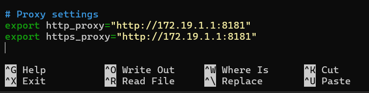
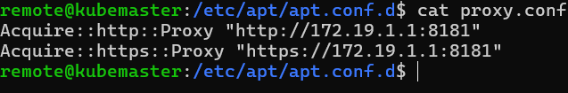

<!--
SPDX-FileCopyrightText: © 2025 Siemens Healthineers AG
SPDX-License-Identifier: MIT
-->

## Remote Linux Development via SSH and VS Code

### 1\. Create SSH Config File

- On your Windows machine, open the file `C:\Users\<YourUsername>\.ssh\config` (create it if it doesn’t exist).
- Add the following entry, adjusting paths and IP as needed:

  - HostName is the IP address of your Linux VM created after K2s installation.
  - User is the username you set up during K2s installation (default is `remote`)
  - After K2s is successfully installed, `id_rsa` file is created in `C:\Users\<YourUsername>\.ssh\K2s\id_rsa` and is the private key used to connect to the Linux VM.
- Replace `<YourUsername>` with your actual Windows username.

### 2\. Install Remote-SSH Extension in VS Code

- Open Visual Studio Code.
- Go to Extensions (`Ctrl+Shift+X`), search for `Remote - SSH`, and install it.

### 3\. Connect to KubeMaster

- Press `F1` in VS Code, type `Remote-SSH: Connect to Host...`, and select `KubeMaster`.

- VS Code will open a new window connected to your Linux VM.

### 4\. Example: Clone a Repository on Linux and Develop from Windows Using VS Code

- In the remote VS Code window, open the terminal (`Ctrl+\``).
- Run: check if internet is working by using following command - curl -vvv https://google.com
  - If above curl command doesnt return 200 response, you need to set proxy in the terminal using following command 
      - export http_proxy=http://172.19.1.1:8181 export https_proxy=https://172.19.1.1:8181 - But this is temporary and will be lost when you close the terminal.
      - To make it permanent, you need to add proxy to ~/.bashrc file.
        
      - Add proxy to /etc/apt/apt.conf.d/proxy.conf → so apt update and apt install work.
        
- To clone a repository, run the following commands (replace `<repo-url>` with your repository URL):
  - Install Git if its not already present in linux vm
    - bash
    - sudo apt update
    - sudo apt install git
    - git --version
  - Set your git user name and email
    - git config --global user.name "Your Name"
    - git config --global user.email "Your email"
  - Goto any folder in terminal and Clone a repository for example git clone https://github.com/Siemens-Healthineers/K2s .
  - While cloning, Git may prompt for authentication. You can authenticate using your GitHub username and a personal access token (PAT), or follow the on-screen instructions for other supported authentication methods (such as browser-based login or OAuth).
- After cloning, Open the cloned repo folder in VS Code (`File > Open Folder...`).