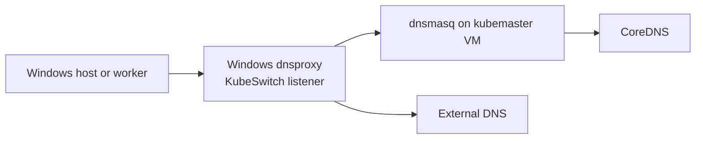

<!--
SPDX-FileCopyrightText: © 2026 Siemens Healthineers AG
SPDX-License-Identifier: MIT
-->

# DNS Host Topologies

K2s provides the same high-level DNS outcome on supported host topologies:
Kubernetes names resolve where K2s workloads and host-integrated tooling need
them, while non-Kubernetes names continue through external DNS.

## Topology pictures

### Windows host with Linux control-plane VM



### Native Linux host

```mermaid
flowchart LR
	App[Linux host application] --> Resolver[/etc/resolv.conf<br/>while K2s is running]
	Resolver --> LinuxProxy[K2s dnsproxy<br/>127.0.0.1 and KubeSwitch]
	LinuxProxy --> CoreDNS[Discovered kube-dns / CoreDNS]
	LinuxProxy --> External[Captured external DNS upstreams]
	Worker[Future Linux or Windows worker] --> LinuxProxy
```

Both topologies offer a KubeSwitch DNS endpoint for K2s-connected nodes and
separate Kubernetes-zone resolution from normal external DNS resolution.

| Aspect | Windows host with Linux control-plane VM | Native Linux host |
|---|---|---|
| Control plane | `kubemaster` Linux VM | Linux host itself |
| DNS proxy location | Windows host | Native Linux host |
| Kubernetes DNS upstream | `dnsmasq` on `kubemaster`, then CoreDNS | Dynamically discovered `kube-dns` / CoreDNS Service |
| Worker-facing endpoint | KubeSwitch address on port 53 | Configured KubeSwitch address on port 53 |
| Host resolver integration | Windows DNS proxy / host networking integration | Temporary K2s-owned `/etc/resolv.conf` pointing to loopback DNS proxy |
| Physical NIC DNS | Windows flow can configure host networking | Never modified by native Linux K2s |
| External DNS | Forwarded by Windows DNS proxy | DNS-over-HTTPS fallback through the K2s HTTP proxy |
| Stop behavior | K2s DNS services stop | Resolver state is restored first, then K2s DNS proxy stops |

## Compatibility boundary

Native Linux DNS lifecycle code is build-tagged for Linux and does not modify
the Windows PowerShell DNS proxy, KubeSwitch, `dnsmasq`, or Windows network
configuration flows. Windows behavior therefore remains backward compatible.

The native Linux KubeSwitch listener is retained for future Linux and Windows
worker-node topologies. The loopback listener serves the native Linux host.