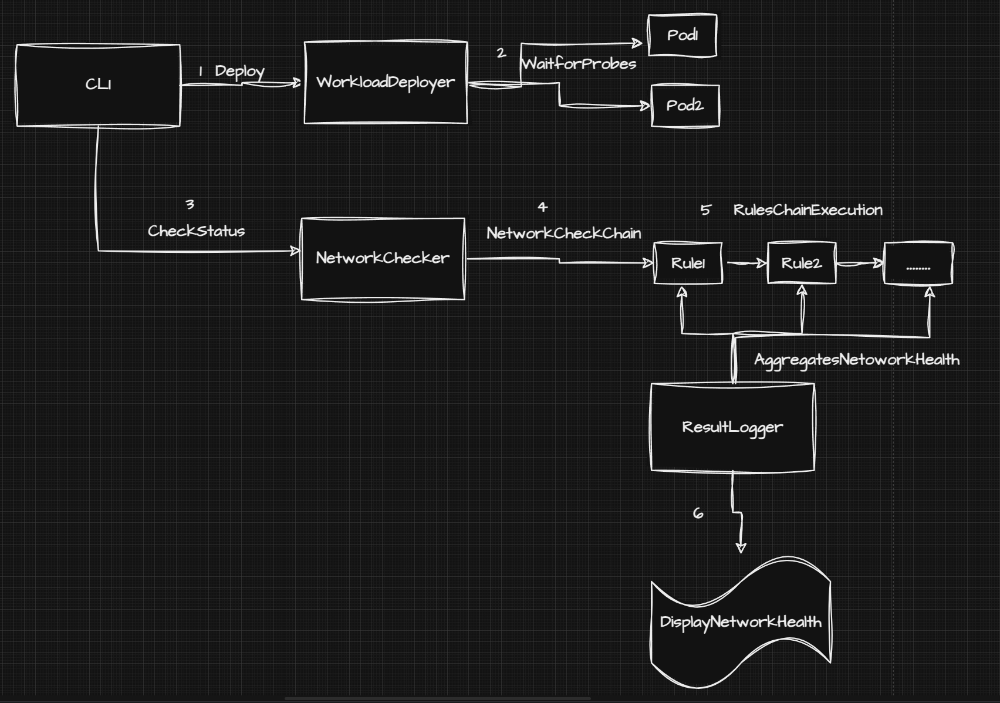

# KEP-1: Cluster Networking Overview

- [Release Signoff Checklist](#release-signoff-checklist)
- [Requirement](#requirement)
  - [Goals](#goals)
  - [Non-Goals](#non-goals)
- [Proposal](#proposal)
  - [High Level User Stories](#high-level-user-stories)
  - [Notes/Constraints/Caveats](#notesconstraintscaveats)
- [Design Details](#design-details)
  - [Test Plan](#test-plan)
    - [Unit tests](#unit-tests)
    - [Integration tests](#integration-tests)
    - [e2e tests](#e2e-tests)
- [Drawbacks](#drawbacks)
- [Alternatives](#alternatives)

## Release Signoff Checklist

- [ ] KEP reviewed and approved by maintainers.
- [x] Design details are appropriately documented.
- [x] Test plan is in place.
  - [x] e2e Tests.
- [x] User documentation has been created.

## Requirement

As a `K2s` user, I want an overview of the cluster's networking health, particularly focusing on pod-to-pod and node-to-node communication.

## Motivation

A key step in ensuring a healthy cluster, both during initial deployment and ongoing operation, is to verify pod-to-pod and node-to-node communication. This functionality is a prerequisite for a functioning cluster. As a user, I do not have a mechanism to verify the cluster networking. This needs an various deployment of pods on each nodes and verify the communication among them which is arduous and highly likely to miss out verifying connectivity in certain combination.

[](k2s-network-status-dark.png)

### Goals

- Provide a dynamic mechanism for the user through CLI to check the cluster networking status.
- In case of networking errors, provide a possible list of troubleshooting steps.
- Verification of networking status is not dependent on any external tools. (Tools available from k2s installation are acceptable)
- Does not require administrative access to the node. (Administrative access via the Kubernetes API is acceptable.)

### Non-Goals

- Providing networking overview of the host machine from a cluster level is not in the scope.
- Resolution of networking issues automatically is not targeted here.

## Proposal

`k2s status` supports displaying basic cluster status. We shall add a subcommand to display the networking status `k2s status network` that will:

1. Deploy networking pods on each node which help in performing networking health checks.
2. Perform communication with:
    - pod-to-pod
    - pod-to-pod across nodes
    - pod-to-service
    - pod-to-internet (Optional)
    - node-to-node.

Sample output for the user:

[](sample-status-network.png)

### High Level User Stories

- As a `k2s` user I want to view networking status of the cluster.
- As a `k2s` user I want to view the connectivity states for a specific node or across nodes.
- As a `k2s` user I want to get troubleshooting tips for faulty connection states in the network.

### Notes/Constraints/Caveats

- In general, `k2s` does not use deploy custom-built container images, for the purpose of gathering network health there is a need of packaging lightweight network probes (~100MB).

## Design Details

### CLI

Preview of `k2s status network` command

```cmd
Provides overview of K2s cluster networking in the installed machine

Usage:
  k2s status network [flags]

Examples:

  # Networking status of the cluster
  k2s status network


Flags:
  -o, --output string   Output format modifier. Currently supported: 'json' for output as JSON structure
  -n, --nodes strings   List of nodes to deploy networking probes, if empty then deployed on all available nodes
  -h, --help            help for network

Global Flags:
  -v, --verbosity string   log level verbosity, either pre-defined levels, integer values or a combination of both.
                           Pre-defined levels: debug = -4 | info = 0 | warn = 4 | error = 8
                           - e.g. '-v debug'    -> debug
                           - e.g. '-v 4'        -> warn
                           - e.g. '-v debug+4'  -> info
                           - e.g. '-v error-8'  -> info
                           - e.g. '-v warn+2'   -> 6 (between warn and error)
                            (default "warn")
```

### Design Goals

- Abstraction: Abstract third-party packages to reduce direct dependencies.
- Reusability: Provide modular `go` packages which can be re-used.
- Scalability: Provide a mechanism to perform checks independent of cluster nodes.
- Observability: Provide mechanism to observe network checks health.

### High level Flow

[](k2s-network-status-design.png)

### High level Components

- `workloaddeployer`: Manages lifecycle of networking probes.
- `networkchecker`: Manages connectivity checks between pods.
- `clusterclient`: Interface for Kubernetes operations using the Kubernetes client-go library.
- `resultlogger`: Responsible for providing networking health overview.
- `cmdexecutor`: Responsible for CLI operations e.g. kubectl

### Test Plan

#### Unit tests

- Standard unit tests for all `go` packages.

#### Integration tests

- Integration tests between `clusterclient` and `workloaddeployer`

##### e2e tests

- Multi node cluster is a pre-requisite. Test the deployment of probes both in online and offline scenario (without internet)

## Drawbacks

- Introduction of `client-go` library bloats CLI (~5MB)

## Alternatives

- Provide deployment through PowerShell.
