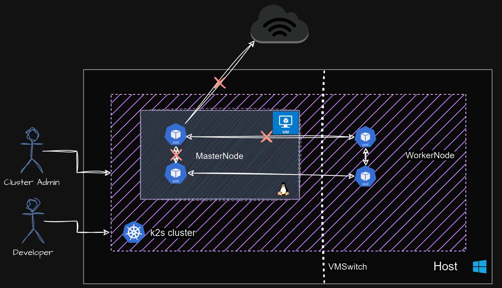
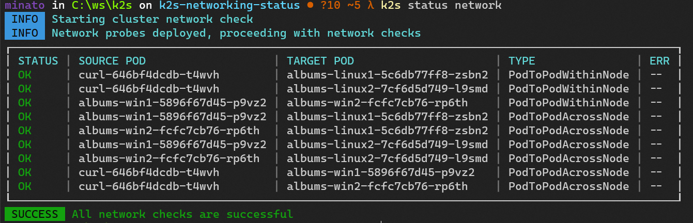

# KEP-1: Cluster Networking Overview

- [Release Signoff Checklist](#release-signoff-checklist)
- [Requirement](#requirement)
  - [Goals](#goals)
  - [Non-Goals](#non-goals)
- [Proposal](#proposal)
  - [User Stories](#user-stories)
  - [Notes/Constraints/Caveats](#notesconstraintscaveats)
- [Design Details](#design-details)
  - [Test Plan](#test-plan)
    - [Unit tests](#unit-tests)
    - [Integration tests](#integration-tests)
    - [e2e tests](#e2e-tests)
- [Doneness Criteria](#doneness-criteria)
- [Drawbacks](#drawbacks)
- [Alternatives](#alternatives)

## Release Signoff Checklist

- [ ] KEP reviewed and approved by maintainers.
- [ ] Design details are appropriately documented.
- [ ] Test plan is in place.
  - [ ] e2e Tests.
- [ ] User documentation has been created.

## Requirement

As a `K2s` user, I want an overview of the cluster's networking health, particularly focusing on pod-to-pod and node-to-node communication.

## Motivation

A key step in ensuring a healthy cluster, both during initial deployment and ongoing operation, is to verify pod-to-pod and node-to-node communication. This functionality is a prerequisite for a functioning cluster. As a user, I do not have a mechanism to verify the cluster networking. This needs an dynamic deployment of pods on each nodes and verify the communication among them which is arduous and highly likely to miss out verifying connectivity in certain combination.

[](k2s-network-status-dark.png)

### Goals

- Provide a dynamic mechanism for the user through CLI to check the cluster networking status.
- In case of networking errors, provide a possible list of troubleshooting steps.
- Verification of networking status is not dependent on any external tools.
- Does not require administrative access to the node. (Administrative access via the Kubernetes API is acceptable.)

### Non-Goals

- Providing networking overview on the node (host machine) level is not in the scope.
- Resolution of networking issues automatically is not targeted here.

## Proposal

`k2s status` supports displaying basic cluster status. We will add a subcommand to display the networking status `k2s status network` that will:

1. Deploy networking pods on each node which help in performing networking health checks.
2. Perform communication with:
    - pod-to-pod
    - pod-to-pod across nodes
    - pod-to-service
    - pod-to-internet (Optional)
    - node-to-node.

Sample output for the user:

[](sample-status-network.png)

### User Stories

- As a `k2s` user I want to view networking status of the cluster.
- As a `k2s` user I want to view the connectivity states across nodes.
- As a `k2s` user I want to get troubleshooting tips for faulty connection states in the network.

### Notes/Constraints/Caveats

t.b.d

## Design Details

### CLI

Preview of `k2s status network` command

```cmd
Provides overview of K2s cluster networking on the installed machine

Usage:
  k2s status network [flags]

Examples:

  # Networking status of the cluster
  k2s status network


Flags:
  -h, --help   help for network

Global Flags:
  -o, --output             Show all logs in terminal
  -v, --verbosity string   log level verbosity, either pre-defined levels, integer values or a combination of both.
                           Pre-defined levels: debug = -4 | info = 0 | warn = 4 | error = 8
                           - e.g. '-v debug'    -> debug
                           - e.g. '-v 4'        -> warn
                           - e.g. '-v debug+4'  -> info
                           - e.g. '-v error-8'  -> info
                           - e.g. '-v warn+2'   -> 6 (between warn and error)
```

### Design Goals

- Abstraction: Abstract third-party packages to reduce direct dependencies.
- Reusability: Provide modular `go` packages which can be re-used.
- Testability: Enhance testability with dependency injection.

### High level Components

- DeploymentManager: Manages pod deployments.
- ConnectivityChecker: Manages connectivity checks between pods.
- K8sClientInterface: Interface for Kubernetes operations.
- K8sClient: Implementation of the K8sClientInterface using the Kubernetes client-go library.
- NetworkStatusPrinter: Prints networking results to the user.
- Config: Configuration settings for the library.

### Test Plan

#### Unit tests

#### Integration tests

##### e2e tests

### Doneness Criteria

## Drawbacks

## Alternatives