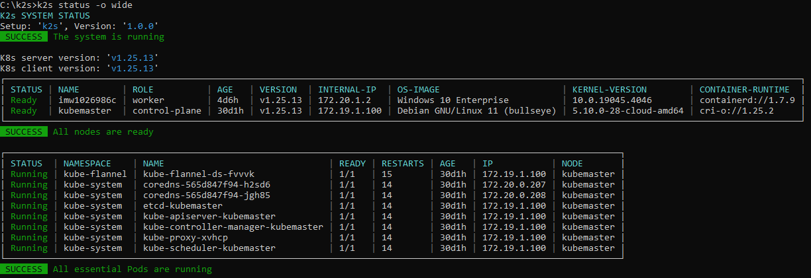

<!--
SPDX-FileCopyrightText: © 2024 Siemens Healthineers AG
SPDX-License-Identifier: MIT
-->

# Checking *K2s* Status
To check *K2s*'s health status (including *K8s*'s health), run:
```console
k2s status
```

To display additional status details, run:
```console
<repo>k2s status -o wide
```

Alternatively, the `ks` shortcut can be executed (see [CLI Shortcuts](../user-guide/cli-shortcuts.md)).

<figure markdown="span">
  { loading=lazy }
  <figcaption>Output of "k2s status -o wide"</figcaption>
</figure>
