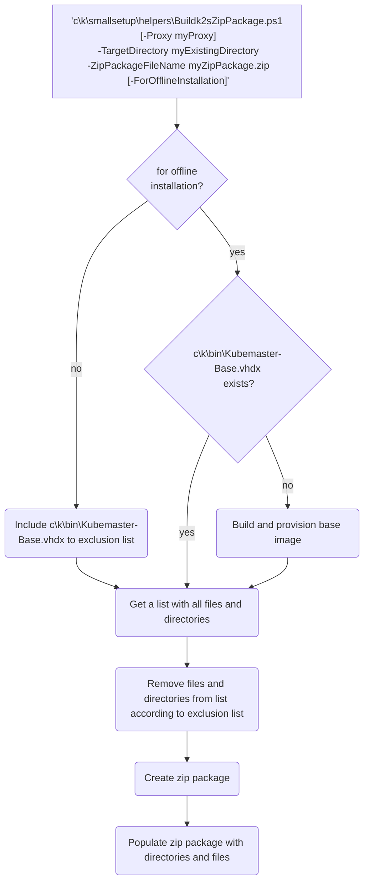

<!--
SPDX-FileCopyrightText: © 2024 Siemens Healthineers AG
SPDX-License-Identifier: MIT
-->

# Creating Offline Package
## *K2s* Offline Package
*K2s* provides support for creating an offline installation package[^1].

[^1]: Creating of and installing from an offline package is currently supported for [Host Variant](../user-guide/hosting-variants.md#host-default) and [Development-Only](../user-guide/hosting-variants.md#development-only) only.

No *K2s* cluster must be installed in order to create an offline package.

To inspect various parameter options, run:
```console
<repo>\k2s.exe system package -h
```

To create a fully offline-capable install package, set the `--for-offline-installation` flag:
```console
<repo>\k2s.exe system package -d <path-to-output-packe>.zip --for-offline-installation
```

When running the aforementioned command and no *K2s* variant has been installed on the current system yet, the [Development-Only Variant](../user-guide/hosting-variants.md#development-only) will be installed in order to create an offline package (which requires an internet connection). If all dependencies are already available locally due to prior installation of *K2s*, the offline package creation does not require internet connection.

??? info "Offline Package Creation Diagram"


!!! note
    Omitting the `--for-offline-installation` flag will effectively bundle only repository source files similar to the [*K2s* Releases](https://github.com/Siemens-Healthineers/K2s/releases){target="_blank"}.

## Addons Offline Package
To enable addons without an internet connection being available, the required binaries can be exported to an offline package as well.

### Addons Export
To inspect all export options, run:
```console
k2s addons export -h
```

Either specify one or more addons to export:
```console
k2s addons export registry -d <export-output-directory>
```

Or export all addons:
```console
k2s addons export -d <export-output-directory>
```

### Addons Import
To inspect all export options, run:
```console
k2s addons import -h
```

Either specify one or more addons to import from the offline package:
```console
k2s addons import registry -z <directory-containing-addons-archive>\addons.zip
```

Or import all addons from the offline package:
```console
k2s addons import -z <directory-containing-addons-archive>\addons.zip
```

!!! note
    Importing a specific addon from the offline package does obviously not work when this package does not contain the specified addon.

After importing an addon, it can be enabled without internet connection being available.

## Delta Packages

For bandwidth-efficient upgrades, *K2s* supports creating delta packages that contain only the files changed between two versions. This significantly reduces package size for minor and patch upgrades.

See [Delta Packages](delta-packages.md) for detailed documentation on creating and applying delta packages.