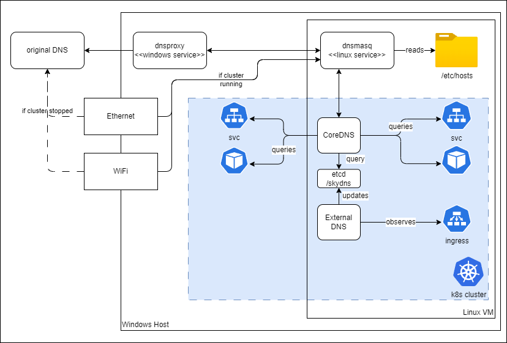

# External DNS

ExternalDNS synchronizes ingress endpoints with a DNS provider.
In a Cloud environment, the DNS provider would be an external DNS.  
For K2s, we re-use the CoreDNS and configure ExternalDNS to sync
all hosts it finds in the ingresses to the same DNS which is used to
resolve the internal k8s svc host names.

## Overview

Here is how DNS resolution work on K2s:



### CoreDNS

CoreDNS is a DNS server part of the core kubernetes system. It monitors kubernetes
services and pods, the relevant part of the default configuration is:

```yaml
k get cm coredns -n kube-system -o yaml
...
        kubernetes cluster.local in-addr.arpa ip6.arpa {
           pods insecure
           fallthrough in-addr.arpa ip6.arpa
           ttl 30
        }
...
```

During the installation phase of K2s, we extend CodeDNS with the `etcd` CoreDNS plugin
and we adjust the configuration like this:

```yaml
        kubernetes cluster.local in-addr.arpa ip6.arpa {
           pods insecure
           fallthrough
           ttl 30
        }
        etcd cluster.local {
            path /skydns
            endpoint https://172.19.1.100:2379
            tls /etc/kubernetes/pki/etcd-client/tls.crt /etc/kubernetes/pki/etcd-client/tls.key /etc/kubernetes/pki/etcd-ca/tls.crt
            fallthrough
        }
```

Observe the modified fallthrough in the kubernetes plugin, which gives a chance
to the etcd plugin to serve the zone `cluster.local` as well.  
The etcd plugin will serve all entries it finds in the `etcd` database under the
prefix `/skydns`,  in SkyDNS Format (done by ExternalDNS - see below).

In this configuration, we use the same etcd instance used by kubernetes. For this,
we import the etcd certificates as secrets and mount them to the CoreDNS
deployment:

```yaml
k get deployment coredns -n kube-system -o yaml
...
        volumeMounts:
        - mountPath: /etc/kubernetes/pki/etcd-ca
          name: etcd-ca-cert
        - mountPath: /etc/kubernetes/pki/etcd-client
          name: etcd-client-cert
...
      volumes:
      - name: etcd-ca-cert
        secret:
          secretName: etcd-ca
      - name: etcd-client-cert
        secret:
          secretName: etcd-client-for-core-dns
...
```

### ExternalDNS

Both K2s Ingress addons: `ingress-nginx'  and ' traefik' will install ExternalDNS,
which will observe all ingresses and populate the etcd /skydns path with
DNS entries  corresponding to the identified endpoints.

The External DNS Deployment uses the same credentials as CoreDNS to access the
cluster etcd database.

See [addons/common/manifests/external-dns]

### etcd

As already mentioned, we use the kubernetes cluster etcd instance to store the
DNS entries corresponding to the ingresses. The etcd certificates are generated
during cluster installation and located under:

```path
/etc/kubernetes/pki/etcd/*
```

At installation time, when we prepare the Linux VM, we also import these
certificates as kubernetes secrets:

```cmd
kubectl create secret -n kube-system tls etcd-ca --cert=etcd/ca.crt --key=etcd/ca.key
kubectl create secret -n kube-system tls etcd-client-for-core-dns --cert=etcd/healthcheck-client.crt --key=etcd/healthcheck-client.key
```

### Physical Network Adapter DNS Configuration

At the end of `k2s start`, we change the DNS Server of all physical network interfaces
to use the `netmasq` DNS service running on the master node.
At the end of `k2s stop` we reset the DNS Configuration of these adapters.

## Links

- [ExternalDNS](https://kubernetes-sigs.github.io/external-dns/v0.14.2/):
  project overview
- [CoreDNS etcd plugin](https://coredns.io/plugins/etcd/):
  extends CoreDNS to answers DNS queries using data in SkyDNS format found in etcd.
- [ExternalDNS coredns plugin](https://github.com/kubernetes-sigs/external-dns/blob/master/docs/tutorials/coredns.md):
  extends ExternalDNS and saves all hosts in SkyDNS format to etcd.  
  [Configuration Env. Variables](https://github.com/kubernetes-sigs/external-dns/blob/master/provider/coredns/coredns.go#L212):
  this will help us setting up the connection to a secured etcd.

## TODO

These hosts are not yet migrated to cluster.local, so they are not known by DNS Query.
They are added to the windows `hosts` file, so they are addressable by name:

- k2s-registry.local
- k2s-gateway.local
