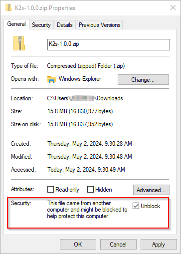

<!--
SPDX-FileCopyrightText: © 2023 Siemens Healthcare GmbH

SPDX-License-Identifier: MIT
-->

# Get K2s
*K2s* can be acquired in two different ways, depending on the intended use:

- [Option 1: Download Official Release Package](#option-1-download-official-release-package) for e.g. use in development environments, test systems or production scenarios.
- [Option 2: Clone Git Repository](#option-2-clone-git-repository) for development of *K2s* or making use of the latest (potentially unstable) features. All dependencies get downloaded during the installation process.

!!! note
    The target installation folder must fulfill the following requirements:

    - Folder name contains only:

          - Letters of the English alphabet (uppercase and lowercase)
          - Digits of the decimal system
          - Spaces
          - Special characters: `+`, `-`, `_` and `.`

    - No special folders (e.g. symbolic links) are allowed

!!! tip
    Due to legal/license considerations, *K2s* cannot provide a full offline installation package for e.g. air-gap scenarios, but you can create one locally[^1] by running:<br/>
    ```console
    <repo>\k2s.exe system package --target-dir "<target-folder-for-package>" --name "<package-name>.zip" --for-offline-installation
    ```
    *K2s* can be installed completely offline with the resulting package archive.

[^1]: Creating of and installing from an offline package is currently supported for [Host Variant](../user-guide/hosting-variants.md#host-default) and [Development-Only](../user-guide/hosting-variants.md#development-only) only.

## \[Option 1\] Download Official Release Package
Download the latest released and officially cleared *K2s* version from [*K2s* Releases](https://github.com/Siemens-Healthineers/K2s/releases){target="_blank"}.

!!! tip
    Please make sure to check *Unblock* in the file properties dialog before extracting the zip file (if this option is available):<br/>
    

Extract the zip file to a target folder of your choice (e.g. `c:\target-dir`) and proceed with the [Installation](installation.md).

!!! warning
    It is recommended to install *K2s* to the *Windows* system drive (most likely `C:\`), because some 3rd-party components might assume that `C:\` is the *Windows* host's system drive, e.g. *Windows*-based containers running in *host mode*.

## \[Option 2\] Clone *Git* Repository
To clone the Git repository into a new folder of your choice, run:
```console
mkdir c:\myFolder; cd c:\myFolder
git clone https://github.com/Siemens-Healthineers/K2s .
```