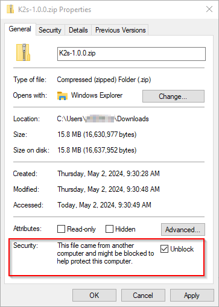

<!--
SPDX-FileCopyrightText: © 2023 Siemens Healthcare GmbH

SPDX-License-Identifier: MIT
-->

# Getting K2s
*K2s* can be acquired in two different ways, depending on the intended use:

- [Option 1: Downloading Official Release Package](#option-1-downloading-official-release-package) for e.g. use in development environments, test systems or production scenarios.
- [Option 2: Cloning Git Repository](#option-2-cloning-git-repository) for development of *K2s* or making use of the latest (potentially unstable) features. All dependencies get downloaded during the installation process.

!!! note
    The target installation folder must fulfill the following requirements:

    - Folder name contains only:

          - Letters of the English alphabet (uppercase and lowercase)
          - Digits of the decimal system
          - Spaces
          - Special characters: `+`, `-`, `_` and `.`

    - No special folders (e.g. symbolic links) are allowed

!!! tip
    Due to legal/license considerations, *K2s* cannot provide a full offline installation package for e.g. air-gap scenarios out-of-the-box, but you can create one yourself locally, see [Creating an Offline Package](creating-offline-package.md).

## \[Option 1\] Downloading Official Release Package
Download the latest released and officially cleared *K2s* version from [*K2s* Releases](https://github.com/Siemens-Healthineers/K2s/releases){target="_blank"}.

!!! tip
    Please make sure to check *Unblock* in the file properties dialog before extracting the zip file (if this option is available):<br/>
    

Extract the zip file to a target folder of your choice (e.g. `c:\target-dir`) and proceed with the installation, see [Installing *K2s*](installing-k2s.md).

!!! warning
    It is recommended to install *K2s* to the *Windows* system drive (most likely `C:\`), because some 3rd-party components might assume that `C:\` is the *Windows* host's system drive, e.g. *Windows*-based containers running in *host mode*.

## \[Option 2\] Cloning *Git* Repository
To clone the Git repository into a new folder of your choice, run:
```console
mkdir c:\myFolder; cd c:\myFolder
git clone https://github.com/Siemens-Healthineers/K2s .
```