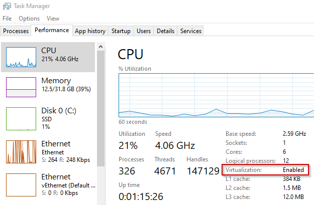

<!--
SPDX-FileCopyrightText: © 2024 Siemens Healthineers AG
SPDX-License-Identifier: MIT
-->

# Installing *K2s*
## Prerequisites
- *K2s* folder being available locally, see [Getting *K2s*](getting-k2s.md)
- The *Windows* host must match one of the [Supported OS Versions](os-support.md)
- Local admin permissions are currently needed in order to be able to create virtual switches, VMs, etc.
- Please try to install from an folder which is available on `C:\` drive, since most open-source components assume this. We are testing the solution also on other drives, but cannot guarantee that the cluster will work fully.
- Hardware: The system should offer at least 2GB RAM free, as well as 10GB disk space free. Recommended are at least 6 CPU cores, but less are possible.
- CPU virtualization must be enabled in the BIOS. To verify, open the *Task Manager* and check the *Virtualization* property on the *Performance* tab:<br/>
 
 <br/>If you run the setup inside a VM, enable nested virtualization (e.g. when using *Hyper-V*:<br/>
 ```powershell
 Set-VMProcessor -VMName $Name -ExposeVirtualizationExtensions $true
 ```
 , see [Configure Nested Virtualization](https://learn.microsoft.com/en-us/virtualization/hyper-v-on-windows/user-guide/enable-nested-virtualization#configure-nested-virtualization){target="_blank"} for details).
- *Docker* (Desktop) must not be running. Either stop *Docker* and set it to start manually or uninstall it completely
- *PowerShell* execution policy must be **RemoteSigned** or less restrictive. To set the policy, run:
  ```powershell 
  Set-ExecutionPolicy RemoteSigned -Force
  ```
- *curl.exe*: the installed version in the *Windows* host must be at least **7.71.0** (to check it call `curl.exe --version` from the command shell).
- *Optional: ssh.exe*: the installed version in the *Windows* host must be at least major version **8** to prevent the installation from hanging in certain situations (to check it call `ssh.exe -V` from the command shell). Normally, only Windows Server 2019 does not fulfill this requirement from the supported operating systems.
- *Optional:* Enable required *Windows Features* beforehand (they will get enabled during the installation anyways, but would require a system restart and installation re-run):
  - *Windows 10/11*
    ```powershell
    Enable-WindowsOptionalFeature -Online -FeatureName $('Microsoft-Hyper-V-All', 'Microsoft-Hyper-V', 'Microsoft-Hyper-V-Tools-All', 'Microsoft-Hyper-V-Management-PowerShell', 'Microsoft-Hyper-V-Hypervisor', 'Microsoft-Hyper-V-Services', 'Microsoft-Hyper-V-Management-Clients', 'Containers', 'VirtualMachinePlatform') -All -NoRestart
    ``` 
  - *Windows Server* OSs
    ```powershell 
    Enable-WindowsOptionalFeature -Online -FeatureName $('Microsoft-Hyper-V', 'Microsoft-Hyper-V-Management-PowerShell', 'Containers', 'VirtualMachinePlatform') -All -NoRestart
    ``` 
- *Hyper-V configuration*: after the enabling of Hyper-V on your host using [Set-VMHost](https://learn.microsoft.com/en-us/powershell/module/hyper-v/set-vmhost) different settings can be configured for Hyper-V, for example in some cases it makes sense to have new default locations for virtual hard disks on that host. Please checkout all possibilities and configure Hyper-V on your host as wanted before doing an install of k2s !


- *Installing in WSL mode*: Enable the WSL 2 feature on Windows. For detailed instructions, see [Configure WSL](https://learn.microsoft.com/windows/wsl/install) or [Manual install (older WSL versions)](https://learn.microsoft.com/windows/wsl/install-manual)
   ```powershell
   Enable-WindowsOptionalFeature -Online -FeatureName $('Microsoft-Windows-Subsystem-Linux', 'VirtualMachinePlatform') -All
   ``` 
  
- *VC Runtime 140*: please install the VC runtime dlls, either with choco

   ```choco install vcredist140 -y```

   or download them from [Microsoft](https://learn.microsoft.com/en-us/cpp/windows/latest-supported-vc-redist) directly and install the appropriate VC runtime.

!!! tip
    Environment variables HTTP_PROXY and HTTPS_PROXY shall not be used in Windows when creating a cluster. Usage of an HTTP proxy shall be configured in `control panel` at the `network and internet` section.
    *K2s* will always take the proxy automatically from the Windows proxy configuration and will use that setting (in this case also local networks can be addressed).


## Installation via *k2s* CLI
The *K2s* setup provides a variety of installation options. Based on the [Hosting Variants](../user-guide/hosting-variants.md), select one of the following setup variants:

 - [Option 1: Host](#option-1-host-default) (Default, *Windows* host acts as a worker node).
 - [Option 2: Development-Only](#option-2-development-only) (no *K8s* cluster, for building and testing containers only)

To inspect the different install options, run:
```console
<repo>\k2s.exe install -h
```
!!! warning
    If the installer detects more than one `k2s.exe` in your system `PATH`, installation will fail.
    Please review the error message for all detected `k2s.exe` locations and remove any outdated or duplicate directories from your `PATH` environment variable before retrying installation.

!!! info
    By default, the installation assumes 6 CPU cores to be available on the host system. If less cores are available, reduce the number of virtual cores used by *K2s* according to the actual amount, e.g. when 4 cores are available, assign max. 4 virtual cores to *K2s*:
    ```console
    <repo>\k2s.exe install --master-cpus 4
    ```

!!! tip
    If you acquired *K2s* via [Cloning the *Git* repository](getting-k2s.md#option-1-cloning-git-repository), you might want to checkout a specific version first, e.g.:
    ```console
    git checkout tags/v1.4.0
    ```

!!! note
    *K2s* will start automatically after the installation has finished.

### Installing Using Config Files
Instead of assembling many command-line parameters/flags to customize the installation, you can also pass a YAML file to the `k2s install` command configuring install parameters like node resource definitions (e.g. CPU, RAM or size of the hard drive):
```console
<repo>\k2s.exe install [-c|--config] <path-to-config-file>
```

!!! example
    Create a custom install config:
    ```yaml linenums="1" title="my_config.yaml"
    kind: k2s
    apiVersion: v1
    nodes:
      - role: control-plane
        resources:
          cpu: 8
          memory: 7GB
          disk: 60GB
    env:
      httpProxy: 192.168.178.100:8765
    installBehavior:
      showOutput: true
    ```
    Start the installation passing this config:
    ```console
    <repo>\k2s.exe install -c c:\temp\my_config.yaml
    ```

To create a user-defined configuration for any of the hosting variants, take one of the corresponding [Base Configuration Files](https://github.com/Siemens-Healthineers/K2s/tree/main/k2s/cmd/k2s/cmd/install/config/embed){target="_blank"} as a template.

### Online vs. Offline
Downloading all dependencies (i.e. binaries) on-the-fly is referred to as *online* installation, whereas *offline* refers to an installation package containing parts of or all the dependencies. If *K2s* was acquired via [Downloading the Official Release Package](getting-k2s.md#option-2-downloading-official-release-package), parts of the dependencies are already available locally. If an offline package was create according to [Creating Offline Package](creating-offline-package.md), all dependencies are available offline.

As per default, the *k2s* CLI keeps downloaded files as well as the *Linux*-based control-plane image and reuses them. To change this behavior, use the following CLI flags (they apply to all installation variants[^1]).

To delete all downloaded binaries and the control-plane image after installation, run:
```console
<repo>\k2s.exe install -d
```

To force the download of all binaries and the re-creation of the control-plane image regardless of their local presence, run:
```console
<repo>\k2s.exe install -f
```

??? info "Offline vs. Online Installation Diagram"
   ```mermaid
   graph TD
       CallScript["Installation scripts\n (Default, BuildOnlySetup)\n\n with\n [-DeleteFilesForOfflineInstallation]\n [-ForceOnlineInstallation]"] --> if_force_online_installation{"Switch\n ForceOnlineInstallation\n used ?"}
       if_force_online_installation --> |yes| BuildAndProvisionKubemasterBaseImage
       if_force_online_installation --> |no| if_base_image_available{"c\k\bin\Kubemaster-Base.vhdx\n available?"}
       if_base_image_available --> |yes| CopyBaseImage
       if_base_image_available --> |no| BuildAndProvisionKubemasterBaseImage
       BuildAndProvisionKubemasterBaseImage("Build and provision base image") --> PublishBaseImage("Publish base image as\n c\k\bin\Kubemaster-Base.vhdx")
       PublishBaseImage --> CopyBaseImage("Copy published base image to\n C\Users\Public\Documents\Hyper-V\Virtual hard disks")
       CopyBaseImage --> InstallLinuxNode("Install Linux node")
       InstallLinuxNode --> if_delete_files_for_offline_installation{"Switch\n -DeleteFilesForOfflineInstallation\n used ?"}
       if_delete_files_for_offline_installation --> |yes| DeleteBaseImage("Delete file c\k\bin\Kubemaster-Base.vhdx")
       if_delete_files_for_offline_installation --> |no| End
       DeleteBaseImage --> End
   ```

[^1]: Creating of and installing from an offline package is currently supported for [Host Variant](../user-guide/hosting-variants.md#host-default) and [Development-Only](../user-guide/hosting-variants.md#development-only) only. 

### \[Option 1\] Host (Default)
Simply run:
```console
<repo>\k2s.exe install
```

#### WSL
To install the control-plane in WSL 2 instead of a dedicated *Linux* VM, run:
```console
<repo>\k2s.exe install --wsl
```

### \[Option 2\] Development-Only
To build and test containers without a *K8s* cluster, run:
```console
<repo>\k2s.exe install buildonly
```
