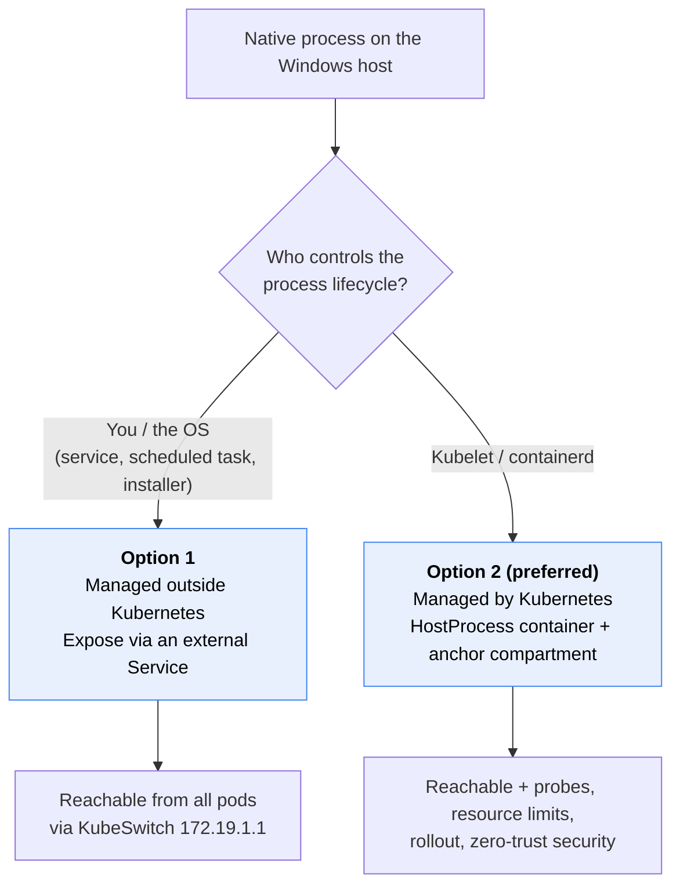
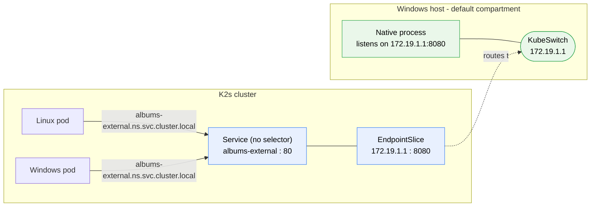
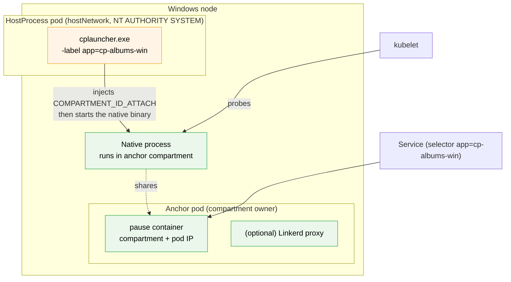
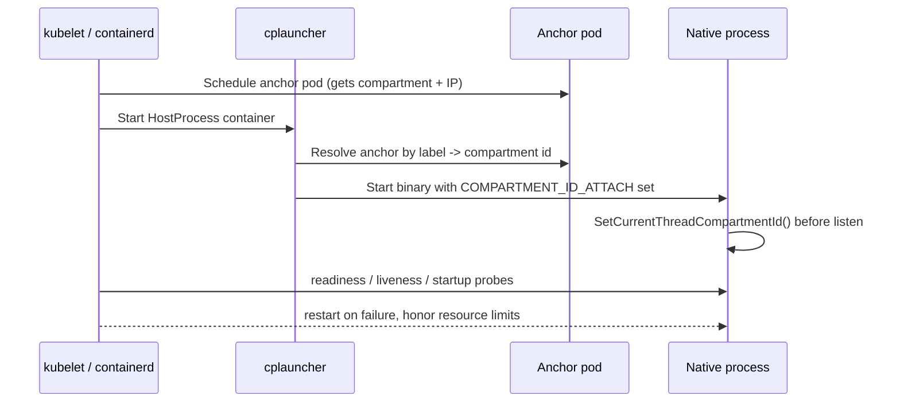
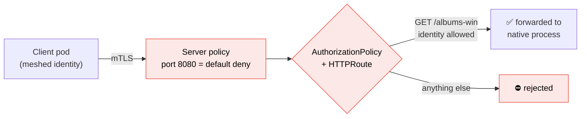
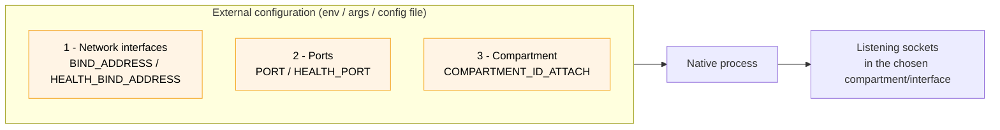
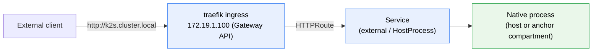
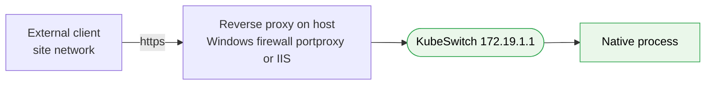

<!--
SPDX-FileCopyrightText: © 2026 Siemens Healthineers AG
SPDX-License-Identifier: MIT
-->

# Integrating Native Host Processes into Kubernetes & K2s

## Overview

Many products that adopt *Kubernetes* still ship one or more **native processes** that run directly on the
bare‑metal *Windows* host: legacy services, closed‑source binaries, hardware‑bound drivers, licensing daemons,
or high‑performance components that were never designed for containers. *K2s* lets you integrate these
processes into the cluster **without rewriting them**, so they can be reached by pods (Linux *and* Windows),
secured, observed, and — if you want — managed by *Kubernetes* itself.

This guide describes the recommended **best practices** for making a native process "cluster‑friendly", and
the **two integration options** with their trade‑offs. Throughout, we use the small test executable
[`albumswin`](https://github.com/Siemens-Healthineers/K2s/blob/main/k2s/test/e2e/cluster/hostprocess/albumswin/main.go)
as the running example. Ready‑to‑use manifests for both options live under
[`k2s/test/e2e/cluster/hostprocess/examples`](https://github.com/Siemens-Healthineers/K2s/tree/main/k2s/test/e2e/cluster/hostprocess/examples).



!!! tip "Rule of thumb"
    **Option 2 is preferred** for most cases: it offers more features (health‑checking, restarts, resource
    governance, rollouts) and, above all, **zero‑trust security** around the process. Choose **Option 1** when
    the process must keep its own OS‑level lifecycle (installed service, own process manager) or you only need
    plain cluster reachability with minimal moving parts.

    Note: *exclusive hardware access* is **not** a distinguishing factor — you can achieve it with a
    HostProcess container (Option 2) as well, since it also runs directly on the host as `NT AUTHORITY\SYSTEM`.

---

## Option 1 — Process Managed Outside Kubernetes

The process keeps its **own lifecycle** (a *Windows* service, scheduled task, installer‑started daemon, …). It
listens on the **KubeSwitch IP `172.19.1.1`**, and you publish it to the cluster with an **external
*Kubernetes* Service** (a `Service` without a selector plus a manually maintained `EndpointSlice`
that points at `172.19.1.1`). Pods then reach it through a **stable ClusterIP and DNS name**, exactly like any
in‑cluster service.



### Why this works in K2s

*K2s* uses Flannel in **host‑gateway** mode (see
[Networking Architecture](./networking-architecture.md)), so `172.19.1.1` (the KubeSwitch gateway on the
*Windows* host) is directly routable from every pod. *K2s* already relies on this for host‑bound endpoints —
e.g. Prometheus scrapes the *Windows* node exporter at `172.19.1.1:9100`. A selectorless `Service` +
`EndpointSlice` simply gives that host endpoint a **stable name and ClusterIP** so consumers do not hard‑code
the host IP.

### Manifest sketch

```yaml
apiVersion: v1
kind: Service
metadata:
  name: albums-external
spec:
  type: ClusterIP          # stable name + ClusterIP; no selector
  ports:
    - name: http
      port: 80
      targetPort: 8080
---
# v1 Endpoints is deprecated in K8s 1.33+, so use a managed EndpointSlice.
apiVersion: discovery.k8s.io/v1
kind: EndpointSlice
metadata:
  name: albums-external-1
  labels:
    kubernetes.io/service-name: albums-external   # associates the slice with the Service
addressType: IPv4
endpoints:
  - addresses:
      - 172.19.1.1       # KubeSwitch IP on the Windows host
    conditions:
      ready: true
ports:
  - name: http           # must match the Service port name
    port: 8080
```

Full, runnable manifests (with Linux and Windows test clients) are in
[`examples/option-1-external-service`](https://github.com/Siemens-Healthineers/K2s/tree/main/k2s/test/e2e/cluster/hostprocess/examples/option-1-external-service).

### Firewall

The native process listens on the host. Ensure an **inbound allow rule** exists for its port on the KubeSwitch
so pods can connect:

```powershell
New-NetFirewallRule -DisplayName "albums-external (cluster)" -Direction Inbound `
  -Action Allow -Protocol TCP -LocalPort 8080
```

!!! note "Exposing outside the host"
    To reach the service from **outside** the *Windows* host, do **not** expose `172.19.1.1` directly. See
    [Optional: Routing from Outside the Host](#optional-routing-from-outside-the-host) at the end of this guide.

### Pros & cons

| Pros | Cons |
|------|------|
| Process keeps its native OS lifecycle (service/installer/hardware access) | No *Kubernetes* health‑probing or restart of the process |
| Minimal moving parts; no HostProcess privileges required | No *Kubernetes* resource limits/requests |
| Stable Service DNS/ClusterIP for all pods | Endpoints are static — if the process is down, connections fail |
| Works for any language/binary listening on `172.19.1.1` | Zero‑trust mesh policies not applied to the process itself |

---

## Option 2 — Process Managed by Kubernetes (HostProcess containers) — preferred

Here *Kubernetes* owns the process lifecycle. The binary runs inside a **Windows HostProcess container** —
still executing on the host **under the same user** (`NT AUTHORITY\SYSTEM`) as in Option 1 — but now
**kubelet/containerd** start, monitor, restart and roll it out. This unlocks liveness/readiness/startup
**probes**, **resource management**, declarative **rollouts**, and integration with the rest of the platform.

For proper *Kubernetes* **networking** integration, we recommend pairing the HostProcess container with an
**anchor pod** and moving the process into the anchor's **network compartment**. The process then receives a
**pod IP**, so an ordinary label‑selector `Service` works and the workload participates in the pod network like
any other pod. This is described in detail in
[Running Native Windows Applications with HostProcess + Network Compartments](./running-apps-as-hostprocess.md).



### How the lifecycle changes vs Option 1



### Advantages gained

* **Probing** — liveness/readiness/startup HTTP probes (use the `HEALTH_PORT`/`HEALTH_BIND_ADDRESS` knobs).
* **Resource management** — CPU/memory requests & limits, scheduling, eviction.
* **Rollouts** — `Deployment` semantics, versioned updates, blue/green via a second anchor+HostProcess pair.
* **Per‑instance IP** — each replica gets its own compartment/IP; multiple instances can share the same port.
* **Observability & mesh** — inject the Linkerd proxy into the anchor pod so the native process' TCP traffic
  is transparently meshed.

### Zero‑trust security for native processes

Because the process now lives in a pod compartment, you can apply **zero‑trust** networking around a binary you
never modified. Using the [`security` addon](https://github.com/Siemens-Healthineers/K2s/blob/main/addons/security/README.md)
(enhanced type: Linkerd + policies), you achieve **security through infrastructure**: mTLS identity, and
fine‑grained authorization that starts from **deny‑all** and then allows only specific operations on specific
resources — for example, a `GET` on `/x/y` only.



This layered model — transparent mTLS + default‑deny + explicit allow‑rules — is the same
**security‑through‑infrastructure** approach *K2s* applies to its containerized workloads, now extended to
native host processes. See [Security Features](../security/security-features.md) and
[Policy Enforcement](../security/policy-enforcement.md).

An illustrative policy manifest is provided in
[`examples/option-2-hostprocess-compartment`](https://github.com/Siemens-Healthineers/K2s/tree/main/k2s/test/e2e/cluster/hostprocess/examples/option-2-hostprocess-compartment).

### Pros & cons

| Pros | Cons |
|------|------|
| *Kubernetes* controls lifecycle: probes, restarts, rollout | Requires HostProcess privileges (`NT AUTHORITY\SYSTEM`) |
| Resource requests/limits and scheduling | Slightly more moving parts (anchor pod + `cplauncher`) |
| Pod IP + ordinary Service selector | Windows‑only for the HostProcess container |
| Zero‑trust mTLS + policies via `security` addon | Anchor readiness must gate the HostProcess start |
| Per‑instance IP, no port collisions when scaling | |

---

## Choosing Between the Options

| Criterion | Option 1 (outside K8s) | Option 2 (HostProcess) |
|-----------|------------------------|------------------------|
| Lifecycle owner | You / the OS | kubelet / containerd |
| Runs as | Native process | HostProcess container (same host user) |
| Network identity | KubeSwitch host IP `172.19.1.1` | Pod IP (anchor compartment) |
| Service type | Selectorless Service + Endpoints | Ordinary Service with selector |
| Health probing | Your own tooling | *Kubernetes* probes |
| Resource limits | OS‑level only | *Kubernetes* requests/limits |
| Zero‑trust mesh policy | Not on the process | Yes (Linkerd + policies) |
| External exposure | Reverse proxy (Secure Host Access) | Reverse proxy or ingress |
| Best when | Installed service / own process manager | You want full K8s integration & security |

!!! success "Recommendation"
    **Prefer Option 2** — it provides the richest integration (probes, restarts, resource governance, rollouts)
    and **zero‑trust** security around the process. Choose **Option 1** when the process must retain its own OS
    lifecycle or you only need plain cluster reachability with minimal moving parts.

---

## Best Practices for a Cluster‑Friendly Native Process

Whichever integration option you choose, make the process **configurable from the outside**. The network
environment (interfaces, ports, compartment) should be injectable so the product using *K2s* can adapt it to its
needs — without recompiling. `albumswin` demonstrates all three knobs via environment variables.

See these best practices applied end‑to‑end in the runnable examples:

* [`examples/option-1-external-service`](https://github.com/Siemens-Healthineers/K2s/tree/main/k2s/test/e2e/cluster/hostprocess/examples/option-1-external-service) — process managed outside Kubernetes.
* [`examples/option-2-hostprocess-compartment`](https://github.com/Siemens-Healthineers/K2s/tree/main/k2s/test/e2e/cluster/hostprocess/examples/option-2-hostprocess-compartment) — process managed by Kubernetes (HostProcess + compartment).

!!! note "These are best practices, not a hard requirement"
    Making the three aspects (interfaces, ports, compartment) configurable is **recommended**, not mandatory —
    a process can still be integrated with either option without them. In practice, most processes simply listen
    on **`0.0.0.0`**, which binds **all interfaces of the default compartment**. That works, but it is **not the
    best choice**: it exposes the process on every host interface, offers no control over which network it is
    reachable from, and cannot join a pod compartment. Prefer an explicit bind address (at least including the
    KubeSwitch IP `172.19.1.1`) and, for Option 2, an explicit compartment.



### 1. Parameterize the network interfaces

Expose **which interface(s)** the process binds to. Besides the process' own interfaces, **always allow binding
the KubeSwitch IP `172.19.1.1`** — the virtual switch gateway present on the *Windows* host. Binding to (or
including) `172.19.1.1` is what makes the service reachable from **any pod** in the cluster, on both the Linux
and the Windows side.

* Bind **`172.19.1.1`** (KubeSwitch) &rarr; reachable from all cluster pods.
* Bind **own/physical interfaces** &rarr; additionally reachable from other networks (site network, dev machine).
* Bind **`0.0.0.0`** &rarr; convenient during development (all interfaces), but be explicit in production.

In `albumswin` the health endpoint uses a dedicated bind address so probes can be isolated from application
traffic:

```go
// HEALTH_BIND_ADDRESS overrides BIND_ADDRESS for the health server.
healthBindAddress := os.Getenv("HEALTH_BIND_ADDRESS")
if healthBindAddress == "" {
    healthBindAddress = bindAddress // falls back to the app bind address
}
```

!!! note "Why a separate health bind address?"
    A dedicated health interface/port lets you keep liveness/readiness probes reachable even when the main
    application traffic is intercepted by a service‑mesh proxy or restricted by policy.

### 2. Parameterize the ports

Expose **every listening port** as configuration. `albumswin` uses `PORT` for the application and `HEALTH_PORT`
for the health endpoints:

```go
port := os.Getenv("PORT")           // application port (default 8080)
healthPort := os.Getenv("HEALTH_PORT") // health port (default 8081)
```

Separate ports keep application, health and (optionally) metrics traffic independently routable and
policy‑controllable.

### 3. Parameterize the network compartment

On *Windows*, a **network compartment** is the isolation boundary for network configuration (interfaces,
routes, DNS) — comparable in spirit to a Linux network namespace. Expose the target compartment so the process
can join a pod's compartment when needed (Option 2). `albumswin` reads `COMPARTMENT_ID_ATTACH` and pins its
thread to that compartment before opening any socket:

```go
compartmentId := os.Getenv("COMPARTMENT_ID_ATTACH")
if compartmentId != "" {
    num, _ := strconv.Atoi(compartmentId)
    runtime.LockOSThread() // compartment IDs are per-thread
    _ = SetCurrentThreadCompartmentId(uint32(num))
}
```

When `COMPARTMENT_ID_ATTACH` is **unset**, the process stays in the host's **default** compartment
(Option 1). When it is **set** (typically injected by the `cplauncher` helper), the process joins an
**anchor pod's** compartment and receives a pod IP inside the cluster network (Option 2).

!!! tip "No code changes? Use `cplauncher` to move the process"
    If you cannot (or do not want to) modify the binary to read `COMPARTMENT_ID_ATTACH` and call
    `SetCurrentThreadCompartmentId` itself, use the `cplauncher` helper shipped with *K2s*
    (`<K2s-install>\bin\cni\cplauncher.exe`). It resolves the anchor pod by label, switches into its
    compartment, and then **starts your unmodified executable** in that compartment — so **any** native
    process can join the cluster network without recompilation. See
    [Running Native Windows Applications with HostProcess + Network Compartments](./running-apps-as-hostprocess.md).

### Configuration summary (from `albumswin`)

| Aspect | Env variable | Default | Purpose |
|--------|--------------|---------|---------|
| App interface | `BIND_ADDRESS` | `0.0.0.0` | Interface the application binds to |
| Health interface | `HEALTH_BIND_ADDRESS` | value of `BIND_ADDRESS` | Interface for liveness/readiness/startup |
| App port | `PORT` | `8080` | Application listening port |
| Health port | `HEALTH_PORT` | `8081` | Health endpoints port |
| Compartment | `COMPARTMENT_ID_ATTACH` | *(unset)* | Windows network compartment to join |
| Resource name | `RESOURCE` | `albums-win` | Route/name used by the app |

!!! tip
    Environment variables are the simplest injection mechanism, but the same values may be provided via
    command‑line arguments or a mounted configuration file. Choose whatever fits your product's packaging.

---

## Optional: Routing from Outside the Host

Both options publish the native process as an in‑cluster `Service` — reachable from pods, but **not** from
outside the *Windows* host. If external clients must reach it too, do **not** expose `172.19.1.1` directly.
There are two ways to route the traffic; they apply to **both** integration options (only the target `Service`
differs).

### Variant A — Kubernetes gateway (preferred)

Route **all** external requests through a *Kubernetes* gateway and let it forward to the `Service` you created —
the **external Service** for Option 1 or the **HostProcess Service** for Option 2. Because both are normal
`ClusterIP` services, a standard **Gateway API** `HTTPRoute` can target them like any other service. This is the
**preferred** approach: it gives you one consistent entry point, path/host‑based routing, TLS termination via
`cert-manager`, and — together with the `security` addon — authentication and policy enforcement, all managed
declaratively in the cluster.

The examples use the **`ingress traefik`** addon, which ships a Gateway API provider (`gatewayClassName:
traefik`) and publishes its `web` entrypoint (container port `8080`) as `:80` on `172.19.1.100`. Enable it with
`k2s addons enable ingress traefik`.



#### Gateway API (`Gateway` + `HTTPRoute`)

Define a `Gateway` with `gatewayClassName: traefik` and an `HTTPRoute` for the app path. Only the target
`backendRefs` service and the path differ between the options:

=== "Option 1 — external Service"

    ```yaml
    apiVersion: gateway.networking.k8s.io/v1
    kind: Gateway
    metadata:
      name: albums-gateway
      namespace: hostprocess-examples
    spec:
      gatewayClassName: traefik
      listeners:
        - name: web
          protocol: HTTP
          port: 8080            # traefik 'web' entrypoint (published as :80 on 172.19.1.100)
          allowedRoutes:
            namespaces:
              from: Same
    ---
    apiVersion: gateway.networking.k8s.io/v1
    kind: HTTPRoute
    metadata:
      name: albums-external
      namespace: hostprocess-examples
    spec:
      parentRefs:
        - name: albums-gateway
      rules:
        - matches:
            - path:
                type: PathPrefix
                value: /albums-win
          backendRefs:
            - name: albums-external          # Option 1: Service in front of 172.19.1.1
              port: 80
    ```

    Call it: `curl.exe -v http://k2s.cluster.local/albums-win`

=== "Option 2 — HostProcess Service"

    ```yaml
    apiVersion: gateway.networking.k8s.io/v1
    kind: Gateway
    metadata:
      name: albums-gateway
      namespace: hostprocess-examples
    spec:
      gatewayClassName: traefik
      listeners:
        - name: web
          protocol: HTTP
          port: 8080            # traefik 'web' entrypoint (published as :80 on 172.19.1.100)
          allowedRoutes:
            namespaces:
              from: Same
    ---
    apiVersion: gateway.networking.k8s.io/v1
    kind: HTTPRoute
    metadata:
      name: albums-win-hp-app-hostprocess
      namespace: hostprocess-examples
    spec:
      parentRefs:
        - name: albums-gateway
      rules:
        - matches:
            - path:
                type: PathPrefix
                value: /albums-win-hp-app-hostprocess
          backendRefs:
            - name: albums-win-hp-app-hostprocess  # Option 2: HostProcess Service (anchor compartment)
              port: 8080
    ```

    Call it: `curl.exe -v http://k2s.cluster.local/albums-win-hp-app-hostprocess`

To add **OAuth2 authentication** in front of the native process without changing it, attach a Traefik
`forwardAuth` `Middleware` to the `HTTPRoute` rule via an `ExtensionRef` filter, pointing at the `security`
addon's OAuth2 proxy:

```yaml
      rules:
        - matches:
            - path:
                type: PathPrefix
                value: /albums-win
          filters:
            - type: ExtensionRef
              extensionRef:
                group: traefik.io
                kind: Middleware
                name: oauth2-proxy-auth
          backendRefs:
            - name: albums-external
              port: 80
```

!!! tip "Add authentication with the `security` addon (OAuth2)"
    Because the traffic flows through the gateway, you can put **authentication in front of your native
    process without changing it**. With the [`security` addon](https://github.com/Siemens-Healthineers/K2s/blob/main/addons/security/README.md)
    enabled, an **OAuth2 proxy** (backed by Keycloak or an external OIDC provider) is invoked by the
    `ExtensionRef` filter so every request is authenticated before it reaches the Service. This is **security
    through infrastructure**: mTLS, TLS termination via `cert-manager` and OAuth2/OIDC authentication are all
    provided by the platform, layered around the unmodified host process.

See [Secure Host Access](./secure-host-access.md) for exposing the gateway endpoint securely outside the host.

### Variant B — reverse proxy on the host

When no gateway is available (or you want to bypass the cluster entirely), route through a reverse proxy **on
the host** as described in [Secure Host Access](./secure-host-access.md). This keeps a single, controlled entry
point and lets you add TLS and authentication at the host level. It is most relevant for **Option 1**, where
the process listens directly on the host (`172.19.1.1`).



Use [Secure Host Access &rarr; Option 1 (Windows firewall `portproxy`)](./secure-host-access.md#option-1-using-the-windows-firewall)
when a plain TCP forward is sufficient; use IIS (Option 2 there) when you need SSL termination with the host
certificate and NTLM/Windows authentication.

---

## Related Documentation

* [Running Native Windows Applications with HostProcess + Network Compartments](./running-apps-as-hostprocess.md)
* [Secure Host Access](./secure-host-access.md)
* [Networking Architecture for K2s](./networking-architecture.md)
* [Security Features](../security/security-features.md) · [Policy Enforcement](../security/policy-enforcement.md)
* [security addon README](https://github.com/Siemens-Healthineers/K2s/blob/main/addons/security/README.md)
* Example manifests: [`hostprocess/examples`](https://github.com/Siemens-Healthineers/K2s/tree/main/k2s/test/e2e/cluster/hostprocess/examples)
