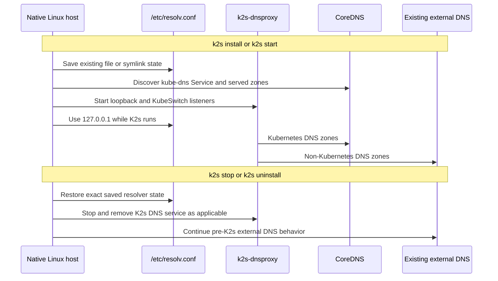
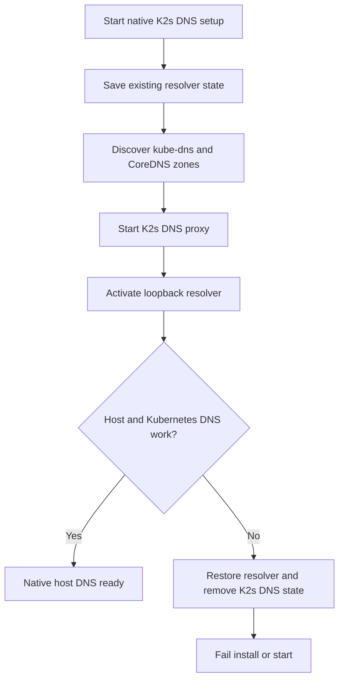

<!--
SPDX-FileCopyrightText: © 2026 Siemens Healthineers AG
SPDX-License-Identifier: MIT
-->

# Native Linux Host DNS

Native Linux K2s makes Kubernetes DNS records available to host applications
while K2s is running. This applies to normal Linux resolvers, including Go
programs that read `/etc/resolv.conf` directly.

## Design

K2s runs the pinned AdGuard `dnsproxy` binary as the `k2s-dnsproxy` systemd
service. It listens on both `127.0.0.1:53` and the configured KubeSwitch
address. The latter is reserved for future K2s worker-node use.

```mermaid
flowchart LR
    Host[Host applications] --> Resolver[/etc/resolv.conf]
    Resolver --> Proxy[K2s dnsproxy]
    Proxy -->|Kubernetes zones| CoreDNS[kube-dns Service]
    Proxy -->|All other zones| External[Original external DNS servers]
```

At installation and `k2s start`, K2s discovers the `kube-dns` Service IP and
the Kubernetes zones from the active CoreDNS configuration. It forwards these
zones, including service, pod, custom, and reverse zones served by CoreDNS, to
CoreDNS. All other requests use the nameservers already present in
`/etc/resolv.conf` before K2s starts. This mirrors the Windows-host flow, where
physical NIC DNS servers become the normal `dnsproxy` upstreams.

## Lifecycle picture



## Resolver safety and lifecycle

K2s does not alter DNS configuration on LAN, Wi-Fi, VPN, DHCP, NetworkManager,
or other host network interfaces.

While K2s is running, it temporarily replaces `/etc/resolv.conf` with a
K2s-owned file that points to `127.0.0.1`. Before this replacement, K2s saves
the exact prior resolver state, including regular-file content or symlink
target and file permissions, under the native K2s runtime directory.

On `k2s stop` K2s restores that saved resolver state **before** it stops the
DNS proxy. On `k2s uninstall` it also restores the saved state and removes only
K2s-owned DNS service and configuration files. Consequently, external DNS
returns to the same resolver state that existed before K2s started.

If DNS proxy startup, CoreDNS discovery, or a host DNS validation fails, K2s
restores the saved resolver configuration and fails installation or startup.



## Operations

Use normal K2s lifecycle commands:

```console
sudo ./k2s.linux start
sudo ./k2s.linux stop
sudo ./k2s.linux uninstall
```

When running, inspect the K2s DNS proxy with:

```console
systemctl status k2s-dnsproxy
tail -f /var/log/dnsproxy/dnsproxy.log
```

To check Kubernetes service resolution from the native host:

```console
getent hosts kubernetes.default.svc.cluster.local
```

`k2s stop` intentionally stops the proxy. Kubernetes DNS names should then no
longer resolve, while external host DNS uses the restored resolver state.