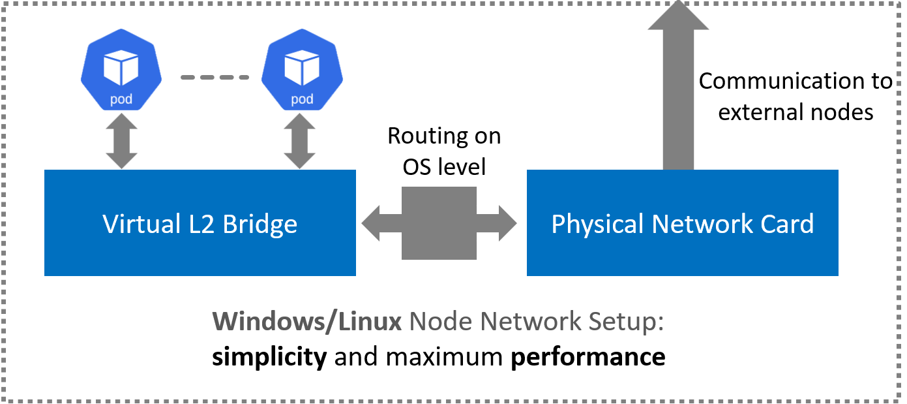

<!--
SPDX-FileCopyrightText: © 2025 Siemens Healthineers AG
SPDX-License-Identifier: MIT
-->

# Networking Architecture for *K2s*

## Core Principles and Architecture: simplicity and maximum performance

In alignment with *K2s*' foundational design principles of operational <b>simplicity</b> and <b>maximum performance</b>, our networking architecture is built upon Flannel CNI configured in host-gateway mode. This provides a transparent, high-throughput, and low-latency data plane that is ideal for demanding workloads and facilitates straightforward network analysis. For production-grade security, K2s integrates the [security addon](https://github.com/Siemens-Healthineers/K2s/blob/main/addons/security/README.md) which uses [Linkerd](https://linkerd.io/) to establish a zero-trust environment for all TCP-based traffic through transparent mTLS and fine-grained policy enforcement.

## The Broader Strategic Value of Simplicity and Performance

The commitment to a simple and performant networking foundation provides strategic advantages that extend far beyond enabling zero-trust features. This architecture directly translates into tangible value for both operators and developers running workloads on *K2s*.

<b>Accelerated Diagnostics and Troubleshooting</b>: The transparent host-gateway data plane avoids complex encapsulation (like VXLAN or IP-in-IP). Network traffic remains directly observable on the host, allowing operators to use standard, universal tools like tcpdump and Wireshark for rapid, intuitive debugging. This dramatically reduces the mean time to resolution (MTTR) for network-related issues compared to debugging opaque overlay networks.

<b>Maximized Resource Efficiency and Throughput</b>: By minimizing the CPU and memory overhead of the networking stack, more resources are available for the applications themselves. This near-bare-metal network performance is critical for the high-throughput and low-latency requirements of data-intensive workloads, such as medical imaging, AI/ML data pipelines, and transactional databases.

<b>Reduced Operational Overhead and Increased Reliability</b>: A simpler architecture with fewer moving parts inherently reduces the system's attack surface and the potential for component failure or misconfiguration. This lean operational model lowers the cognitive load on platform teams, making the cluster easier to manage, secure, and upgrade, thereby increasing overall system reliability.

<b>Enhanced Developer and Operator Experience</b>: The intuitive networking model empowers development teams to deploy and manage their applications without needing to become experts in complex network virtualization. This clarity fosters a stronger sense of ownership and accelerates the development lifecycle, as teams can reason about network communication in a straightforward manner.

<div align="center">


</div>

## Alternative Solutions Considered: Network Policy Controllers (same applies for more complex CNIs like Calico)

During our evaluation, we analyzed solutions designed to enable native Kubernetes NetworkPolicy support on platforms where the CNI does not enforce it. A notable example is the windows-network-policy-controller from the Kubernetes SIGs community, which translates NetworkPolicy objects into rules for the Windows Filtering Platform.

<b>Potential Advantage</b>: The primary benefit of such a controller is the ability to use the standard Kubernetes NetworkPolicy API. This provides a familiar, powerful abstraction for defining granular, label-based traffic rules between pods, which is highly desirable from a user-experience perspective.

<b>Reasons for Rejection</b>: Despite this advantage, we concluded that this approach was not aligned with the core K2s tenets for the following reasons:

<b>Increased Complexity</b>: It introduces another active controller into the cluster's critical path. This component must be installed, managed, and monitored, adding operational overhead. Its logic for translating policies into host rules creates a layer of abstraction that can be difficult to debug when unexpected network behavior occurs.

<b>Performance and Scalability Concerns</b>: A network policy controller must continuously watch the Kubernetes API for changes to pods (e.g., label changes, scaling events) and policies. In dynamic clusters, this can trigger frequent and numerous updates to the host's firewall ruleset, potentially leading to performance degradation, rule conflicts, or transient connectivity issues. This dynamic management layer adds computational overhead compared to the static, highly-performant rules applied by our chosen DaemonSet approach.
In addition, these solutions introduce packet-processing overhead and extra CPU cost from kernel/user space transitions—latency increases of 100 microseconds up to 2 ms per packet, throughput reductions of 20%–80%, and additional CPU overhead of +20%–200%. Packet drops may also occur under high load.

<b>Deviation from Simplicity</b>: The goal of K2s is to provide a transparent and easily understandable system. A dynamic controller that generates a complex and ever-changing set of host firewall rules moves away from this principle, making it harder for operators to reason about the state of the network at any given moment. 

<b>OS support</b> Many of the analyzed solutions were not working under Windows, they provided only for Linux nodes a viable solution.

## Governing Non-TCP Traffic

A critical consideration in this chosen architecture is the governance of non-TCP protocols, primarily UDP. As Linkerd's service mesh capabilities are focused on L4/L7 TCP traffic, UDP communication operates outside its security perimeter. This necessitates a robust and performant solution to control UDP traffic flows without compromising our core design goals of simplicity and speed. While alternative CNIs like Calico offer integrated policy enforcement, they introduce significant operational complexity and potential performance overhead, which runs counter to the *K2s* philosophy.

## HostProcess & Legacy Windows Application Isolation

For scenarios where existing native Windows applications must be integrated into the cluster with compartmentalized networking and optional service mesh capabilities, *K2s* supports a HostProcess + network compartment pattern. This allows unmodified executables to run with per-instance (or shared) compartment isolation while still benefiting from Linkerd (for TCP) and host-level policy controls (for UDP / non-meshed flows).

See: [Running Native Windows Applications with HostProcess + Network Compartments](./running-apps-as-hostprocess.md)

Key advantages of this pattern within the broader networking model:
* Preserves the simplicity of the Flannel host-gateway data plane.
* Avoids introducing opaque overlays when isolating legacy processes.
* Leverages Linkerd for encrypted / observable TCP while keeping direct compartment routing transparent.
* Enables per-workload or per-tenant segmentation without complex CNI changes.

This complements the host-level firewall DaemonSets by layering process-level isolation (compartment) with node-level enforcement.

## The Selected Strategy: Host-Level Firewall Enforcement via a Kubernetes DaemonSet

To address this gap, we have adopted a strategy of leveraging the native, kernel-level firewalls of the host operating systems (Linux iptables and the Windows Filtering Platform). The application and lifecycle of these firewall rules are managed declaratively from within the cluster using a privileged Kubernetes DaemonSet.

## Rationale and Strategic Benefits for K2s

This decision reinforces our commitment to performance and simplicity through the following key advantages:

<b>Upholding Peak Performance</b>: By delegating UDP filtering to the highly-optimized packet processing engines within the host kernel, we ensure that security policies are enforced with negligible latency or throughput degradation. This preserves the performance integrity of the *K2s* data plane, which is paramount for data-intensive applications.

<b>Maintaining Architectural Simplicity</b>: This approach avoids introducing a complex secondary networking stack. We retain the lean, understandable Flannel CNI and sidestep the steep learning curve and operational burden associated with more intricate CNI solutions. The control plane remains minimalist and easy to manage.

<b>Declarative and Scalable Management</b>: While the enforcement mechanism is at the host level, its management is fully integrated into the Kubernetes control plane. The DaemonSet ensures that every node—present and future—automatically and consistently receives the correct security posture. This prevents configuration drift and provides a scalable, "GitOps-friendly" method for managing node security.

<b>Robust and Mature Technology</b>: We are building upon the most stable, battle-tested components of the operating systems themselves. iptables and the Windows Firewall are mature, reliable, and well-understood technologies, minimizing the risk of introducing new bugs or unpredictable behaviors into the networking stack.

## Implementation Example: Node Firewall DaemonSet

The following DaemonSet manifest provides a reference implementation for applying firewall rules on all Linux nodes. A corresponding DaemonSet using a Windows container image and PowerShell commands would be deployed for Windows nodes.

```
apiVersion: apps/v1
kind: DaemonSet
metadata:
  name: k2s-node-firewall-configurator
  namespace: kube-system
  labels:
    app.kubernetes.io/name: k2s-node-firewall
spec:
  selector:
    matchLabels:
      app.kubernetes.io/name: k2s-node-firewall
  template:
    metadata:
      labels:
        app.kubernetes.io/name: k2s-node-firewall
    spec:
      # Target Linux nodes specifically
      nodeSelector:
        kubernetes.io/os: linux
      # Allow this pod to run on any node, including control-plane
      tolerations:
      - operator: Exists
      # Use the host's namespaces to modify its settings
      hostNetwork: true
      hostPID: true
      containers:
      - name: iptables-configurator
        image: docker.io/library/alpine:latest # A minimal, secure base image
        # This pod requires elevated privileges to modify host iptables
        securityContext:
          privileged: true
        command: ["/bin/sh", "-c"]
        args:
        - |
          # Ensure iptables is available
          apk add --no-cache iptables

          # IPTABLES RULESET FOR UDP RESTRICTION

          # 1. Allow established and related traffic to pass. This is crucial for return packets.
          iptables -A INPUT -m state --state ESTABLISHED,RELATED -j ACCEPT || true
          iptables -A OUTPUT -m state --state ESTABLISHED,RELATED -j ACCEPT || true
          
          # 2. Specifically allow outbound DNS requests (UDP to port 53)
          iptables -A OUTPUT -p udp --dport 53 -j ACCEPT || true
          
          # 3. Specifically allow inbound DNS responses (UDP from port 53)
          iptables -A INPUT -p udp --sport 53 -j ACCEPT || true
          
          # 4. Drop all other UDP traffic attempting to be forwarded between network interfaces (e.g., pod-to-pod across nodes)
          iptables -A FORWARD -p udp -j DROP || true

          # 5. Drop all other inbound and outbound UDP traffic from the node itself
          iptables -A INPUT -p udp -j DROP || true
          iptables -A OUTPUT -p udp -j DROP || true
          
          echo "K2s UDP firewall rules applied successfully."
          
          # Keep the container alive indefinitely
          sleep infinity
```

## Implementation Example: Node Firewall DaemonSet for Windows

```
# Filename: windows-node-firewall-daemonset.yaml
apiVersion: apps/v1
kind: DaemonSet
metadata:
  name: k2s-windows-node-firewall
  namespace: kube-system
  labels:
    app.kubernetes.io/name: k2s-node-firewall
spec:
  selector:
    matchLabels:
      app.kubernetes.io/name: k2s-windows-node-firewall
  template:
    metadata:
      labels:
        app.kubernetes.io/name: k2s-windows-node-firewall
    spec:
      nodeSelector:
        kubernetes.io/os: windows
      tolerations:
      - operator: Exists
      securityContext:
        windowsOptions:
          hostProcess: true
          runAsUserName: "System"
      hostNetwork: true
      containers:
      - name: powershell-configurator
        image: mcr.microsoft.com/powershell:lts-nanoserver-1809
        command:
        - "powershell.exe"
        - "-Command"
        args:
        - |
          # Define a unique group name for our rules
          $group = 'K2s-UDP-Policy'

          # Remove any pre-existing rules in this group to ensure a clean state
          Get-NetFirewallRule -Group $group | Remove-NetFirewallRule

          # Rule 1: Block all inbound UDP traffic by default.
          New-NetFirewallRule -DisplayName 'Block All UDP Inbound' -Group $group -Direction Inbound -Action Block -Protocol UDP -Profile Any

          # Rule 2: Explicitly allow inbound DNS responses (overrides the block rule).
          New-NetFirewallRule -DisplayName 'Allow DNS Inbound (UDP)' -Group $group -Direction Inbound -Action Allow -Protocol UDP -LocalPort 53 -Profile Any

          # Rule 3: Block all outbound UDP traffic by default.
          New-NetFirewallRule -DisplayName 'Block All UDP Outbound' -Group $group -Direction Outbound -Action Block -Protocol UDP -Profile Any

          # Rule 4: Explicitly allow outbound DNS requests.
          New-NetFirewallRule -DisplayName 'Allow DNS Outbound (UDP)' -Group $group -Direction Outbound -Action Allow -Protocol UDP -RemotePort 53 -Profile Any

          Write-Host "K2s Windows UDP firewall rules applied."

          # Keep the container alive
          Start-Sleep -Seconds 2147483647
```

Conclusion

By implementing UDP security policies via a host-firewall DaemonSet, *K2s* strikes an optimal balance. We secure the cluster by closing the UDP gap while staying true to our core tenets: delivering a Kubernetes distribution that is exceptionally fast, operationally simple, and ready for the most demanding production workloads.