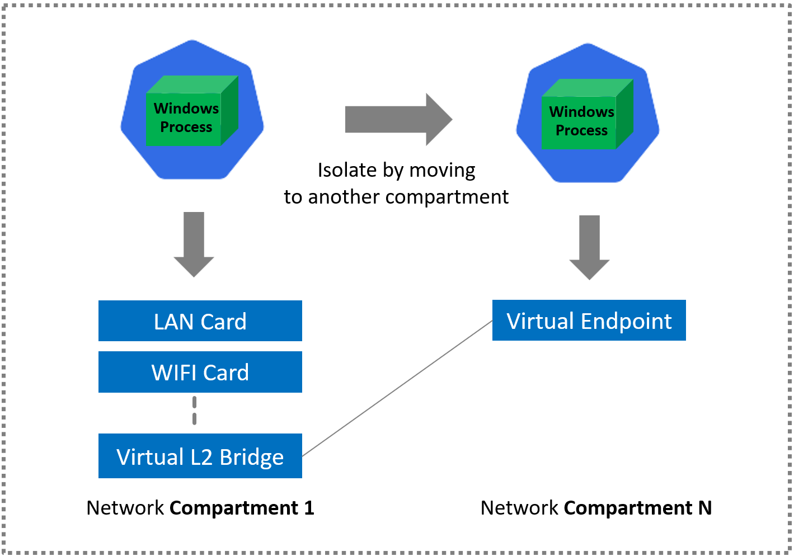

<!--
SPDX-FileCopyrightText: © 2025 Siemens Healthineers AG
SPDX-License-Identifier: MIT
-->

# Running Native Windows Applications with HostProcess + Network Compartments

## Overview

Running existing (often legacy or closed‑source) native Windows applications in Kubernetes can be challenging when you need modern platform capabilities (service mesh, observability, scaling) but the binaries were never built for container awareness or multi‑instance coexistence. On Windows, **network compartments** provide a logical isolation boundary for network configuration (interfaces, routes, policies, DNS) similar in spirit to a network namespace on Linux, but they are not automatically created for HostProcess containers (which execute directly in the host context).
Bringing these native Windows applications into Kubernetes as HostProcess containers and isolating them to run in a specific pod network compartment lets you reuse these platform capabilities (service mesh, observability, scaling) with minimal or no code change.

<div align="center">


</div>

This pattern enables you to:

- Place an unmodified native Windows process into an isolated network compartment
- Assign the process a stable per-instance IP (via the anchor pod's compartment networking)
- Inject mesh sidecars / data-plane capabilities at the compartment boundary (via the anchor)
- Scale to multiple parallel instances—each with its own compartment/IP—without port conflicts
- Gradually migrate or encapsulate legacy services without rewriting them for container semantics

We achieve this by combining:

1. An ordinary Windows (non-HostProcess) "anchor" pod that the kubelet / CNI associates with a compartment.
2. A HostProcess container that runs a privileged launcher which switches into the anchor's compartment before starting the legacy (or new) executable.

This guide shows how to run an existing (possibly legacy / closed‑source) Windows application inside Kubernetes while giving it its **own isolated network context** (a Windows network compartment) and a stable IP address, *without* modifying the binary. The isolation is achieved by pairing:

1. An **anchor pod** (ordinary Windows container) which the Windows CNI stack places into a compartment and wires with an interface + IP.
2. A **HostProcess container** that launches the real application *after* switching its thread into the anchor's compartment using the helper launcher `cplauncher`.

This pattern preserves compatibility (run any EXE), improves multi‑instance scalability (no port collisions), and enables advanced platform add‑ons (service mesh, traffic capture, zero‑downtime rotation) around software that cannot be easily containerized in the traditional sense.

## Why This Pattern?
Windows HostProcess containers execute directly on the host and can start arbitrary processes with elevated permissions. However, binding those processes to a different compartment than the default host compartment requires explicit movement to a new compartment before listening sockets are opened. The pattern here externalizes the compartment selection logic to a launcher tool that:

- Discovers the target compartment by locating a labeled anchor pod.
- Extracts and validates required network context (e.g. IP addresses, annotations, labels).
- Sets the thread's network compartment.
- Starts the desired executable while streaming logs.
- Exits with a meaningful status for observability.

Tool is available under the K2s installation:
```
K2S-INSTALLATION-FOLDER\bin\cni\cplauncher.exe
```

### Benefits
| Theme | Value | Detail |
|-------|-------|--------|
| Service Mesh | Sidecar / proxy enablement | Anchor pod can host or trigger mesh injection; your legacy EXE traffic is transparently managed. |
| Per‑Instance IP | No port conflicts | Each replica gets its own compartment + IP; multiple instances can all listen on the same port (e.g. 8080). |
| Gradual Modernization | No code changes needed | Keep shipping the old binary while layering on Kubernetes services, probes, policies. |
| Traffic Governance | Fine‑grained routing/shaping | Compartment boundaries + HNS policies restrict blast radius of misconfiguration. |
| Security & Isolation | Network surface reduction | Only the intended interface/routes are visible to the process after compartment switch. |
| Scaling & Rollouts | Safer blue/green | Stand up a new anchor+HostProcess pair, cut over Service selector, retire old pair. |
| Observability | Consistent log path | Launcher streams child stdout/stderr; you can attach log collectors at host or compartment scope. |
| Multi‑Tenancy | Logical segmentation | Multiple teams share a node but remain partitioned at network compartment level. |
| Compliance & Audit | Deterministic bootstrap log | Launcher emits parameters (anchor label, namespace, target exe); auditable trail. |
| Troubleshooting | Predictable mapping | Label -> anchor -> compartment -> process chain simplifies root cause analysis. |

> NOTE: While HostProcess containers run with elevated host privileges, the network compartment switch confines *network presence* of the launched process to the intended virtual environment derived from the anchor.

## High-Level Flow
1. Deploy (or already have) a namespace.
2. Create anchor pod with distinct label (e.g. `app=my-anchor-1`).
3. Deploy HostProcess object referencing that label via `cplauncher -label app=my-anchor-1 -namespace <ns> -- <your.exe> <args>`.
4. `cplauncher` resolves anchor pod -> extracts compartment -> switches thread -> launches application.
5. (Optional) Expose via a Service with selector `app=my-legacy-app`.
6. Scale by repeating (anchor, HostProcess pair) or using a Deployment (1:1 pods) where each new replica references a unique anchor label (pattern generation or pre-created anchors).
7. (Optional) Reuse a single anchor for multiple HostProcess instances (shared compartment/IP) if safe—but prefer 1:1 mapping for isolation and distinct IPs.

## Full Generic Example
Below is a generalized manifest (anchor + HostProcess) based on `cplauncher.example.yaml`. Adjust label values, paths, and image versions to fit your environment.

```yaml
---
apiVersion: v1
kind: Pod
metadata:
  name: myapp-compartment-anchor
  namespace: apps
  labels:
    app: myapp-anchor-1    # label used by cplauncher discovery
  annotations:
    linkerd.io/inject: enabled   # enables Linkerd proxy injection if mesh is installed and auto-inject is permitted
spec:
  nodeSelector:
    kubernetes.io/os: windows
  containers:
    - name: pause
      image: shsk2s.azurecr.io/pause-win:v1.5.0
      imagePullPolicy: IfNotPresent
  restartPolicy: Always
---
apiVersion: apps/v1
kind: Deployment
metadata:
  name: myapp-hostprocess
  namespace: apps
  labels:
    app: myapp
spec:
  replicas: 1
  selector:
    matchLabels:
      app: myapp
  template:
    metadata:
      labels:
        app: myapp
    spec:
      nodeSelector:
        kubernetes.io/os: windows
      securityContext:
        windowsOptions:
          hostProcess: true
          runAsUserName: "NT AUTHORITY\\SYSTEM"
      hostNetwork: true
      containers:
        - name: cplauncher
          image: mcr.microsoft.com/oss/kubernetes/windows-host-process-containers-base-image:v1.0.0
          imagePullPolicy: IfNotPresent
          command:
            - "cmd.exe"
            - "/c"
            - "K2S-INSTALLATION-FOLDER\\bin\\cni\\cplauncher.exe"  # replace placeholder with actual path or env var
            - "-label"; "app=myapp-anchor-1"
            - "-namespace"; "apps"
            - "--"
            - "C:\\apps\\legacy\\myapp.exe"; "--config"; "C:\\apps\\config\\prod.json"
          volumeMounts:
            - name: host-apps
              mountPath: C:/apps
      volumes:
        - name: host-apps
          hostPath:
            path: C:/apps
            type: Directory
```

### Parameter Breakdown
| Flag / Element | Purpose | Notes |
|----------------|---------|-------|
| `-label app=myapp-anchor-1` | Selects anchor pod | Must uniquely identify one running anchor. |
| `-namespace apps` | Scopes pod lookup | Avoid cross-namespace ambiguity. |
| `--` | Separator | Everything after is the target process + its args. |
| `myapp.exe --config ...` | Target workload | Unmodified native binary. |
| Host mount `C:/apps` | Binary + config injection | Could be replaced with projected CSI / SMB if desired. |

### Adding a Service
```yaml
apiVersion: v1
kind: Service
metadata:
  name: myapp
  namespace: apps
spec:
  selector:
    app: myapp   # target the HostProcess deployment label
  type: ClusterIP
  ports:
    - port: 80
      targetPort: 8080   # assuming binary listens on 8080
      protocol: TCP
  clusterIP: 172.21.1.222
```

### Scaling Strategies
| Approach | Description | Trade‑Off |
|----------|-------------|----------|
| One anchor per replica (static) | Pre-create anchors (myapp-anchor-1..N) and pass different label per HostProcess pod | Higher YAML management overhead |
| Controller-generated labels | Custom controller creates anchor + HP pair | Requires controller development |
| StatefulSet with deterministic labels | Use ordinal to form anchor label (e.g. `myapp-anchor-$(ordinal)`) | Needs deterministic anchor provisioning logic |

### Mesh / Sidecar Considerations
If your service mesh supports Windows injection, target only the anchor pod for injection so traffic is compartment‑scoped before proxy handling. Ensure `cplauncher` waits until the anchor is Ready (consider a readiness annotation gate).

## Using Linkerd with HostProcess Compartments
Linkerd can provide mutual TLS, latency metrics, policy enforcement, and traffic shaping for legacy Windows workloads launched via HostProcess + compartment binding.

### Injection Path
1. Install Linkerd with Windows support features enabled (control plane on Linux nodes; data plane proxy supports Windows anchors).
2. Annotate the anchor pod (or label the namespace) with `linkerd.io/inject: enabled`.
3. The proxy sidecar is injected into the anchor pod only (HostProcess pods cannot host conventional sidecars).
4. `cplauncher` switches the HostProcess-launched application into the same compartment; traffic now traverses the proxy transparently.

### Traffic & Identity
| Aspect | Detail |
|--------|--------|
| mTLS Identity | Derived from the anchor pod's ServiceAccount; all processes sharing the compartment inherit that trust domain. |
| Multiple Processes | If multiple HostProcess workloads share one anchor, they also share identity—use separate anchors for isolation. |
| Policy Objects | Use `Server` / `ServerAuthorization` (or `Policy` in newer Linkerd) referencing labels on the HostProcess Service. |
| Outbound Control | Leverage `linkerd viz edges` to confirm encrypted edges; restrict egress with NetworkPolicy + Linkerd policy. |

### Observability
| Tool | Usage |
|------|-------|
| `linkerd viz stat` | Verify success/latency for the Service selecting HostProcess pods. |
| `linkerd viz tap` | Inspect live requests; confirm compartment-switched process traffic is visible. |
| `linkerd viz edges` | Confirm mTLS (identity established) between consumers and the workload. |

### Recommended Sequence
```
1. k2s addons enable security --type enhanced --omitHydra --omitKeycloak --omitOAuth2Proxy 
4. Deploy anchor (pause image) + wait for Ready
5. Deploy HostProcess deployment with cplauncher referencing anchor label
6. kubectl port-forward or curl via a meshed client to validate traffic
7. linkerd viz stat deploy -n apps
8. linkerd viz tap deploy/myapp -n apps (optional)
```

### Best Practices
| Practice | Reason |
|----------|--------|
| One anchor per identity-sensitive workload | Limits blast radius and clarifies metrics ownership. |
| Health gating in launcher | Prevents proxy receiving traffic before process is ready. |
| Structured launcher logs | Facilitates correlation with Linkerd tap output. |
| Explicit port documentation | Helps avoid conflicts and clarifies expected interception. |

### Security Notes
Because HostProcess runs with elevated rights, restrict file system exposure (mount only what you need) and sign the launcher & target binaries. Use per‑namespace RBAC limiting list/get permissions strictly to Pods.

## References
- Kubernetes Windows HostProcess Containers: https://kubernetes.io/docs/concepts/windows/intro/#hostprocess-containers
- Windows Network Compartments (Microsoft Docs): https://learn.microsoft.com/windows/win32/api/netioapi/nf-netioapi-setcurrentthreadcompartmentid

