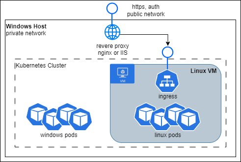
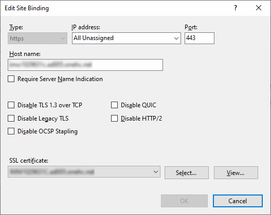
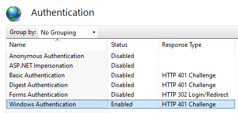
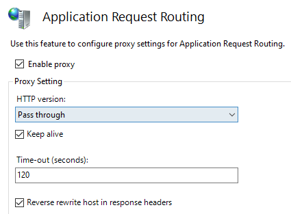

<!--
SPDX-FileCopyrightText: © 2024 Siemens Healthineers AG
SPDX-License-Identifier: MIT
-->

# Secure Host Access
*K2s* provides three addons which can be used to expose the functionality implemented inside the *Kubernetes* cluster outside of it: `ingress-nginx`, `traefik` and `gateway-nginx`.

However, because the whole *K2s* solution relies on a private network, the exposed endpoints are only available inside this private network, running behind the *Windows* host - regardless which [Hosting Variant](../user-guide/hosting-variants.md) is used.

In this document, we will assume you have enabled the *K2s* addon `dashboard`, so it is usable on your local host at `http://k2s-dashboard.local`, and we further more assume you have an own product configured in one of the *K2s* ingress, reachable locally under `http://my-product.local`.

If we want to expose the *ingress* / *gateway* endpoints outside of the *Windows* host in a secure manner, we need to configure a reverse proxy on the *Windows* host. The following picture shows this schematically for one of the variants:



We describe here two ways to do that: using the addon `exthttpaccess` and using *IIS*.

## \[Option 1\] Using the Addon `exthttpaccess`
This *K2s* addon installs *NGINX* as a *Windows* service on the host, and configures it as a reverse proxy to the installed *ingress* addon. Products shall adjust the configuration.

See [NGINX Reverse Proxy](https://docs.nginx.com/nginx/admin-guide/web-server/reverse-proxy/){target="_blank"}.

The example shows how to make the two web applications *K2s* dashboard available outside your host, under an  `https` endpoint:

* `https://my-host.my-domain.com/dashboard` -> `http://k2s-dashboard.local`
* `https://my-host.my-domain.com/my-product` -> `http://my-product.local`

For this you need a server certificate issued by a trusted authority for the FQDN of your host, in this example `my-host.my-domain.com`:

1. Enable the *K2s* addon `exthttpaccess`

2. Update the configuration file `<k2s-install-dir>\bin\nginx\nginx.conf`

    ```title=""
    ...
    http {
      server {
        listen 443          ssl;
        server_name         my-host.my-domain.com;
        ssl_certificate     my-host.my-domain.com.crt;
        ssl_certificate_key my-host.my-domain.com.key;

        location /dashboard/ {
          proxy_pass http://k2s-dashboard.local/;
          proxy_set_header Accept-Encoding "";
        }

        location /my-product/ {
          proxy_pass http://my-product.local/;
          sub_filter 'base href="' 'base href="/my-product';
          proxy_buffering off;
        }
      }
    }
    ```

    * The `sub_filter` will replace e.g. `<base href="/app/"/>` with `<base href="/my-product/app/"/>`, and is needed for apps with static base `href`. The dashboard has dynamic base `href` and need no path re-write.
    * The `proxy_buffering` needs to be turned off if the application uses [Server-Send-Events](https://javascript.info/server-sent-events){target="_blank"}.

3. Restart `nginx-ext` using `nssm`, to use the updated configuration file:

   ```console
   nssm restart nginx-ext
   ```

!!! question "Open Points"
    * How can *NGINX* authenticate users against NTLM? This feature seems to be available, but only for *NGINX Plus*.
    * Can *NGINX* use server certificates private key from the *Windows Certificate Store*? Companies might have an established process to manage and distribute their server certificates, which on *Windows* means they are created in the computer certificate store and their private key cannot be exported to be used by *NGINX*. *IIS* can use it from there.

## \[Option 2\] Using *IIS*
Another way to expose the functionality outside of the *Windows* host is to use the [Application Request Routing module for IIS](https://learn.microsoft.com/en-us/iis/extensions/planning-for-arr/using-the-application-request-routing-module){target="_blank"} and the [URL Rewrite IIS Module](https://www.iis.net/downloads/microsoft/url-rewrite){target="_blank"} to configure a reverse proxy to the services exposed by the *K2s* *ingress* or *gateway* addon.

Using the *IIS* will ease up integration in the site network environment regarding secure communication and user management, as the *IIS* can be configured for SSL using the existing host certificate and the NTLM authentication can be configured in *IIS*.

The example below shows again how to make the same two applications available outside your host over `https`, and this time also making sure that the **user is authenticated** against the local host (i.e. he would also be allowed to log in on your local host):

* `https://my-host.my-domain.com/dashboard` -> `http://k2s-dashboard.local`
* `https://my-host.my-domain.com/my-product` -> `http://my-product.local`

Follow these steps:

1. Install the *IIS Module*  [URL Rewrite](https://www.iis.net/downloads/microsoft/url-rewrite){target="_blank"}
2. Install the *IIS Module* [Application Request Routing](https://www.iis.net/downloads/microsoft/application-request-routing){target="_blank"}
3. In *IIS Manager*, navigate to your default site and select `bindings` in the `Actions pane` on the right.

   Activate SSL binding for your default site in *IIS*. You need a server certificate to do that.

   

4. In *IIS Manager*, navigate to your default site and select `Authentication` in the `IIS` section of the `Features View`.

   Enable `Windows Authentication`:

   

5. In *IIS Manager*, select your computer (root node) and then select `Application Request Routing Cache` in the `IIS` section of the `Features View`. Then select `Server Proxy Settings...` in the `Actions pane`, and enable the proxy:

   

   Also activate the `Reverse rewrite host in response headers`.

6. Finally, in *IIS Manager*, navigate to your default site again, select `URL Rewrite`, and create your inbound and outbound rules. Alternatively, update the configuration file under `C:\inetpub\wwwroot\web.config` and restart the site in *IIS*.

The example below shows how to forward requests to two different ingress endpoints, one of them being the *K2s* dashboard also used in the previous section.

```xml
<?xml version="1.0" encoding="UTF-8"?>
<configuration>
  <system.webServer>
    <rewrite>
      <rules>
        <rule name="k2s-dashboard" stopProcessing="true">
          <match url="^dashboard/?(.*)" />
          <serverVariables>
            <set name="HTTP_ACCEPT_ENCODING" value="" />
          </serverVariables>
          <action type="Rewrite" url="http://k2s-dashboard.local/{R:1}" logRewrittenUrl="true" />
        </rule>
        <rule name="my-product" stopProcessing="true">
          <match url="^my-product/?(.*)" />
          <action type="Rewrite" url="http://my-product.local/{R:1}" logRewrittenUrl="true" />
        </rule>
      </rules>
      <outboundRules>
        <rule name="my-product-out" preCondition="isHTML" stopProcessing="true">
          <match filterByTags="Base" pattern="^/?(.*)$" negate="false" />
          <action type="Rewrite" value="/my-product/{R:1}" />
          <conditions>
            <add input="{URL}" pattern="/my-product.*" />
          </conditions>
        </rule>
        <preConditions>
          <remove name="isHTTP" />
          <preCondition name="isHTML">
            <add input="{RESPONSE_CONTENT_TYPE}" pattern="^text/html" />
          </preCondition>
        </preConditions>
      </outboundRules>
    </rewrite>
    <security>
      <authentication>
        <windowsAuthentication enabled="true" />
      </authentication>
    </security>
  </system.webServer>
</configuration>
```

!!! question "Open Point"
    It seems that *IIS Application Request Routing* has an issue with URLs ending with a space character (as this is forbidden) - although *NGINX* is tolerant with this.

    The dashboard web application makes calls to APIs, and in many of them the namespace is used as REST API resource ID, e.g. all *Pods* of namespace `kubernetes-dashboard` are retrieved with this API call:

    `http://k2s-dashboard.local/api/v1/pod/kubernetes-dashboard?query=value&...`

    But when the user selects `All Namespaces` in the User Interface, the same URL is invoked with a space character (`%20`) as the name of the resource - it seems as this is the convention the developers of the *Dashboard* made:

    `http://k2s-dashboard.local/api/v1/pod/%20?query=value&...`

    The HTTP specs forbid to have a space at the end on an URL, but it works for some reasons. However, when the rewrite rules kick in, it seems they drop the space and the application is not working with `All Namespaces` selected.

    This line in the *Kubernetes* dashboard sources is causing the issue (the space character):

    [`return this.namespace_.isMultiNamespace(currentNamespace) ? ' ' : currentNamespace;`](https://github.com/kubernetes/dashboard/blob/master/modules/web/src/common/services/resource/resource.ts#L69){target="_blank"}

## Base `href`
When configuring reverse proxies, special attention and test effort must be spent to ensure that URLs are properly handled, in case they are pointing to the services being re-directed to.

In our example above, the `my-product.local` app makes several calls to APIs using relative URLs.
The app is designed to work e.g. at `my-product.local/`, and encodes the `<base href="/">`.
But when the application is accessed through the secure URL at e.g. `my-host.my-domain.com/my-product`, the base URL must be rewritten to `<base href="/my-product/">`.

This is solved for `my-product` by outbound rules, which inspects the responses and make the necessary changes for the `<base href.../>`.

For the dashboard, no change is necessary, because it detects and sets the base `href` dynamically, [see the code](https://github.com/kubernetes/dashboard/blob/dde23c41c6ee7e85194dc897cf73ee0f781f7d99/modules/web/src/index.html#L32){target="_blank"}.