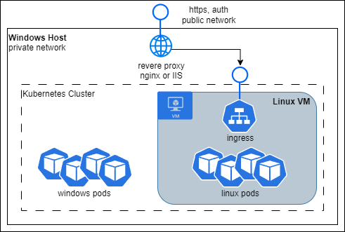
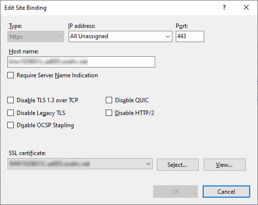
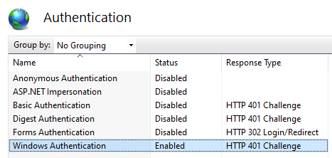
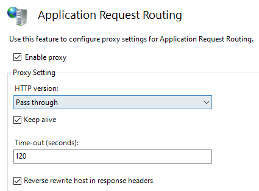

<!--
SPDX-FileCopyrightText: © 2024 Siemens Healthineers AG
SPDX-License-Identifier: MIT
-->

# Secure Host Access
*K2s* provides three addons which can be used to expose the functionality implemented inside the *Kubernetes* cluster outside of it: `ingress nginx`, `ingress traefik`.

However, because the whole *K2s* solution relies on a private network, the exposed endpoints are only available inside this private network, running behind the *Windows* host - regardless which [Hosting Variant](../user-guide/hosting-variants.md) is used.

In this document, we will assume you have enabled the *K2s* addon `dashboard`, so it is usable on your local host at `http://k2s.cluster.local/dashboard/`, and we further more assume you have an own product configured in one of the *K2s* ingress, reachable locally under `http://my-product.local`.

If we want to expose the *ingress* / *gateway* endpoints outside of the *Windows* host in a secure manner, we need to configure a reverse proxy on the *Windows* host. The following picture shows this schematically for one of the variants:



We describe here two ways to do that: using the windows firewall and using *IIS*.

## \[Option 1\] Using the Windows firewall
 
One way to expose the functionality outside of the *Windows* host is to use the *Windows* firewall.
Use the Windows *netsh* command to create a port proxy that forwards external traffic to your ingress controller:

`netsh interface portproxy add v4tov4 listenport=8443 listenaddress=YOUR-HOST-IP connectport=443 connectaddress=172.19.1.100`

This command creates a tunnel that:

Listens on port 8443 (or choose another free port on your host) at address YOUR-HOST-IP (your host interface IP, in most cases your Ethernet adapter) and 
forwards traffic to port 443 at 172.19.1.100 (likely your ingress controller's service), by this the traffic will flow to the K8s cluster. 

Result: External clients can now access your Kubernetes services by connecting to YOUR-HOST-IP:8443. The traffic flows through the Windows port proxy to your ingress controller, which then routes it to the appropriate service based on your ingress rules (hostname, path, etc.).
This setup is commonly used in local development environments where the Kubernetes cluster runs on the host.

Please check out other helpfull commands regarding portproxy:

`netsh interface portproxy show all` - shows all port forwardings settings

`netsh interface portproxy reset`    - cleans them all, for testing very usefull 

## \[Option 2\] Using *IIS*
Another way to expose the functionality outside of the *Windows* host is to use the [Application Request Routing module for IIS](https://learn.microsoft.com/en-us/iis/extensions/planning-for-arr/using-the-application-request-routing-module){target="_blank"} and the [URL Rewrite IIS Module](https://www.iis.net/downloads/microsoft/url-rewrite){target="_blank"} to configure a reverse proxy to the services exposed by the *K2s* *ingress* or *gateway* addon.

Using the *IIS* will ease up integration in the site network environment regarding secure communication and user management, as the *IIS* can be configured for SSL using the existing host certificate and the NTLM authentication can be configured in *IIS*.

The example below shows again how to make the same two applications available outside your host over `https`, and this time also making sure that the **user is authenticated** against the local host (i.e. he would also be allowed to log in on your local host):

* `https://my-host.my-domain.com/dashboard` -> `http://k2s.cluster.local/dashboard/`
* `https://my-host.my-domain.com/my-product` -> `http://my-product.local`

Follow these steps:

1. Install the *IIS Module*  [URL Rewrite](https://www.iis.net/downloads/microsoft/url-rewrite){target="_blank"}
2. Install the *IIS Module* [Application Request Routing](https://www.iis.net/downloads/microsoft/application-request-routing){target="_blank"}
3. In *IIS Manager*, navigate to your default site and select `bindings` in the `Actions pane` on the right.

   Activate SSL binding for your default site in *IIS*. You need a server certificate to do that.

   

4. In *IIS Manager*, navigate to your default site and select `Authentication` in the `IIS` section of the `Features View`.

   Enable `Windows Authentication`:

   

5. In *IIS Manager*, select your computer (root node) and then select `Application Request Routing Cache` in the `IIS` section of the `Features View`. Then select `Server Proxy Settings...` in the `Actions pane`, and enable the proxy:

   

   Also activate the `Reverse rewrite host in response headers`.

6. Finally, in *IIS Manager*, navigate to your default site again, select `URL Rewrite`, and create your inbound and outbound rules. Alternatively, update the configuration file under `C:\inetpub\wwwroot\web.config` and restart the site in *IIS*.

The example below shows how to forward requests to two different ingress endpoints, one of them being the *K2s* dashboard also used in the previous section.

```xml
<?xml version="1.0" encoding="UTF-8"?>
<configuration>
  <system.webServer>
    <rewrite>
      <rules>
        <rule name="k2s-dashboard" stopProcessing="true">
          <match url="^dashboard/?(.*)" />
          <serverVariables>
            <set name="HTTP_ACCEPT_ENCODING" value="" />
          </serverVariables>
          <action type="Rewrite" url="http://k2s.cluster.local/dashboard/{R:1}" logRewrittenUrl="true" />
        </rule>
        <rule name="my-product" stopProcessing="true">
          <match url="^my-product/?(.*)" />
          <action type="Rewrite" url="http://my-product.local/{R:1}" logRewrittenUrl="true" />
        </rule>
      </rules>
      <outboundRules>
        <rule name="my-product-out" preCondition="isHTML" stopProcessing="true">
          <match filterByTags="Base" pattern="^/?(.*)$" negate="false" />
          <action type="Rewrite" value="/my-product/{R:1}" />
          <conditions>
            <add input="{URL}" pattern="/my-product.*" />
          </conditions>
        </rule>
        <preConditions>
          <remove name="isHTTP" />
          <preCondition name="isHTML">
            <add input="{RESPONSE_CONTENT_TYPE}" pattern="^text/html" />
          </preCondition>
        </preConditions>
      </outboundRules>
    </rewrite>
    <security>
      <authentication>
        <windowsAuthentication enabled="true" />
      </authentication>
    </security>
  </system.webServer>
</configuration>
```

!!! note
    The `dashboard` addon now uses **Headlamp** (kubernetes-sigs/headlamp) which serves the UI at port 4466 (HTTP). When exposed via ingress at `/dashboard/`, the `--base-url=/dashboard` flag ensures Headlamp constructs all relative URLs correctly. No special namespace URL encoding workarounds are required.

## Base `href`
When configuring reverse proxies, special attention and test effort must be spent to ensure that URLs are properly handled, in case they are pointing to the services being re-directed to.

In our example above, the `my-product.local` app makes several calls to APIs using relative URLs.
The app is designed to work e.g. at `my-product.local/`, and encodes the `<base href="/">`.
But when the application is accessed through the secure URL at e.g. `my-host.my-domain.com/my-product`, the base URL must be rewritten to `<base href="/my-product/">`.

This is solved for `my-product` by outbound rules, which inspects the responses and make the necessary changes for the `<base href.../>`.

For Headlamp, the base URL is configured via the `--base-url=/dashboard` flag passed by the Helm chart values, so no outbound rewrite rules are necessary.

