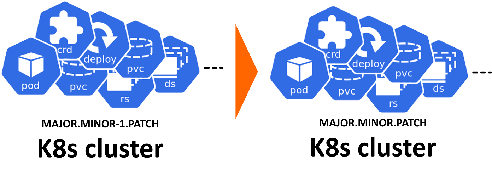

<!--
SPDX-FileCopyrightText: © 2024 Siemens Healthineers AG
SPDX-License-Identifier: MIT
-->

# Upgrading *K2s*

This guide explains how to upgrade an existing *K2s* cluster in-place to a newer released version using the `k2s system upgrade` command.

## Versioning
*K2s* release versions follow semantic versioning: `MAJOR.MINOR.PATCH` (see the [Releases page](https://github.com/Siemens-Healthineers/K2s/releases){target="_blank"}).

Supported upgrade path:
- Standard path: upgrade only from `MINOR-1` to the next `MINOR` within the same `MAJOR` (e.g. `1.4.x` → `1.5.y`).
- Skipping multiple minor versions: perform sequential upgrades through each intermediate minor release.
- Using `--force` (or `-f` if supported): attempts a direct upgrade between any two versions, but only a subset of combinations are continuously tested.

Recommendation: If the currently installed version is several minor releases behind, back up persistent data (application volumes, etc.) before proceeding or use a staging environment to validate.

Upgrade support is available starting from *K2s* `v1.1.0`.

<figure markdown="span">
  { loading=lazy }
  <figcaption>K2s Cluster Upgrade Versioning Semantics</figcaption>
</figure>

## Upgrade Procedure

> **ℹ️ Info:** The upgrade process re-installs the cluster binaries, migrates (exports/imports) Kubernetes resources, and re-enables previously enabled addons. It does not also upgrade existing addons, this needs to be done separatly using the `k2s addons ...` commands.

> **⚠️ Warning:** Addon data/persistence is also **not** automatically restored during upgrade. To backup and restore addon data, use `k2s addons export` before upgrade and `k2s addons import` after upgrade.

1. Extract the new *K2s* release package into a directory (e.g. `C:\k2s\v1.5.0`).
2. Open an elevated (Administrator) PowerShell or command prompt in that directory.
3. Run the upgrade command:
   ```console
   k2s system upgrade
   ```

### Common Flags (please check all possible flags on the cli)

| Flag | Purpose |
|------|---------|
| `-d` | Delete previously cached artifacts after upgrade (cleans local cache). |
| `-c <file>` | Supply a new configuration file to override existing cluster settings (memory, CPU, storage…). |
| `-p <http-proxy>` | Use the specified HTTP proxy for any required network access during the upgrade. |
| `--force` | Attempt upgrade even if skipping multiple minor versions. Use with caution; take a backup first. |

Examples:
```console
# Override settings using a new config
k2s system upgrade -c my-settings.yaml

# Use proxy and remove cached artifacts after success
k2s system upgrade -p http://proxy.local:8080 -d

# Force upgrade across multiple minor jumps
k2s system upgrade --force
```

### Configuration Override
If you omit `-c`, the previous cluster's effective settings (memory, CPU, storage paths) are reused. To change them during an upgrade, provide a config file as described in [Installing Using Config Files](installing-k2s.md#installing-using-config-files).

### What the Command Does
Internally the following high‑level steps are performed:
1. Export all existing workloads (cluster‑scoped resources and namespaced resources).
2. Capture the list of currently enabled addons.
3. Uninstall the existing cluster components.
4. Install the new version from the extracted package.
5. Import previously exported workloads.
6. Re-enable previously enabled addons.
7. Verify workload health (basic readiness checks).
8. Final cluster availability validation.

### Rollback Considerations
There is no automatic rollback. If an upgrade fails:
- Review logs under the K2s log directory.
- Re-run with increased verbosity (if supported) or `--force` only after assessing the cause.
- If recovery is not feasible, you can reinstall the previous version then import a backup (if you captured one beforehand) or re-run your deployment manifests.

### Backups (Recommended)
Before upgrading across more than one minor version, back up:
- Application persistent volumes (if external, ensure snapshots exist).
- Custom configuration files and secrets (outside of version-controlled items).

### Proxy Usage
If your environment requires HTTP(S) proxy access, specify it with `-p`. Ensure the proxy allows access to any required artifact repositories; otherwise offline packages should include all needed assets.

### Upgrade Hooks (Full Upgrade Only)
The full upgrade process supports custom backup and restore hooks for cluster resources that need special handling during upgrade (e.g., SMB shares, external configurations).

> **ℹ️ Note:** Hooks are only executed during **full upgrades**. Delta updates preserve cluster state in place and do not execute hooks.

**Hook Locations:**

1. **Default location:** `<K2s-install-dir>\bin\LocalHooks\`
2. **Additional location:** Specify via the `--additional-hooks-dir` flag

**Hook Naming Convention:**

- Backup hooks: `<name>.Backup.ps1` — executed before cluster uninstall
- Restore hooks: `<name>.Restore.ps1` — executed after cluster install

**Hook Script Parameters:**

Each hook script receives the following parameters:

| Parameter | Description |
|-----------|-------------|
| `-BackupDir` | Directory where backup data should be stored/retrieved |
| `-ShowLogs` | Whether to display verbose logging |

**Example Hook Script:**
```powershell
# MyResource.Backup.ps1
param(
    [string]$BackupDir,
    [switch]$ShowLogs
)

# Backup custom resource
$backupPath = Join-Path $BackupDir "my-resource"
New-Item -ItemType Directory -Path $backupPath -Force | Out-Null
# ... backup logic here
```

**Usage:**
```console
# Use additional hooks directory
k2s system upgrade --additional-hooks-dir "C:\MyHooks"
```

### After Upgrade
Validate cluster:
```console
kubectl get nodes
kubectl get pods -A
```

Check addon status (addons are automatically re-enabled during upgrade):
```console
k2s addons status
```

If you exported addon data before upgrade, restore it now:
```console
k2s addons import
```

If any workload fails readiness, inspect its namespace events and logs before proceeding with further changes.

## Delta Updates

For bandwidth-constrained environments or large-scale deployments, *K2s* supports delta packages that contain only the files changed between two specific versions.

> **ℹ️ Info:** Delta updates perform an in-place update without uninstalling/reinstalling the cluster. The cluster is stopped, files are updated, and the cluster is restarted. This means workloads, addons, and persistent data remain intact.

### When to Use Delta Updates

- Upgrading between adjacent minor versions (e.g., 1.4.x → 1.5.x)
- Applying patch releases (e.g., 1.4.0 → 1.4.1)
- Environments with limited bandwidth or storage
- When you want to preserve running workloads and addon state

### What Delta Update Does

Unlike full upgrades, delta updates:

1. Detect delta package root (current directory with `delta-manifest.json`)
2. Detect target installation folder (from `setup.json`)
3. Stop the cluster if running
4. Update Windows executables and scripts from delta to target installation
5. Update Debian packages on the Linux VM (if applicable)
6. Update container images from delta
7. Restart the cluster

**Key Differences from Full Upgrade:**

| Aspect | Full Upgrade | Delta Update |
|--------|--------------|--------------|
| Cluster state | Uninstalled and reinstalled | Stopped and restarted |
| Workloads | Exported and re-imported | Preserved in place |
| Addons | Re-enabled after install | Remain enabled |
| Addon data | Not preserved (use export/import) | Preserved |
| Upgrade hooks | Executed (backup/restore) | Not executed |
| Package size | Full installation (~GB) | Only changed files (~MB) |

### Applying a Delta Package

1. Verify your current version matches the delta's source version
2. Extract the delta package:
   ```console
   Expand-Archive k2s-delta-v1.5.0-to-v1.6.0.zip -Destination .\delta
   ```
3. Navigate to the extracted directory and run the upgrade:
   ```console
   cd .\delta
   .\k2s.exe system upgrade
   ```
4. Validate the cluster as described above

> **⚠️ Note:** The `k2s system upgrade` command automatically detects whether to perform a full upgrade or delta update based on the presence of `delta-manifest.json` in the package directory.

For complete documentation on creating and applying delta packages, see [Delta Packages](delta-packages.md).