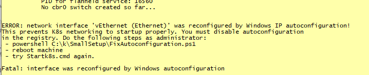
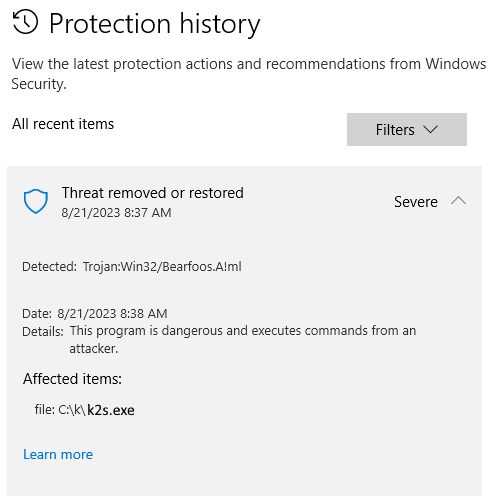
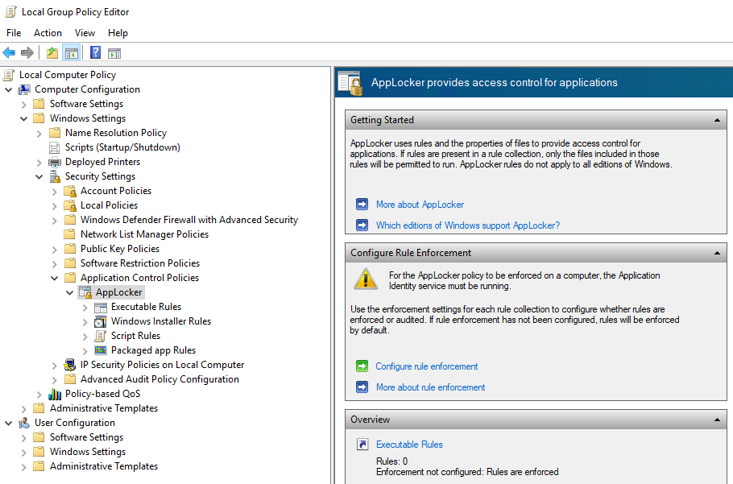

<!--
SPDX-FileCopyrightText: © 2024 Siemens Healthineers AG
SPDX-License-Identifier: MIT
-->

# Known Issues
## Secret Issue When Loading via [Kustomize](https://github.com/kubernetes-sigs/kustomize){target="_blank"}
```console
kubectl apply -k <folder>
error: rawResources failed to read Resources: Load from path ../secrets failed: '../secrets' must be a file (got d='..\kubernetes\secrets')
```

=> [kubectl](https://kubernetes.io/docs/reference/kubectl/){target="_blank"} might be outdated, please us a newer version.

## Disk Pressure
You may suddenly find that *Kubernetes* cannot start a large number of *Pods*. This is often due to *Disk Pressure* meaning that you are lacking available space on your hard disk.

For diagnostics, either inspect the [*K2s* System Status](diagnostics.md#k2s-system-status) or use *kubectl* directly:
```console
kubectl describe nodes
```

Additionally, on *Linux*, you can run:
```console
kubectl describe nodes | less
```

Be aware that the disk pressure may occur on your physical *Windows* system as well as inside the *Linux* VM.

If you have a large number of *Pods* stopped than the problem is probably on the *Linux* side since most of the containers run there.
If the problem is on your local *Windows* system, use the *standard* tools to win space on the drives, (e.g. *TreeSize* utility on `C\` and `D:\`).

You need a least 10 GB free on both disks.

If the problem is on your *Linux* VM, you need following commands to find and fix the problem (get an overview of the disk space consumption):

- `k2s node connect -i 172.19.1.100 -u remote` to open a shell on the *Linux* machine
- `df` and look at /dev/sda1 percentage

Then go to the very top directory with `cd ../..` and with `sudo du -d1 -x -h` you can look in each directory and subdirectory to localize the high space consumption.

You may have too many data in your couch data and can remove them under `/mnt/<folder>` with `sudo rm -r -d shards/`.

The problem comes most probably from the *Docker* registry and you can clean it up with `docker system prune` or `crictl rmi --prune` if you do not have *Docker* installed.

!!! warning
    If you are currently using some locally built containers, *Kubernetes* will not be able to reload them automatically.

    You must rebuild them locally on your system with the `k2s image build` command.

## Volume Access Problem
TP remove unbound volumes, run:
```console
k delete pvc <pvc-name> -n <namespace> --f
k delete pv  <pv-name> -n <namespace>
```

Then re-apply the volumes:
```console
ka -f <manifest-containing-pv>.yaml
```

Then re-apply the manifest of the service consuming the volumes:
```console
kubectl -k .\<manifest-folder>
```

## No `cbr0` Switch Being Created During Start
When starting *K2s*, you run into an error (e.g. timeout) while the script is waiting for the `cbr0` switch to be created by [flannel](https://github.com/flannel-io/flannel){target="_blank"}:

```title="Example Output"
    [10:19:22] waiting for cbr0 switch to be created by flanneld...
    Be prepared for several seconds of disconnected network!
    [10:19:25] State of services (checkpoint 1): All running
    No cbr0 switch created so far...
    [10:19:27] State of services (checkpoint 2): All running
    PID for flanneld service: 20256
    No cbr0 switch created so far...
    [10:19:29] State of services (checkpoint 3): All running
    No cbr0 switch created so far...
    [10:19:31] State of services (checkpoint 4): All running
    No cbr0 switch created so far...
    [10:19:33] State of services (checkpoint 5): All running
    PID for flanneld service: 5260  (restarted after failure)
    No cbr0 switch created so far...
    [10:19:35] State of services (checkpoint 6): All running
    PID for flanneld service: 14488  (restarted after failure)
    No cbr0 switch created so far...
    [10:19:37] State of services (checkpoint 7): All running
    PID for flanneld service: 2236  (restarted after failure)
    No cbr0 switch created so far...
```

There are several reasons which can cause this. Basically the *flanneld* process is waiting for a new virtual switch to be created which has the same IP as the original, physical ethernet adapter. 

## Networking Problems
If you face network errors especially between *Linux* and *Microsoft* services, you may need to reset your networking.

### Minor Workaround
- Run `k2s stop`
- Run `ipconfig`
- Run:<br/>
    ```PowerShell
    get-hnsnetwork | remove-hnsnetwork
    ```
- Run `ipconfig` to check cleanup result
- Run `k2s start`

### Major Workaround
!!! warning
    This workaround resets the networking on *Windows*.

- Run `netcfg -d`
- Reboot the host system

## *Microsoft* APIPA / Link-Local Address
Another reason could be the *Windows* Automatic Private IP Addressing (APIPA). It is enabled by default in *Windows 10* and depending on the speed of the physical adapter, the CPU and the DHCP server, it may happen that *Windows* decides to use an "automatic APIPA address".

There is a reserved IPv4 address block `169.254.0.0/16` (`169.254.0.0` – `169.254.255.255`) for link-local addressing. If such an address is chosen by *Microsoft*, it will no longer be overwritten by the DHCP server (depending on OS version). This will make the *flanneld* approach unusable. Such APIPA addresses are detected during the *K2s* start routine. A workaround is also provided the script [FixAutoconfiguration.ps1](https://github.com/Siemens-Healthineers/K2s/blob/main/smallsetup/FixAutoconfiguration.ps1){target="_blank"}.



!!! bug
    After applying this fix, the APIPA system is completely disabled on the machine. Nevertheless, *Microsoft* does not indicate that properly when you issue the `ipconfig /all` command. You will still see lines that state `Autoconfiguration Enabled . . . . : Yes` but **that is not true**. Don't believe it, it's just a bug in the output. Autoconfiguration is really disabled.

More information on this topic:

- [What is APIPA](https://www.geeksforgeeks.org/what-is-apipa-automatic-private-ip-addressing/){target="_blank"}
- [Wikipedia on APIPA](https://en.wikipedia.org/wiki/Link-local_address){target="_blank"}
- [Microsoft on APIPA](https://docs.microsoft.com/en-us/previous-versions/windows/it-pro/windows-2000-server/cc958957(v=technet.10)?redirectedfrom=MSDN){target="_blank"}

## Unable to Mount File Share Between Nodes
### Problem
Mounting errors like the following occurred:
``` title=""
mount: /mnt/k8s-smb-share: can't read superblock on //172.x.x.x/k8s-smb-share.
```

### Solution
Respective user must have local permissions to use file shares in order to host/mount SMB shares.

## `k2s.exe` Missing / *k2s* Command Not Found
### Problem
If the `k2s.exe` is missing in the install folder, most likely the *Windows Virus & thread protection* identified it as a thread and moved it to quarantine. Despite all exclusion lists this file was added to by the *K2s* maintainers, this can happen from time to time.

### Solution
- If the *Windows Virus & thread protection* asks for the appropriate action, allow the `k2s.exe` file on your system.
- To restore the file, go to `Windows Virus & thread protection` -> `Protection history` and restore `k2s.exe`. The result should look similar to this:

  

## Unable to Run *Windows* Container on a Hardened Machine (*AppLocker* Rules)
### Problem
If the *K2s* cluster is installed on a machine where security hardening is applied using *AppLocker* rules, then running *Windows* containers will be blocked. If you describe the *Windows* container *Pod* then you might see the following error, where the application is blocked by group policy:
```title=""
Warning  FailedCreatePodSandBox  0s    kubelet            Failed to create pod sandbox: rpc error: code = Unknown desc = failed to start sandbox container task "459fe28ca0da5a154964c80e1b5d74de3abefc83cf7ad77418a5d6cd9a7e5605": hcs::System::CreateProcess 459fe28ca0da5a154964c80e1b5d74de3abefc83cf7ad77418a5d6cd9a7e5605: This program is blocked by group policy. For more information, contact your system administrator.: unknown
```

You can check the existing *AppLocker* rules by opening `Local Group Policy Editor` by running `gpedit.msc`. You can find the rules as shown below:



### Solution
!!! warning
    This is not an ideal solution, rather a workaround.

Change registry setting under `Computer\HKEY_LOCAL_MACHINE\SOFTWARE\Policies\Microsoft\Windows\SrpV2\EXE`, `AllowsWindows - 1`, `EnforcementMode - 1` (both are decimals). Next, we should disable the rules in *AppLocker* and restart the machine.

Although, this is just a hack to continue working, we should allow *Windows* containers execution specifically `CMD.exe` in a secured way.

!!! warning
    Please review the `AppLocker` rules with your security experts.

## Unable to Run *Windows Hyper-V* on Host Machine
### Problem
*Hyper-V Manager* unable to connect to *Virtual Machine Management* service on host machine. To reproduce, run:
```PowerShell
Get-VM
```
If there is no error, the command should return a list of VMs (or an empty list).

If an error occurs, it might look like:
```title=""
Hyper-V encountered an error trying to access an object on computer ‘localhost’ because the object was not found. The object might have been deleted. Verify that the Virtual Machine Management service on the computer is running. If the service is running, try to perform the task again by using Run as Administrator.
```

### Solution
This is due to a prior uninstall which has deleted a *MOF* file which is required for *HyperVisor*. In order to regenerate this file, run the following command from an elevated (administrator) command prompt:
```console
MOFCOMP %SYSTEMROOT%\System32\WindowsVirtualization.V2.mof
```

## Unable to Run *Windows* Containers on Host Machine
### Problem
*Windows* containers are unable to run due to failure in `hcs::CreateComputeSystem`:
```title="Error Log from Pod"
Failed to create pod sandbox: rpc error: code = Unknown desc = failed to create containerd task: failed to create shim task: hcs::CreateComputeSystem 9f078e725c4f6b36dc2647d6323bc214da46fa24ba88d3d5652bc687993c27ed: The request is not supported.: unknown
```
```title="General Error"
Error response from daemon: hcsshim::CreateComputeSystem 70b6cf806eef813a8a93b40780c32e43f5406f0cbec10b922d3bd35ecc677b6c: The request is not supported.
```

### Solution
  1. Run `k2s stop`
  2. Run:<br/>
    ```PowerShell
    Disable-WindowsOptionalFeature -Online -FeatureName Microsoft-Hyper-V-All
    ```
  3. Restart host machine
  4. Run:<br/>
    ```PowerShell
    Enable-WindowsOptionalFeature -Online -FeatureName Microsoft-Hyper-V-All
    ```
  5. Restart host machine
  6. Run `k2s start`
  7. Re-deploy *Windows* containers