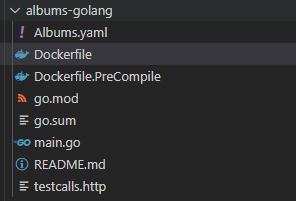

<!--
SPDX-FileCopyrightText: © 2024 Siemens Healthineers AG
SPDX-License-Identifier: MIT
-->

# Building a Container Image
This page describes how to build a container image using *K2s*.

*K2s* internally uses [Buildah](https://buildah.io/){target="_blank"} (on *Linux*) and [Docker](https://www.docker.com/){target="_blank"} (on *Windows*) for building container images.

## Container Runtime and Build Tool
*Windows* node:

* [containerd](https://containerd.io/){target="_blank"} - Used as the container runtime for the *Windows* node.
* *Docker* - Used only for building container images on *Windows*.

*Linux* node:

* [CRI-O](https://cri-o.io/){target="_blank"} - Used as the container runtime on *Linux*.
* *Buildah* - Used only for building container images on *Linux*.

Usage:
```console
k2s image build [flags]
```

## *Dockerfile*
The steps and methods to build a container are numerous. Containers can be build in different languages, they can need different compilers with different options and typically, each container needs a specific basis (*Windows*/*Linux*, etc.) and a specific amount of data to be packed in the container.

This specification is defined in a unified manner in a *Dockerfile* (and this is also the real name of the file). This ASCII file has a standard content originally defined by *Docker*, but grown to an implicit standard and therefore reused by other building infrastructure like the *containerd*.

To build a container, you must provide such a *Dockerfile* and store it beside your code. The tooling described below will use this file to build the container by default. Additionally, you can use also use a *Dockerfile* present in a different location than your code by using `--dockerfile` parameter.

## Building a *Windows* Container Image
If you need to build a *Windows*-based application (e.g. a *.NET* application), you might have the following project structure:


```console
k2s image build --input-folder C:\s\examples\albums-netcore --windows --image-name local/example.albums-win --image-tag 99 -o
```

In the above example, *k2s* CLI is being used with `build` option to build a *.NET* application under a particular folder with image name and tag accordingly. It is important to mention the  `--windows` flag while building *Windows*-based container images.

```title="Example output"
⏳ [12:11:00] Successfully built ec44caa68e5e
⏳ [12:11:00] Successfully tagged local/example.albums-win:99
⏳ [12:11:00] Output of checking if the image local/example.albums-win:99 is now available in docker:
⏳ [12:11:00] REPOSITORY                 TAG       IMAGE ID       CREATED                  SIZE
⏳ [12:11:00] local/example.albums-win   99        ec44caa68e5e   Less than a second ago   361MB
⏳ [12:11:00] C:\ws\k2s\Temp\ExportedImages
⏳ [12:11:00] Saving image local/example.albums-win:99 temporarily as C:\ws\k2s\Temp\ExportedImages\BuiltImage.tar to import it afterwards into containerd...
⏳ [12:11:16] ...saved.
⏳ [12:11:16] Importing image local/example.albums-win:99 from C:\ws\k2s\Temp\ExportedImages\BuiltImage.tar into containerd...
⏳ [12:11:19] unpacking docker.io/local/example.albums-win:99 (sha256:6a4c30f6f25f7ba959e904fbbf3d1193fd1a1ba8027cbf414f456704bb3ec4b9)...
⏳ [12:11:20] Loaded image: local/example.albums-win:99
⏳ [12:11:20] ...imported
⏳ [12:11:20] Removing temporarily created file C:\ws\k2s\Temp\ExportedImages\BuiltImage.tar...
⏳ [12:11:20] ...removed
⏳ [12:11:21] The built image 'local/example.albums-win:99' is available in the containerd's local repository.
⏳ [12:11:21] Total duration: 00:00:59
⏳ [12:11:21] Converting message of type 'CmdResult' to JSON..
⏳ [12:11:21] message converted
⏳ [12:11:21] JSON compressed
⏳ [12:11:21] JSON base64 encoded
⏳ [12:11:21] message sent via CLI
 SUCCESS  'image build' completed in 1m6.2240613s
Please see 'C:\var\log\k2s.log' for more information
```

As we are building container images using *Docker*, built images should be available for *containerd* and this is achieved via import of built images to the *containerd* repository.

After a successful build command, the image should be available in the *containerd* repository and can be queried with *k2s* CLI:

```title=""
k2s image ls

Available Images
┌───────────────────────────────────────────────────────────────────────────────────────────────────────────┐
| ImageId       | Repository                                              | Tag      | Node        | Size   |
| ec44caa68e5e6 | docker.io/local/example.albums-win                      | 99       | imw1026986c | 204MB  |
└───────────────────────────────────────────────────────────────────────────────────────────────────────────┘
```

For running *Windows* *Pods* in *K8s*, please always specify the *Node* selector for *Windows*, as well as a specific *Toleration* in your YAML file:
```yaml title=""
      nodeSelector:
        kubernetes.io/os: windows
      tolerations:
        - key: "OS"
          operator: "Equal"
          value: "Windows"
          effect: "NoSchedule"
```

## Building a *Linux* Container Image
If you need to build a *Linux*-based application (e.g. a *Go*-based application), you might have the following project structure:



```console
k2s image build --input-folder C:\s\examples\albums-golang --image-name local/example.albums-golang --image-tag 99 -o
```

In the above example, the *k2s* CLI is used with `build` command to build a *Go*-based application under a particular folder with image name and tag set accordingly.

## Pushing to a Registry
In order to push your container image, you need to label it with the appropriate version number and push it to the registry:

```console
k2s image build --input-folder C:\s\examples\albums-netcore --windows --image-name local/example.albums-win --image-tag 99 -p -o
```

!!! note
    Make sure the registry you want to push to is configured (see [Adding a Container Registry](adding-container-registry.md)).

The `--push` or `-p` option is required for pushing container image to the configured registry.

Then, you need to update the YAML file with the newly published version:

```yaml title=""
   spec:
      imagePullSecrets:
        - name: regcred
      containers:
        - name: albums-win
          image: docker.io/local/example.albums-win:99
          args: ["--v", "4"]

```

## Specifying the *Dockerfile* Explicitly
It is possible to specify a *Dockerfile* that is not present in the same location as your source to build the container image. This can be achieved by specifying the path to the *Dockerfile* with the `--dockerfile` or `-f` parameter:

```console
k2s image build --input-folder C:\s\examples\albums-golang --dockerfile C:\Dockerfile --image-name local/example.albums-golang --image-tag 99 -o
```

If the file `C:\Dockerfile` does not exist, the build command will fallback to the *Dockerfile* beside your code, if present. If it is missing, the command will fail.

!!! note
    When specifying the *Dockerfile*, it is possible to use relative paths:

    ```console
    k2s image build --input-folder C:\s\examples\albums-golang --dockerfile ..\..\Dockerfile --image-name local/example.albums-golang --image-tag 99 -o
    ```

    In this case, the path to the *Dockerfile* is resolved to the current working directory. If the *Dockerfile* is not found after the path is resolved, the the *Dockerfile*, if present, beside your code is used. Otherwise, the command fails.

## Specifying Build Arguments
Build arguments are a great way to add flexibility to your container image builds. You can pass build argument at build-time and a default value can be specified to be used as a fallback:

```Dockerfile title="Example Dockerfile with Arguments"
ARG BaseImage=alpine:latest

FROM ${BaseImage}
COPY servicelin /bin
RUN ["chmod",  "777", "./bin/servicelin"]
ENTRYPOINT ["/bin/servicelin"]
```

Above is a *Dockerfile* which has the build argument `BaseImage`. If the build argument is not set via  `k2s image build`, the default value `alpine:latest` is used.

You can specify the build argument using `--build-arg` parameter. In this example, the base image can be set to a *Debian* version:

```console
k2s image build -n k2s.io/servicelin -t 1 --build-arg="BaseImage=debian:latest"
```

### Multiple Build Arguments
It is also possible to supply multiple build arguments. 

For example, if your *Dockerfile* has two build arguments `BaseImage` and `CommitId`:

```Dockerfile title=""
ARG BaseImage=alpine:latest
ARG CommitId=latest

FROM ${BaseImage}

LABEL "Commit-Id"=${CommitId}

COPY servicelin /bin
RUN ["chmod",  "777", "./bin/servicelin"]
ENTRYPOINT ["/bin/servicelin"]
```

Then, we can supply the values to these build arguments using the following command:

```console
k2s image build -n k2s.io/servicelin -t 1 --build-arg="BaseImage=debian:latest" --build-arg="CommitId=a5e04dafb1d235a81d3332a6535b63e7"
```

Here, we use the parameter `--build-arg` twice to supply the values of both the build arguments.

For running *Linux* *Pods* in *K8s* please always specify the *Node* selector for *Linux*:
```yaml title=""
      nodeSelector:
        kubernetes.io/os: linux
```

## `k2s build` Internals
Under the hood of `k2s build` is the *PowerShell* script [Build-Image.ps1](https://github.com/Siemens-Healthineers/K2s/blob/main/lib/scripts/k2s/image/Build-Image.ps1){target="_blank"} (and its batch-wrapper, both part of the *K2s* setup) to automate the container build. A container image will be created in your local repository.

In general, `k2s build` supports *Linux* (default) as well as *Windows* containers.
There are also two types of a *Dockerfile* supported:

- `Dockerfile` - The entire build chain is executed as part of the image build process resulting in a container image.
- `Dockerfile.Precompile` - The content of the working directory is being build first and the container image is created afterwards (which is the default behavior if both are files are available).
