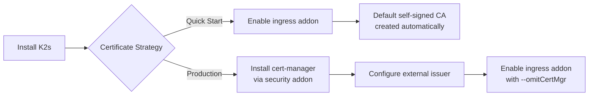

<!--
SPDX-FileCopyrightText: © 2026 Siemens Healthineers AG
SPDX-License-Identifier: MIT
-->

# Certificate Management

*K2s* uses [cert-manager](https://cert-manager.io/){target="_blank"} to automate TLS certificate lifecycle management within the cluster. This page describes how cert-manager is deployed, how the default self-signed CA works, and how to integrate an external Certificate Authority for production use.

## Overview

When you enable an **ingress addon** (`nginx`, `traefik`, or `nginx-gw`) or the **security addon** (`--type basic`), cert-manager is automatically installed alongside a default self-signed CA chain. This provides immediate TLS support without any external infrastructure.

For production deployments, you should replace the default self-signed CA with certificates issued by your organization's trusted Certificate Authority. The `--omitCertMgr` flag on ingress addons enables exactly this workflow.



## Default Self-Signed CA

By default, K2s creates a certificate chain using cert-manager:

| Resource | Kind | Purpose |
|----------|------|---------|
| `k2s-boot-strapper-issuer` | `ClusterIssuer` (SelfSigned) | Bootstrap issuer that signs the CA certificate |
| `k2s-self-signed-ca` | `Certificate` (CA) | Root CA certificate (valid for 10 years) |
| `k2s-ca-issuer` | `ClusterIssuer` (CA) | Issues TLS certificates signed by the root CA |

The root CA public certificate is also imported into the **Windows Trusted Root Certification Authorities** store, so browsers and tools on the host trust certificates issued by `k2s-ca-issuer`.

### How it works

1. The `k2s-boot-strapper-issuer` (a self-signed `ClusterIssuer`) issues the root CA certificate `k2s-self-signed-ca`
2. The CA certificate's private key is stored in the Kubernetes secret `ca-issuer-root-secret`
3. The `k2s-ca-issuer` `ClusterIssuer` uses that secret to sign TLS certificates for your applications
4. Ingress resources annotated with `cert-manager.io/cluster-issuer: k2s-ca-issuer` automatically receive TLS certificates

### Securing your application

Add the following annotations to your Ingress resource to obtain a TLS certificate from the default CA:

```yaml
apiVersion: networking.k8s.io/v1
kind: Ingress
metadata:
  annotations:
    cert-manager.io/cluster-issuer: k2s-ca-issuer
    cert-manager.io/common-name: your-app.k2s.cluster.local
spec:
  tls:
    - hosts:
        - your-app.k2s.cluster.local
      secretName: your-app-tls
  rules:
    - host: your-app.k2s.cluster.local
      http:
        paths:
          - path: /
            pathType: Prefix
            backend:
              service:
                name: your-app
                port:
                  number: 80
```

cert-manager observes the annotation, creates a `Certificate` resource, obtains a signed certificate from `k2s-ca-issuer`, and stores it in the secret `your-app-tls`. The ingress controller then uses it for HTTPS termination.

## Using an External Certificate Authority

For production environments, the default self-signed CA is not suitable — browsers and clients outside the cluster will not trust it. Instead, you should configure cert-manager with an issuer backed by your organization's CA or an ACME provider (e.g., Let's Encrypt).

### Strategy

The recommended workflow is:

1. **Install cert-manager** independently (via the security addon)
2. **Create your external issuer** (a `ClusterIssuer` or namespace-scoped `Issuer`)
3. **Enable the ingress addon** with `--omitCertMgr` to skip the default CA setup
4. **Annotate your Ingress resources** with your custom issuer name

### Step 1: Install cert-manager

Use the security addon in basic mode to install only cert-manager:

```console
k2s addons enable security --type basic
```

This installs cert-manager controllers and CRDs, the default `k2s-ca-issuer`, and the `cmctl.exe` CLI tool.

!!! note
    You can also let the ingress addon install cert-manager automatically (without `--omitCertMgr`), and then create additional issuers alongside the default one.

### Step 2: Create your external issuer

Create a `ClusterIssuer` that references your organization's CA or an ACME endpoint. Below are common examples.

=== "Organization CA"

    Store your CA certificate and key in a Kubernetes secret, then reference it:

    ```yaml
    apiVersion: v1
    kind: Secret
    metadata:
      name: org-ca-key-pair
      namespace: cert-manager
    type: kubernetes.io/tls
    data:
      tls.crt: <base64-encoded-ca-cert>
      tls.key: <base64-encoded-ca-key>
    ---
    apiVersion: cert-manager.io/v1
    kind: ClusterIssuer
    metadata:
      name: org-ca-issuer
    spec:
      ca:
        secretName: org-ca-key-pair
    ```

=== "ACME (Let's Encrypt)"

    ```yaml
    apiVersion: cert-manager.io/v1
    kind: ClusterIssuer
    metadata:
      name: letsencrypt-prod
    spec:
      acme:
        server: https://acme-v02.api.letsencrypt.org/directory
        email: your-email@example.com
        privateKeySecretRef:
          name: letsencrypt-account-key
        solvers:
          - http01:
              ingress:
                class: nginx  # or traefik
    ```

=== "Venafi / Vault"

    See the cert-manager documentation for configuring [Venafi](https://cert-manager.io/docs/configuration/venafi/){target="_blank"} or [HashiCorp Vault](https://cert-manager.io/docs/configuration/vault/){target="_blank"} issuers.

Apply your issuer:

```console
kubectl apply -f my-cluster-issuer.yaml
```

### Step 3: Enable ingress with --omitCertMgr

Since cert-manager is already installed, skip its installation when enabling the ingress addon:

```console
k2s addons enable ingress nginx --omitCertMgr
k2s addons enable ingress traefik --omitCertMgr
k2s addons enable ingress nginx-gw --omitCertMgr
```

!!! warning
    When using `--omitCertMgr`, the default `k2s-ca-issuer` and its root CA are **not created**. TLS certificates must be provided by your custom issuer or created manually.

### Step 4: Annotate your Ingress resources

Reference your custom issuer in Ingress annotations:

```yaml
metadata:
  annotations:
    cert-manager.io/cluster-issuer: org-ca-issuer  # your issuer name
    cert-manager.io/common-name: myapp.example.com
```

### Providing TLS for k2s.cluster.local

When using `--omitCertMgr`, the default `k2s-cluster-local-tls` certificate is not created automatically. You need to create a `Certificate` resource for it manually if you want HTTPS on the K2s dashboard or other addons:

```yaml
apiVersion: cert-manager.io/v1
kind: Certificate
metadata:
  name: k2s-cluster-local-tls
  namespace: ingress-nginx  # or ingress-traefik, depending on your implementation
spec:
  secretName: k2s-cluster-local-tls
  duration: 2160h  # 90 days
  renewBefore: 720h  # 30 days
  commonName: k2s.cluster.local
  dnsNames:
    - k2s.cluster.local
  issuerRef:
    name: org-ca-issuer  # your issuer name
    kind: ClusterIssuer
```

## Managing Certificates

### cmctl CLI

The `cmctl.exe` CLI is installed in the K2s `bin` directory when cert-manager is deployed. Use it to inspect and manage certificates:

```console
# Check cert-manager API readiness
cmctl.exe check api

# List certificates
cmctl.exe status certificate k2s-cluster-local-tls -n ingress-nginx

# Manually trigger renewal
cmctl.exe renew k2s-cluster-local-tls -n ingress-nginx

# Renew all certificates
cmctl.exe renew --all --all-namespaces
```

### Inspecting certificates in the browser

If you have the **dashboard** addon enabled with an ingress, navigate to <https://k2s.cluster.local> and click the lock icon to inspect the TLS certificate.

### Windows certificate store

The default CA certificate is imported into `Cert:\LocalMachine\Root` (Trusted Root Certification Authorities). When the ingress addon is disabled, the certificate is automatically removed from the Windows store.

If you use an external CA, you may need to import your organization's root certificate into the Windows trust store separately:

```powershell
Import-Certificate -FilePath "C:\path\to\org-root-ca.crt" -CertStoreLocation Cert:\LocalMachine\Root
```

## Decision Guide

| Scenario | Recommended Approach |
|----------|---------------------|
| Development / testing | Use the default self-signed CA (no extra configuration needed) |
| Internal production (corporate CA) | Create a CA `ClusterIssuer` with your org's root certificate |
| Public-facing services | Use an ACME issuer (e.g., Let's Encrypt) |
| Air-gapped / offline | Use the default self-signed CA or pre-provision a CA `ClusterIssuer` with an offline root certificate |
| Multiple issuers needed | Install cert-manager first, create multiple `ClusterIssuer` resources, then enable ingress with `--omitCertMgr` |

## Browser Security Considerations

Browsers track security properties of visited sites (HSTS, certificate pinning). If you switch CAs or re-issue certificates with different properties, the browser may reject the new certificate.

To **reset HSTS** settings for `k2s.cluster.local`:

- **Chrome/Edge**: Navigate to `chrome://net-internals/#hsts` and delete the entry for `k2s.cluster.local`
- **Firefox**: Clear site data for `k2s.cluster.local` in Settings → Privacy & Security

## See Also

- [cert-manager documentation](https://cert-manager.io/docs/){target="_blank"}
- [Addons](addons.md) — addon CLI reference including ingress flags
- [Security Features](../security/security-features.md) — security addon modes
