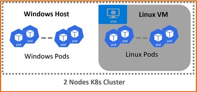
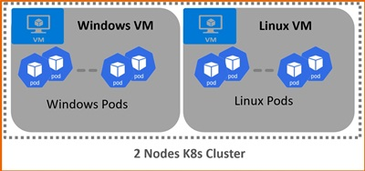
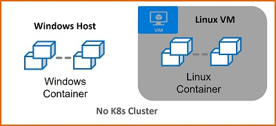

<!--
SPDX-FileCopyrightText: © 2024 Siemens Healthineers AG
SPDX-License-Identifier: MIT
-->

# Hosting Variants
## Host (Default)
On the *Windows* host, a single VM is exclusively utilized as the *Linux* control-plane node while the *Windows* host itself functions as the worker node.

This variant is also the default, offering efficient and very low memory consumption. The VM's memory usage starts at 4GB.  

## Multi VM 
For each node, a VM is created, with a minimum configuration of one *Windows* node and one *Linux* node. The memory usage for each node starts at 10GB.  

## Development-Only
In this variant, the focus is on setting up an environment solely for building and testing *Windows* and *Linux* containers without creating a *K8s* cluster.  

