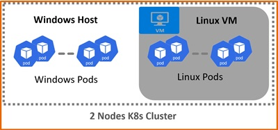
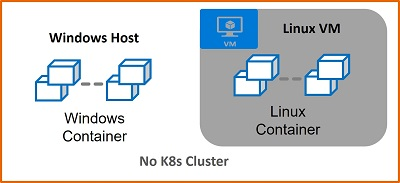

<!--
SPDX-FileCopyrightText: © 2024 Siemens Healthineers AG
SPDX-License-Identifier: MIT
-->

# Hosting Variants
## Host (Default)
On the *Windows* host, a single VM is exclusively utilized as the *Linux* control-plane node while the *Windows* host itself functions as the worker node.

This variant is also the default, offering efficient and very low memory consumption. The VM's memory usage starts at 2GB.  

## Development-Only
In this variant, the focus is on setting up an environment solely for building and testing *Windows* and *Linux* containers without creating a *K8s* cluster.  

## Linux Host

!!! warning "Experimental"
    Linux host support is experimental. Some features (offline packaging, backup/restore) are not yet available. The interface may change without notice.

In this variant the *Linux* machine **is** the host. The *Kubernetes* control plane runs natively on the host (no VM), and an optional *Windows* VM is provisioned via *libvirt/KVM* with OVMF UEFI firmware to provide a mixed-OS worker node.

The *k2s* CLI is compiled as a native *Linux* binary and uses *Go* APIs directly (kubeadm, kubectl, libvirt, SSH) — **no PowerShell** is required.

| Component | Location |
|-----------|----------|
| Control plane (kubelet, kube-apiserver, etcd, …) | Linux host |
| Linux container runtime (CRI-O / containerd) | Linux host |
| Windows worker (optional) | Windows VM via KVM |
| CLI | `k2s` (Linux binary) |
