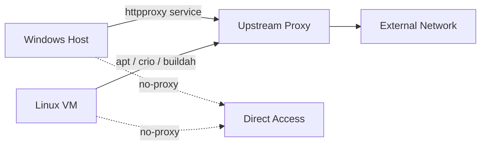

<!--
SPDX-FileCopyrightText: © 2026 Siemens Healthineers AG
SPDX-License-Identifier: MIT
-->

# Proxy Configuration

If your environment requires an HTTP proxy to access external networks (e.g., corporate firewalls), *K2s* can route all outbound traffic from both the Windows host and the Linux VM through a proxy server.

This page covers configuring the proxy **after** installation. To set a proxy **during** installation, use the `--proxy` flag — see [k2s CLI – install](k2s-cli.md#install).

## How It Works

*K2s* runs a transparent HTTP proxy service (`httpproxy`) on the Windows host. When you configure a proxy, the following happens:

1. The `httpproxy` service on the Windows host is configured to forward requests through your upstream proxy.
2. Inside the Linux VM (KubeMaster), the proxy settings are applied to:
    - **APT** (package manager) — `/etc/apt/apt.conf.d/proxy.conf`
    - **CRI-O** (container runtime) — systemd environment override
    - **Buildah/Podman** (container engine) — `/etc/containers/containers.conf`
3. Proxy overrides (no-proxy entries) define hosts that should be reached **directly**, bypassing the proxy. *K2s* automatically includes internal cluster addresses in the no-proxy list.



## Commands

All proxy commands require a running *K2s* installation.

### Set proxy

Configure the HTTP proxy for the cluster.

```console
k2s system proxy set <proxy-uri>
```

**Example:**

```console
k2s system proxy set http://proxy.example.com:8080
```

This updates the proxy on both the Windows host and the Linux VM. The `httpproxy` service is restarted with the new configuration.

### Get proxy

Print the currently configured proxy URI.

```console
k2s system proxy get
```

Returns only the proxy URI (useful for scripting). If no proxy is configured, the output is empty.

### Show proxy details

Display the proxy URI together with all configured proxy overrides.

```console
k2s system proxy show
```

**Example output:**

```text
Proxy: http://proxy.example.com:8080
Proxy Overrides:
  - .example.com
  - 10.0.0.0/8
  - 172.19.1.0/24
```

### Reset proxy

Remove all proxy configuration from the cluster.

```console
k2s system proxy reset
```

This clears the proxy on both the Windows host and the Linux VM:

- The `httpproxy` service is restarted without an upstream proxy.
- APT, CRI-O, and container engine proxy settings are removed from the Linux VM.

After resetting, the cluster accesses external networks directly (or via NAT, depending on the hosting variant).

---

## Proxy Overrides (No-Proxy)

Proxy overrides define destinations that should bypass the proxy and be reached directly. *K2s* automatically includes internal cluster addresses (e.g., the control-plane IP, pod/service CIDRs) — you do not need to add these manually.

Use overrides for additional hosts or domains that should not go through the proxy, such as internal registries, artifact servers, or local services.

### Add overrides

```console
k2s system proxy override add <hosts...>
```

**Example:**

```console
k2s system proxy override add registry.internal.example.com .local 10.20.0.0/16
```

You can specify multiple entries separated by spaces. Supported formats:

| Format | Example | Matches |
|--------|---------|---------|
| Hostname | `registry.example.com` | Exact host |
| Domain wildcard | `.example.com` | All subdomains of `example.com` |
| IP address | `10.0.0.5` | Single IP |
| CIDR range | `10.20.0.0/16` | All IPs in the subnet |

### Delete overrides

```console
k2s system proxy override delete <hosts...>
```

**Example:**

```console
k2s system proxy override delete registry.internal.example.com
```

### List overrides

```console
k2s system proxy override ls
```

Lists all currently configured proxy overrides, including both user-added and auto-generated K2s internal entries.

---

## Typical Workflow

A common workflow for configuring proxy access in a corporate environment:

```console
# 1. Set the proxy
k2s system proxy set http://proxy.corp.example.com:3128

# 2. Add internal hosts that should bypass the proxy
k2s system proxy override add .corp.example.com registry.internal.corp.example.com

# 3. Verify the configuration
k2s system proxy show

# 4. Later, if the proxy is no longer needed
k2s system proxy reset
```

!!! tip
    If you are creating an offline package with `k2s system package` while behind a proxy, run `k2s system proxy reset` **before** packaging. This ensures the package does not contain references to your proxy server.

## See Also

- [k2s CLI – install `--proxy` flag](k2s-cli.md#install) — set a proxy during installation
- [k2s CLI – system proxy](k2s-cli.md#system-proxy) — command reference
- [Hosting Variants Features Matrix](../dev-guide/hosting-variants-features-matrix.md) — which variants use the HttpProxy service
