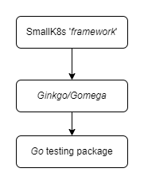

<!--
SPDX-FileCopyrightText: © 2023 Siemens Healthcare GmbH

SPDX-License-Identifier: MIT
-->

- [*K2s* Acceptance Testing](#k2s-acceptance-testing)
  - [Tech Stack](#tech-stack)
  - [Implementing Tests/Specs](#implementing-testsspecs)
  - [Executing Tests/Specs](#executing-testsspecs)
    - [Example: Core *K2s* Communication tests](#example-core-k2s-communication-tests)
    - [Build executable for tests](#build-executable-for-tests)

# *K2s* Acceptance Testing
> The terms *acceptance testing* and *end-to-end (e2e) testing* are used synonymously

**The acceptance tests focus on testing *K2s* from a user's point of view** in an automated, repeatable and reproduceable fashion. They are intended to cover all available features across the various [Supported OS Versions](../../README.md#supported-os-versions). They are not intended to cover all the edge and corner cases, though (Unit Tests might be a better fit there).

**To mark acceptance tests as such** and provide additional information about test prerequisites (e.g. a running *K2s* cluster, internet connectivity, etc.), **use labels/tags** (see [Tags/Labels](../../docs/dev-guide/contributing/tags-labels.md)).

## Tech Stack
The tech stack mostly comprises the [*Go* testing package](https://pkg.go.dev/testing), [*Ginkgo*](https://onsi.github.io/ginkgo/#top)/[*Gomega*](https://onsi.github.io/gomega/#top) and the so called *[framework](./framework/README.md)* provided by *K2s* to write acceptance tests in an efficient way without having to write boilerplate code repeatedly. The levels of abstraction are depicted in the following:



## Implementing Tests/Specs
The acceptance tests' source code is organized under [*e2e* folder](./e2e/). The *[framework](./framework/README.md)* is located under the [*framework* folder](./framework/).

## Executing Tests/Specs
See [Automated Testing](../../docs/dev-guide/contributing/automated-testing.md) for general information and technical prerequisites.

### Example: Core *K2s* Communication tests
Test are located under [*core* folder](./e2e/cluster/core/). To run those tests, either run:

```cmd
cd <install-dir>\k2s\test
ginkgo -v --label-filter=core -r
```

or navigate to the specific folder and run:

```cmd
cd <install-dir>\k2s\test\e2e\cluster\core
go test -v
```
> '-r' and './...' are synonymous for scanning for tests recursively.

### Build executable for tests
`go test -v -c`
