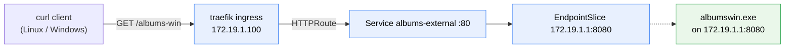

<!--
SPDX-FileCopyrightText: © 2026 Siemens Healthineers AG
SPDX-License-Identifier: MIT
-->

# Option 1 — Native Process Managed Outside Kubernetes

The native process keeps its **own lifecycle** (a Windows service, scheduled task or installer‑started daemon).
It listens on the **KubeSwitch IP `172.19.1.1`**, and we publish it to the cluster with a **selectorless
Service + EndpointSlice**. A **curl client** then calls the app through the **traefik ingress**, which routes to
that Service and finally to the native `albumswin.exe`.



## Prerequisites

Enable the traefik ingress addon (provides the Gateway API implementation):

```powershell
k2s addons enable ingress traefik
```

## 1. Start the native process on the host

Run `albumswin.exe` directly on the Windows host, bound to the KubeSwitch IP. It stays in the host's **default
compartment** because `COMPARTMENT_ID_ATTACH` is **not** set:

```powershell
$env:BIND_ADDRESS = "172.19.1.1"   # or 0.0.0.0 to also serve own interfaces
$env:PORT         = "8080"
$env:HEALTH_BIND_ADDRESS = "172.19.1.1"
$env:HEALTH_PORT  = "8081"
$env:RESOURCE     = "albums-win"
# Note: COMPARTMENT_ID_ATTACH intentionally unset -> host default compartment
.\albumswin.exe
```

Allow the port through the Windows firewall so the cluster can connect:

```powershell
New-NetFirewallRule -DisplayName "albums-external (cluster)" -Direction Inbound `
  -Action Allow -Protocol TCP -LocalPort 8080
```

## 2. Publish the external Service

```powershell
kubectl apply -f 10-external-service.yaml
```

This creates a `Service` **without a selector** and a matching `EndpointSlice` (`discovery.k8s.io/v1`) pointing
at `172.19.1.1:8080`. The `kubernetes.io/service-name` label links the slice to the Service. (`v1 Endpoints` is
deprecated in K8s 1.33+.)

## 3. Consume the Service directly from client pods

These clients call the `albums-external` **Service directly** (no ingress). Their logs show the albums JSON in
a loop:

```powershell
kubectl apply -f 20-test-clients-service.yaml

kubectl -n hostprocess-examples logs deploy/curl-linux-svc -f
kubectl -n hostprocess-examples logs deploy/curl-windows-svc -f
```

- **Linux** pod calls the Service DNS name: `http://albums-external.hostprocess-examples.svc.cluster.local/albums-win`.
- **Windows** HostProcess client (host network) calls the native process via the KubeSwitch IP:
  `http://172.19.1.1:8080/albums-win` — cluster DNS is not resolvable from the host.

## 4. Route it through the traefik ingress

Traefik's Gateway API provider watches the experimental `TCPRoute`/`TLSRoute` CRDs, which K2s does **not**
install (standard channel only). Without them the provider stalls and the `Gateway` stays *"Waiting for
controller"* (→ `404`). Apply the small prerequisite CRDs first, then the gateway:

```powershell
kubectl apply -f 25-traefik-gateway-crds.yaml
kubectl wait --for condition=established `
  crd/tcproutes.gateway.networking.k8s.io crd/tlsroutes.gateway.networking.k8s.io

# If traefik was already running, restart it so its Gateway provider re-initializes
# with the now-present CRDs (otherwise the GatewayClass stays ACCEPTED=Unknown).
kubectl -n ingress-traefik rollout restart deploy/traefik
kubectl -n ingress-traefik rollout status deploy/traefik

kubectl apply -f 30-gateway-api.yaml

# The GatewayClass/Gateway should now be Accepted (not 'Waiting for controller')
kubectl get gatewayclass traefik
kubectl -n hostprocess-examples get gateway,httproute
```

`30-gateway-api.yaml` creates a `GatewayClass` (`traefik`), a `Gateway` (`gatewayClassName: traefik`) and an
`HTTPRoute` that forwards the `/albums-win` path to the `albums-external` Service. The traefik addon publishes
its `web` entrypoint as `:80` on `172.19.1.100`, and `k2s.cluster.local` resolves to that IP on the host. Call
it directly:

```powershell
# From the Windows host — client -> traefik ingress -> Service -> albumswin.exe
curl.exe -v http://k2s.cluster.local/albums-win

# Other routes exposed by albumswin (GET by id, POST)
curl.exe -s http://k2s.cluster.local/albums-win/2
curl.exe -s -X POST -H "Content-Type: application/json" `
  -d '{"id":"4","title":"Meddle","artist":"Pink Floyd","price":19.99}' `
  http://k2s.cluster.local/albums-win
```

Each call returns the albums JSON served by the native process.

## 5. Call the ingress from curl client pods

These clients call `/albums-win` **through the ingress** in a loop, so their logs show the albums JSON produced
by the native host process:

```powershell
kubectl apply -f 40-test-clients-ingress.yaml

kubectl -n hostprocess-examples logs deploy/curl-linux-ingress -f
kubectl -n hostprocess-examples logs deploy/curl-windows-ingress -f
```

- **Linux** pod calls the in‑cluster traefik service with the `k2s.cluster.local` Host header:
  `curl -H "Host: k2s.cluster.local" http://traefik.ingress-traefik.svc.cluster.local/albums-win`.
- **Windows** client calls the traefik external IP with the same Host header: `http://172.19.1.100/albums-win`.

> **Why the `Host` header?** The traefik `Gateway` listener binds the shared hostname `k2s.cluster.local`, so
> requests must carry that `Host`. From the Windows host you can just use `curl.exe http://k2s.cluster.local/...`
> (it resolves to `172.19.1.100`); in‑cluster pods that cannot resolve the name send the header explicitly.

> **Windows client note:** normal (process‑isolated) Windows container images must match the node's OS build, so
> a fixed `nanoserver`/`servercore` tag fails to pull on differing nodes. The Windows clients therefore run as
> **HostProcess** containers (using the already‑available `pause-win` image) and use the host's own `curl.exe`
> on the host network.

## Cleanup

```powershell
kubectl delete -f 40-test-clients-ingress.yaml -f 30-gateway-api.yaml `
  -f 20-test-clients-service.yaml -f 10-external-service.yaml
Remove-NetFirewallRule -DisplayName "albums-external (cluster)"
```
