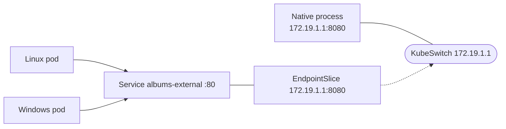

<!--
SPDX-FileCopyrightText: © 2026 Siemens Healthineers AG
SPDX-License-Identifier: MIT
-->

# Option 1 — Native Process Managed Outside Kubernetes

The native process keeps its **own lifecycle** (a Windows service, scheduled task or installer‑started daemon).
It listens on the **KubeSwitch IP `172.19.1.1`**, and we publish it to the cluster with a **selectorless
Service + EndpointSlice** so pods reach it via a **stable ClusterIP / DNS name**.



## 1. Start the native process on the host

Run `albumswin.exe` directly on the Windows host, bound to the KubeSwitch IP. It stays in the host's **default
compartment** because `COMPARTMENT_ID_ATTACH` is **not** set:

```powershell
$env:BIND_ADDRESS = "172.19.1.1"   # or 0.0.0.0 to also serve own interfaces
$env:PORT         = "8080"
$env:HEALTH_BIND_ADDRESS = "172.19.1.1"
$env:HEALTH_PORT  = "8081"
$env:RESOURCE     = "albums-win"
# Note: COMPARTMENT_ID_ATTACH intentionally unset -> host default compartment
.\albumswin.exe
```

Allow the port through the Windows firewall so pods can connect:

```powershell
New-NetFirewallRule -DisplayName "albums-external (cluster)" -Direction Inbound `
  -Action Allow -Protocol TCP -LocalPort 8080
```

## 2. Publish the external Service

```powershell
kubectl apply -f 10-external-service.yaml
```

This creates a `Service` **without a selector** and a matching `EndpointSlice` (`discovery.k8s.io/v1`) pointing
at `172.19.1.1:8080`. The `kubernetes.io/service-name` label links the slice to the Service. (`v1 Endpoints` is
deprecated in K8s 1.33+.)

## 3. Consume the Service from Linux and Windows clients

Deploy the test clients. They **continuously curl** the `albums-win` endpoint in a loop, so their logs show the
albums JSON returned by the native host process:

```powershell
kubectl apply -f 20-test-clients.yaml

kubectl -n hostprocess-examples logs deploy/curl-linux -f
kubectl -n hostprocess-examples logs deploy/curl-windows -f
```

> **Windows client note:** normal (process‑isolated) Windows container images must match the node's OS build,
> so a fixed `nanoserver`/`servercore` tag fails to pull on differing nodes. The `curl-windows` client
> therefore runs as a **HostProcess** container (using the already‑available `pause-win` image) and uses the
> host's own `curl.exe`. Because it shares the host network, it reaches the process via the KubeSwitch IP
> `172.19.1.1` — cluster DNS (`*.svc.cluster.local`) is only resolvable from regular pods.

You can also call the Service ad‑hoc with `kubectl exec`. The app (`albumswin`) exposes the routes
`GET /albums-win`, `GET /albums-win/{id}` and `POST /albums-win`:

```powershell
# List all albums (verbose) from a Linux pod (via Service DNS)
kubectl -n hostprocess-examples exec deploy/curl-linux -- \
  curl -v http://albums-external.hostprocess-examples.svc.cluster.local/albums-win

# Get a single album by id
kubectl -n hostprocess-examples exec deploy/curl-linux -- \
  curl -s http://albums-external.hostprocess-examples.svc.cluster.local/albums-win/2

# Create an album (POST)
kubectl -n hostprocess-examples exec deploy/curl-linux -- \
  curl -s -X POST -H "Content-Type: application/json" \
  -d '{"id":"4","title":"Meddle","artist":"Pink Floyd","price":19.99}' \
  http://albums-external.hostprocess-examples.svc.cluster.local/albums-win

# By ClusterIP instead of DNS name
$ip = kubectl -n hostprocess-examples get svc albums-external -o jsonpath='{.spec.clusterIP}'
kubectl -n hostprocess-examples exec deploy/curl-linux -- curl -s "http://$ip/albums-win"

# From the Windows HostProcess client (host network -> use the KubeSwitch IP)
kubectl -n hostprocess-examples exec deploy/curl-windows -- \
  curl.exe -s http://172.19.1.1:8080/albums-win
```

All calls should return the albums JSON served by the host process.

## Optional: expose outside the host

Do **not** expose `172.19.1.1` directly. Route external traffic through a *Kubernetes* gateway using the
standard **Gateway API**. A ready‑to‑apply routing manifest is included:

| File | Purpose |
|------|---------|
| `30-gateway-api.yaml` | Standard Gateway API `Gateway` + `HTTPRoute` to the external Service (requires `ingress nginx-gw` or `ingress traefik` addon) |

```powershell
kubectl apply -f 30-gateway-api.yaml
```

Consume the same `albums-win` functionality **through the gateway**. The `HTTPRoute` matches host
`albums.my-domain.local`, so send that `Host` header to the gateway address (the K2s ingress is reachable at
`172.19.1.100`):

```powershell
# From the Windows host (or any client that can reach the gateway)
curl.exe -v -H "Host: albums.my-domain.local" http://172.19.1.100/albums-win

# Or add a hosts entry (albums.my-domain.local -> 172.19.1.100) and call it directly
curl.exe -v http://albums.my-domain.local/albums-win
```

See [Secure Host Access](https://siemens-healthineers.github.io/K2s/next/op-manual/secure-host-access/) for
exposing the gateway endpoint securely outside the host.

## Cleanup

```powershell
kubectl delete -f 30-gateway-api.yaml --ignore-not-found
kubectl delete -f 20-test-clients.yaml -f 10-external-service.yaml
Remove-NetFirewallRule -DisplayName "albums-external (cluster)"
```
