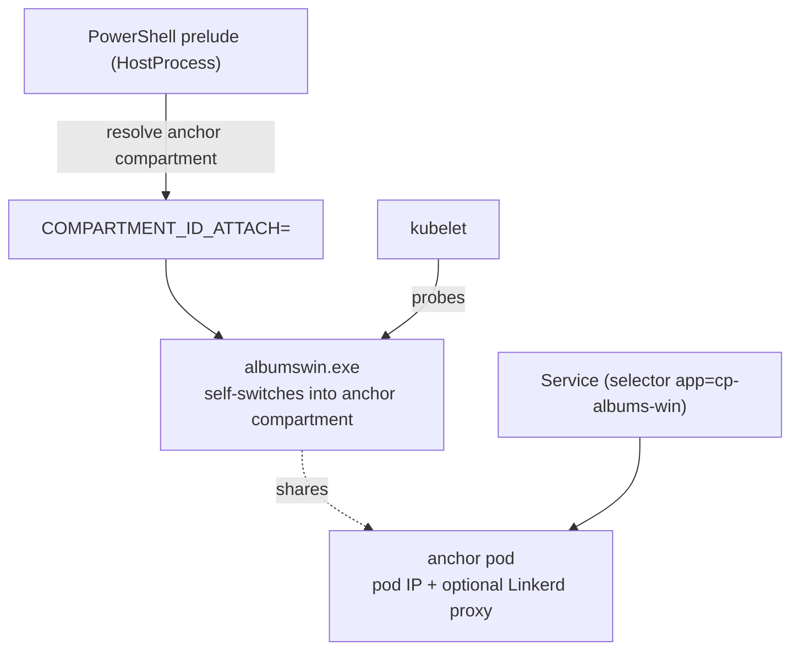

<!--
SPDX-FileCopyrightText: © 2026 Siemens Healthineers AG
SPDX-License-Identifier: MIT
-->

# Option 2 — Native Process Managed by Kubernetes (HostProcess + Compartment)

*Kubernetes* owns the process lifecycle. `albumswin.exe` runs inside a **Windows HostProcess container**
(still on the host, as `NT AUTHORITY\SYSTEM`). Instead of `cplauncher`, a small PowerShell prelude resolves the
**anchor pod's network compartment** and starts albumswin with the **`COMPARTMENT_ID_ATTACH`** env var set;
albumswin then switches its own threads into that compartment (see
[`albumswin/main.go`](../albumswin/main.go)) and gets a **pod IP**. An ordinary label‑selector `Service` exposes
it, and kubelet runs probes, restarts and rollouts.



> This example demonstrates the **no‑cplauncher** variant. The compartment is discovered by mapping the anchor
> pod IP to a Windows network compartment via `ipconfig /allcompartments` (the same technique `cplauncher`
> uses). If you prefer `cplauncher` to do the discovery and launch, see the concept guide below.

See the concept guide:
[Running Native Windows Applications with HostProcess + Network Compartments](https://siemens-healthineers.github.io/K2s/next/op-manual/running-apps-as-hostprocess/).

## Files

| File | Purpose |
|------|---------|
| `05-launcher-configmap.yaml` | `ALBUMS_WIN` path (+ optional `KUBECTL`) — **edit for your host** |
| `06-launcher-script.yaml` | `start-albumswin.ps1` mounted into the container (compartment resolve + launch) |
| `07-system-rbac.yaml` | Role/RoleBinding letting `k2s-NT-AUTHORITY-SYSTEM` list pods (for the script) |
| `10-anchor-pod.yaml` | Anchor pod that owns the compartment / pod IP |
| `15-health-probe-policy.yaml` | Linkerd policy allowing kubelet probes on the health port (**meshed clusters only**) |
| `20-hostprocess-deployment.yaml` | HostProcess Deployment (runs the mounted script) + Service |
| `30-zero-trust-policy.yaml` | Illustrative Linkerd default‑deny + allow `GET` policy |
| `40-gateway-api.yaml` | Optional standard Gateway API `Gateway` + `HTTPRoute` to the HostProcess Service |

## 1. Configure host paths

Edit `05-launcher-configmap.yaml` so `ALBUMS_WIN` points to the built `albumswin.exe`. The PowerShell prelude
uses `kubectl` to read the anchor pod IP, so `NT AUTHORITY\SYSTEM` must be able to run it:

```powershell
# One-time: give the SYSTEM account a kubeconfig (RBAC is applied below via 07-system-rbac.yaml)
k2s system users add -u "NT AUTHORITY\SYSTEM"

kubectl apply -f 05-launcher-configmap.yaml
kubectl apply -f 06-launcher-script.yaml
kubectl apply -f 07-system-rbac.yaml
```

The launch logic lives in the mounted `start-albumswin.ps1` (from `06-launcher-script.yaml`), not inline in the
Deployment. It runs as `NT AUTHORITY\SYSTEM` and calls `kubectl get pod`, so it needs both a kubeconfig
(`k2s system users add`) and the pod‑read RBAC in `07-system-rbac.yaml`. If `kubectl.exe` is not on the SYSTEM
PATH, set the `KUBECTL` key in `05-launcher-configmap.yaml`.

## 2. Deploy the anchor pod first, then the HostProcess workload

The anchor pod must be **Ready** before the HostProcess deployment starts, so the prelude can resolve its
compartment by label.

```powershell
kubectl apply -f 10-anchor-pod.yaml
kubectl -n hostprocess-examples wait --for=condition=Ready pod/albums-compartment-anchor --timeout=180s

# ONLY if the security addon (Linkerd) is enabled: allow kubelet probes on the health port.
# The anchor compartment is meshed, and on Windows the mesh cannot be bypassed per-port, so
# without this the readiness/liveness/startup probes are rejected with 403 and the pod never
# becomes Ready.
kubectl apply -f 15-health-probe-policy.yaml

kubectl apply -f 20-hostprocess-deployment.yaml

# The prelude logs the resolved compartment id before starting albumswin:
kubectl -n hostprocess-examples logs deploy/albums-win-hp-app-hostprocess | Select-String COMPARTMENT_ID_ATTACH
```

## 3. (Optional) Enable zero‑trust security

With the `security` addon (enhanced) enabled, apply the illustrative policy. It sets the app port to
**default‑deny** and allows only `GET` on the app route from authorized, meshed clients — **security through
infrastructure** around an unmodified binary.

```powershell
k2s addons enable security --type enhanced
kubectl apply -f 30-zero-trust-policy.yaml
```

## 4. (Optional) Route through the traefik ingress

Expose the HostProcess Service through the **traefik ingress** using the standard **Gateway API** (the traefik
addon runs the Gateway API provider, `gatewayClassName: traefik`):

```powershell
# Requires:  k2s addons enable ingress traefik
# Traefik's Gateway provider watches the experimental TCPRoute/TLSRoute CRDs, which K2s
# does not install. Apply the prerequisite CRDs from the Option 1 example first, else the
# Gateway stays 'Waiting for controller' and every request 404s.
kubectl apply -f ../option-1-external-service/25-traefik-gateway-crds.yaml
kubectl wait --for condition=established `
  crd/tcproutes.gateway.networking.k8s.io crd/tlsroutes.gateway.networking.k8s.io

# Restart traefik so its Gateway provider re-initializes with the now-present CRDs
# (otherwise the GatewayClass stays ACCEPTED=Unknown).
kubectl -n ingress-traefik rollout restart deploy/traefik
kubectl -n ingress-traefik rollout status deploy/traefik

kubectl apply -f 40-gateway-api.yaml
kubectl get gatewayclass traefik
kubectl -n hostprocess-examples get gateway,httproute
```

Call the `albums` functionality **through the ingress**. The traefik `web` entrypoint is published as `:80` on
`172.19.1.100`, and `k2s.cluster.local` resolves to that IP on the host. The app's route is
`/albums-win-hp-app-hostprocess` (the `RESOURCE` env value):

```powershell
curl.exe -v http://k2s.cluster.local/albums-win-hp-app-hostprocess
```

This flows: **client → traefik ingress → HostProcess Service → `albumswin.exe`** (in the anchor compartment).

## 5. Consume the Service from pods

The HostProcess Service is a normal `ClusterIP` with a selector, reachable from any pod. Use a temporary curl
pod (or reuse the clients from the Option 1 example — they share the `hostprocess-examples` namespace). The app
(`albumswin`) exposes `GET /albums-win-hp-app-hostprocess`, `GET /albums-win-hp-app-hostprocess/{id}` and
`POST /albums-win-hp-app-hostprocess`:

```powershell
kubectl -n hostprocess-examples get pods,svc

# Ad-hoc Linux client
kubectl -n hostprocess-examples run curl-tmp --rm -it --restart=Never \
  --image=docker.io/curlimages/curl:8.5.0 -- \
  curl -v http://albums-win-hp-app-hostprocess.hostprocess-examples.svc.cluster.local/albums-win-hp-app-hostprocess

# Get a single album by id
kubectl -n hostprocess-examples run curl-tmp --rm -it --restart=Never \
  --image=docker.io/curlimages/curl:8.5.0 -- \
  curl -s http://albums-win-hp-app-hostprocess.hostprocess-examples.svc.cluster.local/albums-win-hp-app-hostprocess/2
```

> **Note:** With the zero‑trust policy (`30-zero-trust-policy.yaml`) applied, only **meshed** clients with an
> allowed identity may call the Service, and only `GET` on the app route is permitted — other verbs/paths are
> denied.

## Cleanup

```powershell
kubectl delete -f 40-gateway-api.yaml --ignore-not-found
kubectl delete -f 30-zero-trust-policy.yaml --ignore-not-found
kubectl delete -f 20-hostprocess-deployment.yaml -f 10-anchor-pod.yaml -f 05-launcher-configmap.yaml
```
