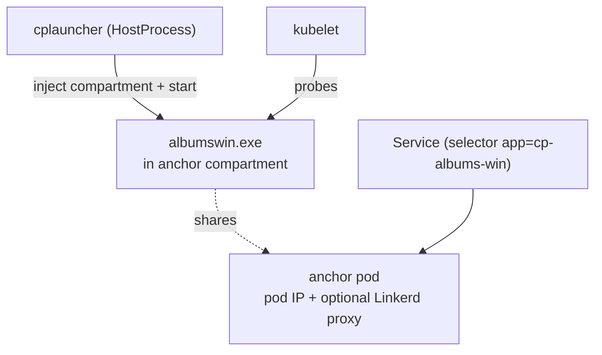

<!--
SPDX-FileCopyrightText: © 2026 Siemens Healthineers AG
SPDX-License-Identifier: MIT
-->

# Option 2 — Native Process Managed by Kubernetes (HostProcess + Compartment)

*Kubernetes* owns the process lifecycle. `albumswin.exe` runs inside a **Windows HostProcess container**
(still on the host, as `NT AUTHORITY\SYSTEM`), and `cplauncher` moves it into an **anchor pod's network
compartment** so it gets a **pod IP**. An ordinary label‑selector `Service` then exposes it, and kubelet runs
probes, restarts and rollouts.



See the concept guide:
[Running Native Windows Applications with HostProcess + Network Compartments](https://siemens-healthineers.github.io/K2s/next/op-manual/running-apps-as-hostprocess/).

## Files

| File | Purpose |
|------|---------|
| `05-launcher-configmap.yaml` | Host paths for `cplauncher` and the target binary (**edit for your host**) |
| `10-anchor-pod.yaml` | Anchor pod that owns the compartment / pod IP |
| `20-hostprocess-deployment.yaml` | HostProcess Deployment (`cplauncher`) + Service |
| `30-zero-trust-policy.yaml` | Illustrative Linkerd default‑deny + allow `GET` policy |
| `40-gateway-api.yaml` | Optional standard Gateway API `Gateway` + `HTTPRoute` to the HostProcess Service |

## 1. Configure host paths

Edit `05-launcher-configmap.yaml` so `CPLAUNCHER_BASE` points to the folder containing `cplauncher.exe`
(usually `<K2s-install>\bin\cni`) and `ALBUMS_WIN` points to the built `albumswin.exe`.

```powershell
kubectl apply -f 05-launcher-configmap.yaml
```

## 2. Deploy the anchor pod first, then the HostProcess workload

The anchor pod must be **Ready** before the HostProcess deployment starts, so `cplauncher` can resolve its
compartment by label.

```powershell
kubectl apply -f 10-anchor-pod.yaml
kubectl -n hostprocess-examples wait --for=condition=Ready pod/albums-compartment-anchor --timeout=180s
kubectl apply -f 20-hostprocess-deployment.yaml
```

## 3. (Optional) Enable zero‑trust security

With the `security` addon (enhanced) enabled, apply the illustrative policy. It sets the app port to
**default‑deny** and allows only `GET` on the app route from authorized, meshed clients — **security through
infrastructure** around an unmodified binary.

```powershell
k2s addons enable security --type enhanced
kubectl apply -f 30-zero-trust-policy.yaml
```

## 4. (Optional) Route from outside the host

Expose the HostProcess Service through a *Kubernetes* gateway using the standard **Gateway API**:

```powershell
# Requires the ingress nginx-gw or traefik addon
kubectl apply -f 40-gateway-api.yaml
```

Consume the `albums` functionality **through the gateway**. The `HTTPRoute` matches host
`albums.my-domain.local`, so send that `Host` header to the gateway address (the K2s ingress is reachable at
`172.19.1.100`). Here the app's route is `/albums-win-hp-app-hostprocess` (the `RESOURCE` env value):

```powershell
curl.exe -v -H "Host: albums.my-domain.local" http://172.19.1.100/albums-win-hp-app-hostprocess
```

## 5. Consume the Service from pods

The HostProcess Service is a normal `ClusterIP` with a selector, reachable from any pod. Use a temporary curl
pod (or reuse the clients from the Option 1 example — they share the `hostprocess-examples` namespace). The app
(`albumswin`) exposes `GET /albums-win-hp-app-hostprocess`, `GET /albums-win-hp-app-hostprocess/{id}` and
`POST /albums-win-hp-app-hostprocess`:

```powershell
kubectl -n hostprocess-examples get pods,svc

# Ad-hoc Linux client
kubectl -n hostprocess-examples run curl-tmp --rm -it --restart=Never \
  --image=docker.io/curlimages/curl:8.5.0 -- \
  curl -v http://albums-win-hp-app-hostprocess.hostprocess-examples.svc.cluster.local/albums-win-hp-app-hostprocess

# Get a single album by id
kubectl -n hostprocess-examples run curl-tmp --rm -it --restart=Never \
  --image=docker.io/curlimages/curl:8.5.0 -- \
  curl -s http://albums-win-hp-app-hostprocess.hostprocess-examples.svc.cluster.local/albums-win-hp-app-hostprocess/2
```

> **Note:** With the zero‑trust policy (`30-zero-trust-policy.yaml`) applied, only **meshed** clients with an
> allowed identity may call the Service, and only `GET` on the app route is permitted — other verbs/paths are
> denied.

## Cleanup

```powershell
kubectl delete -f 40-gateway-api.yaml --ignore-not-found
kubectl delete -f 30-zero-trust-policy.yaml --ignore-not-found
kubectl delete -f 20-hostprocess-deployment.yaml -f 10-anchor-pod.yaml -f 05-launcher-configmap.yaml
```
