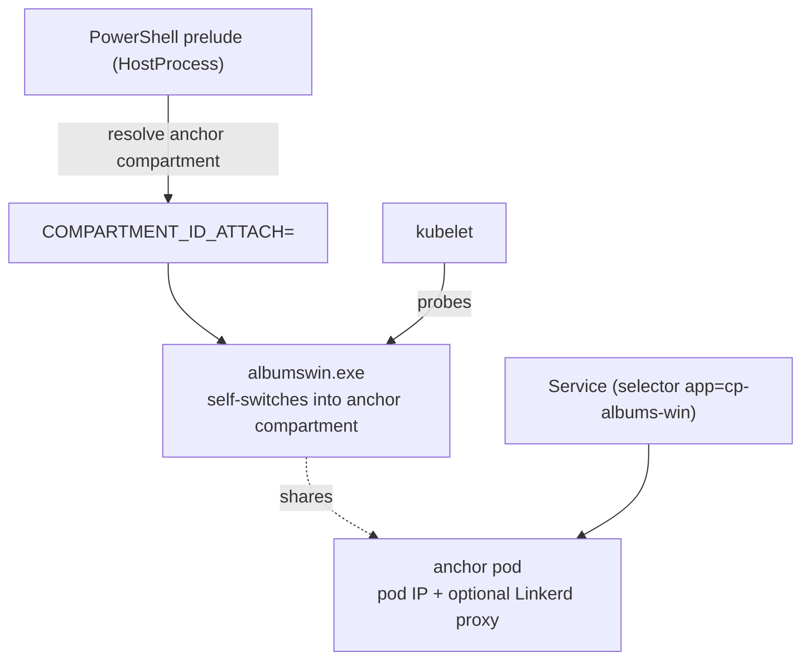

<!--
SPDX-FileCopyrightText: © 2026 Siemens Healthineers AG
SPDX-License-Identifier: MIT
-->

# Option 2 — Native Process Managed by Kubernetes (HostProcess + Compartment)

*Kubernetes* owns the process lifecycle. `albumswin.exe` runs inside a **Windows HostProcess container**
(still on the host, as `NT AUTHORITY\SYSTEM`). Instead of `cplauncher`, a small PowerShell prelude resolves the
**anchor pod's network compartment** and starts albumswin with the **`COMPARTMENT_ID_ATTACH`** env var set;
albumswin then switches its own threads into that compartment (see
[`albumswin/main.go`](../albumswin/main.go)) and gets a **pod IP**. An ordinary label‑selector `Service` exposes
it, and kubelet runs probes, restarts and rollouts.



> This example demonstrates the **no‑cplauncher** variant. The compartment is discovered by mapping the anchor
> pod IP to a Windows network compartment via `ipconfig /allcompartments` (the same technique `cplauncher`
> uses). If you prefer `cplauncher` to do the discovery and launch, see the concept guide below.

See the concept guide:
[Running Native Windows Applications with HostProcess + Network Compartments](https://siemens-healthineers.github.io/K2s/next/op-manual/running-apps-as-hostprocess/).

## Files

| File | Purpose |
|------|---------|
| `05-launcher-configmap.yaml` | `ALBUMS_WIN` path (+ optional `KUBECTL`) — **edit for your host** |
| `06-launcher-script.yaml` | `start-albumswin.ps1` mounted into the container (compartment resolve + launch) |
| `07-system-rbac.yaml` | Role/RoleBinding letting `k2s-NT-AUTHORITY-SYSTEM` list pods (for the script) |
| `10-anchor-pod.yaml` | Anchor pod that owns the compartment / pod IP |
| `15-health-probe-policy.yaml` | Linkerd policy allowing kubelet probes on the health port (**meshed clusters only**) |
| `20-hostprocess-deployment.yaml` | HostProcess Deployment (runs the mounted script) + Service |
| `40-gateway-api.yaml` | Optional standard Gateway API `Gateway` + `HTTPRoute` to the HostProcess Service (HTTP + HTTPS) |
| `50-test-clients-service.yaml` | Linux (meshed) + Windows (meshed, normal pod) clients consuming the Service directly |
| `60-test-clients-ingress.yaml` | Linux + Windows (both normal pods) clients consuming via the traefik ingress (HTTPS) |
| `70-zero-trust-policy.yaml` | **Optional / applied last.** Illustrative Linkerd default‑deny + allow `GET` policy |
| `75-ingress-authorization-policy.yaml` | **Optional.** Only needed *with* `70-` **and** ingress — authorizes the meshed traefik identity to the `GET` route |

## 1. Configure host paths

Edit `05-launcher-configmap.yaml` so `ALBUMS_WIN` points to the built `albumswin.exe`. The PowerShell prelude
uses `kubectl` to read the anchor pod IP, so `NT AUTHORITY\SYSTEM` must be able to run it:

```powershell
# One-time: give the SYSTEM account a kubeconfig (RBAC is applied below via 07-system-rbac.yaml)
k2s system users add -u "NT AUTHORITY\SYSTEM"

kubectl apply -f 05-launcher-configmap.yaml
kubectl apply -f 06-launcher-script.yaml
kubectl apply -f 07-system-rbac.yaml
```

The launch logic lives in the mounted `start-albumswin.ps1` (from `06-launcher-script.yaml`), not inline in the
Deployment. It runs as `NT AUTHORITY\SYSTEM` and calls `kubectl get pod`, so it needs both a kubeconfig
(`k2s system users add`) and the pod‑read RBAC in `07-system-rbac.yaml`. If `kubectl.exe` is not on the SYSTEM
PATH, set the `KUBECTL` key in `05-launcher-configmap.yaml`.

## 2. Deploy the anchor pod first, then the HostProcess workload

The anchor pod must be **Ready** before the HostProcess deployment starts, so the prelude can resolve its
compartment by label.

```powershell
kubectl apply -f 10-anchor-pod.yaml
kubectl -n hostprocess-examples wait --for=condition=Ready pod/albums-compartment-anchor --timeout=180s

# ONLY if the security addon (Linkerd) is enabled: allow kubelet probes on the health port.
# The anchor compartment is meshed, and on Windows the mesh cannot be bypassed per-port, so
# without this the readiness/liveness/startup probes are rejected with 403 and the pod never
# becomes Ready.
kubectl apply -f 15-health-probe-policy.yaml

kubectl apply -f 20-hostprocess-deployment.yaml

# The prelude logs the resolved compartment id before starting albumswin:
kubectl -n hostprocess-examples logs deploy/albums-win-hp-app-hostprocess | Select-String COMPARTMENT_ID_ATTACH
```

## 3. (Optional) Route through the traefik ingress

Expose the HostProcess Service through the **traefik ingress** using the standard **Gateway API** (the traefik
addon runs the Gateway API provider, `gatewayClassName: traefik`):

```powershell
# Requires:  k2s addons enable ingress traefik
# Traefik's Gateway provider watches the experimental TCPRoute/TLSRoute CRDs, which K2s
# does not install. Apply the prerequisite CRDs from the Option 1 example first, else the
# Gateway stays 'Waiting for controller' and every request 404s.
kubectl apply -f ../option-1-external-service/25-traefik-gateway-crds.yaml
kubectl wait --for condition=established `
  crd/tcproutes.gateway.networking.k8s.io crd/tlsroutes.gateway.networking.k8s.io

# Restart traefik so its Gateway provider re-initializes with the now-present CRDs
# (otherwise the GatewayClass stays ACCEPTED=Unknown).
kubectl -n ingress-traefik rollout restart deploy/traefik
kubectl -n ingress-traefik rollout status deploy/traefik

kubectl apply -f 40-gateway-api.yaml
kubectl get gatewayclass traefik
kubectl -n hostprocess-examples get gateway,httproute
```

The Gateway exposes **two** listeners on `172.19.1.100`: `web` (HTTP, `:80`) and `websecure`
(HTTPS, `:443`, TLS terminated with the addon's `k2s-cluster-local-tls` cert). A `ReferenceGrant`
lets the Gateway use that cert from the `ingress-traefik` namespace.

> **Meshed clusters (security addon) — use HTTPS.** Linkerd's default inbound policy is
> `all-authenticated`, and the security addon meshes traefik while skipping only the
> `websecure`/`traefik`/`metrics` ports — **not** the HTTP `web` port. So plain HTTP to traefik is
> rejected at traefik's own proxy with **403** for unauthenticated callers (this happens *before*
> the backend). The `websecure` (`:443`) entrypoint **is** skipped from the mesh, so external/
> unmeshed clients use it; traefik (meshed) then forwards to the meshed backend with its own
> identity. **On a meshed cluster, call the ingress over HTTPS.**
>
> Separately, if you also applied `70-zero-trust-policy.yaml` (which switches port `8080` to
> default‑deny and only allows `hostprocess-examples` identities), traefik's own identity is not in
> that set — apply `75-ingress-authorization-policy.yaml` to authorize traefik to the `GET` route.
> Without `70-`, ingress works **without** `75-` (the backend is `all-authenticated` and meshed
> traefik is already allowed), which is why calling from the host succeeds on its own.

Call the `albums` functionality **through the ingress**. `k2s.cluster.local` resolves to
`172.19.1.100` on the host. The app's route is `/albums-win-hp-app-hostprocess` (the `RESOURCE`
env value):

```powershell
# Meshed cluster (security addon): HTTPS via the websecure entrypoint (-k = self-signed cert)
curl.exe -k -v https://k2s.cluster.local/albums-win-hp-app-hostprocess

# Cluster WITHOUT the security addon: plain HTTP also works
curl.exe -v http://k2s.cluster.local/albums-win-hp-app-hostprocess
```

This flows: **client → traefik ingress → HostProcess Service → `albumswin.exe`** (in the anchor compartment).

## 4. Consume the Service from pods

The HostProcess Service is a normal `ClusterIP` with a selector, reachable from any pod. Ready‑to‑apply looping
clients are included (mirroring the Option 1 example):

| File | Purpose |
|------|---------|
| `50-test-clients-service.yaml` | Linux (meshed) + Windows (meshed, normal pod) clients calling the **Service** directly |
| `60-test-clients-ingress.yaml` | Linux + Windows (both normal pods) clients calling **through the traefik ingress** (`k2s.cluster.local`) |

```powershell
kubectl apply -f 50-test-clients-service.yaml
kubectl apply -f 60-test-clients-ingress.yaml

kubectl -n hostprocess-examples logs deploy/curl-linux-svc -f       # via Service (meshed)
kubectl -n hostprocess-examples logs deploy/curl-windows-svc -f     # via Service ClusterIP (meshed, normal pod)
kubectl -n hostprocess-examples logs deploy/curl-linux-ingress -f   # via ingress
kubectl -n hostprocess-examples logs deploy/curl-windows-ingress -f # via ingress (Windows, normal pod)
```

The app (`albumswin`) exposes `GET /albums-win-hp-app-hostprocess`, `GET /albums-win-hp-app-hostprocess/{id}`
and `POST /albums-win-hp-app-hostprocess`. Ad‑hoc from a temporary pod:

```powershell
kubectl -n hostprocess-examples run curl-tmp --rm -it --restart=Never `
  --image=docker.io/curlimages/curl:8.5.0 -- `
  curl -s http://albums-win-hp-app-hostprocess.hostprocess-examples.svc.cluster.local:8080/albums-win-hp-app-hostprocess/2
```

> **Mesh notes (zero‑trust):** the app port `8080` is meshed, so callers need an mTLS identity:
> - Both **service‑direct** clients are meshed (`linkerd.io/inject`) so they are allowed. The Windows client is
>   a **normal (non‑HostProcess) pod** reusing the OS‑matched `pause-win` image, so it gets a pod IP, can be
>   meshed, and reaches the Service ClusterIP. Without the security addon the annotation is a no‑op and they are
>   plain pods (also fine, since `8080` is then unmeshed).
> - Both **ingress** clients are **normal (non‑HostProcess) pods** (the Windows one does not run as
>   `NT AUTHORITY\SYSTEM`). They call the ingress over **HTTPS** on `:443`. On a meshed cluster traefik's HTTP
>   `web` port is denied for unauthenticated callers (`403`), but the `websecure` (`:443`) port is skipped from
>   the mesh, so external/unmeshed clients use it; traefik then reaches the backend with its own identity. The
>   Windows client uses `curl --resolve` (nanoserver can't run curl's threaded resolver) and `-k` (self‑signed
>   cluster‑local cert).
> - With `70-zero-trust-policy.yaml` applied, only `GET` on the app route is permitted; other verbs/paths are
>   denied. traefik (a different, meshed identity) is then authorized separately by
>   `75-ingress-authorization-policy.yaml`.

## 5. (Optional, applied last) Zero‑trust hardening

> This is the **untested / illustrative** part — everything above works without it. Apply it last.

With the `security` addon (enhanced) enabled, switch the app port to **default‑deny** and allow only `GET` on
the app route from authorized, meshed clients — **security through infrastructure** around an unmodified binary.

```powershell
k2s addons enable security --type enhanced
kubectl apply -f 70-zero-trust-policy.yaml

# ONLY if you also route through the ingress: authorize traefik's (meshed) identity to the GET route,
# otherwise ingress calls return 403 once 70- makes the port default-deny.
kubectl apply -f 75-ingress-authorization-policy.yaml
```

## Cleanup

```powershell
kubectl delete -f 75-ingress-authorization-policy.yaml -f 70-zero-trust-policy.yaml --ignore-not-found
kubectl delete -f 60-test-clients-ingress.yaml -f 50-test-clients-service.yaml --ignore-not-found
kubectl delete -f 40-gateway-api.yaml --ignore-not-found
kubectl delete -f 15-health-probe-policy.yaml --ignore-not-found
kubectl delete -f 20-hostprocess-deployment.yaml -f 10-anchor-pod.yaml `
  -f 07-system-rbac.yaml -f 06-launcher-script.yaml -f 05-launcher-configmap.yaml
```
